# User Journeys - Tutoring Marketplace

## Platform Overview

| User Type | Role             | Main Goal                            |
| --------- | ---------------- | ------------------------------------ |
| Student   | Learner          | To learn from tutors                 |
| Tutor     | Instructor       | To teach students                    |
| Admin     | Platform Manager | To manage everything on the platform |

---

# 0. Complete Platform Flow (Mega All-in-One Diagram)

এই diagram এ পুরো platform এর সব flows একসাথে দেখানো হয়েছে - Student, Tutor, Admin journeys এবং তারা কিভাবে Session, Payment, ও Review system এ connect হয়।

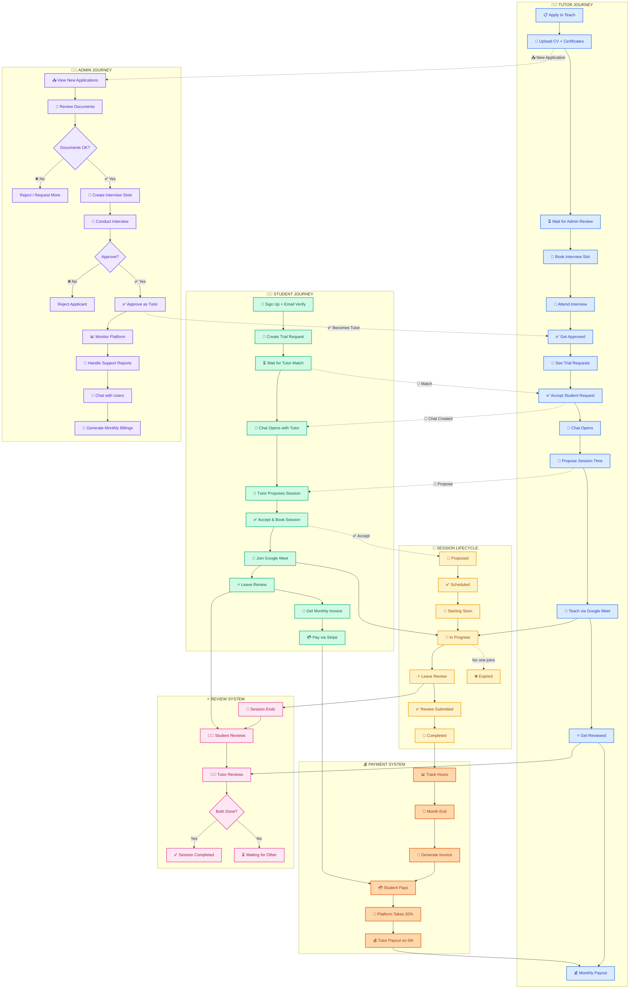
```mermaid
flowchart TB
    %% ==================== STUDENT JOURNEY ====================
    subgraph StudentJourney[👨‍🎓 STUDENT JOURNEY]
        direction TB
        S1[🔐 Sign Up + Email Verify] --> S2[📝 Create Trial Request]
        S2 --> S3[⏳ Wait for Tutor Match]
        S3 --> S4[💬 Chat Opens with Tutor]
        S4 --> S5[📅 Tutor Proposes Session]
        S5 --> S6[✅ Accept & Book Session]
        S6 --> S7[🎥 Join Google Meet]
        S7 --> S8[⭐ Leave Review]
        S8 --> S9[📄 Get Monthly Invoice]
        S9 --> S10[💳 Pay via Stripe]
    end

    %% ==================== TUTOR JOURNEY ====================
    subgraph TutorJourney[👨‍🏫 TUTOR JOURNEY]
        direction TB
        T1[📋 Apply to Teach] --> T2[📄 Upload CV + Certificates]
        T2 --> T3[⏳ Wait for Admin Review]
        T3 --> T4[📅 Book Interview Slot]
        T4 --> T5[🎥 Attend Interview]
        T5 --> T6[✅ Get Approved]
        T6 --> T7[👀 See Trial Requests]
        T7 --> T8[✅ Accept Student Request]
        T8 --> T9[💬 Chat Opens]
        T9 --> T10[📅 Propose Session Time]
        T10 --> T11[🎥 Teach via Google Meet]
        T11 --> T12[⭐ Get Reviewed]
        T12 --> T13[💰 Monthly Payout]
    end

    %% ==================== ADMIN JOURNEY ====================
    subgraph AdminJourney[👨‍💼 ADMIN JOURNEY]
        direction TB
        A1[📥 View New Applications] --> A2[📄 Review Documents]
        A2 --> A3{Documents OK?}
        A3 -->|❌ No| A4[Reject / Request More]
        A3 -->|✅ Yes| A5[📅 Create Interview Slots]
        A5 --> A6[🎥 Conduct Interview]
        A6 --> A7{Approve?}
        A7 -->|❌ No| A8[Reject Applicant]
        A7 -->|✅ Yes| A9[✅ Approve as Tutor]
        A9 --> A10[📊 Monitor Platform]
        A10 --> A11[🎫 Handle Support Reports]
        A11 --> A12[💬 Chat with Users]
        A12 --> A13[📄 Generate Monthly Billings]
    end

    %% ==================== SESSION LIFECYCLE ====================
    subgraph SessionFlow[📅 SESSION LIFECYCLE]
        direction LR
        SF1[📝 Proposed] --> SF2[✅ Scheduled]
        SF2 --> SF3[🔔 Starting Soon]
        SF3 --> SF4[🎥 In Progress]
        SF4 --> SF5[⭐ Leave Review]
        SF5 --> SF6[✅ Review Submitted]
        SF6 --> SF7[🏁 Completed]
        SF4 -.->|No one joins| SF8[❌ Expired]
    end

    %% ==================== PAYMENT FLOW ====================
    subgraph PaymentFlow[💰 PAYMENT SYSTEM]
        direction LR
        P1[📊 Track Hours] --> P2[📅 Month End]
        P2 --> P3[📄 Generate Invoice]
        P3 --> P4[💳 Student Pays]
        P4 --> P5[🏦 Platform Takes 20%]
        P5 --> P6[💰 Tutor Payout on 5th]
    end

    %% ==================== REVIEW FLOW ====================
    subgraph ReviewFlow[⭐ REVIEW SYSTEM]
        direction LR
        R1[🎥 Session Ends] --> R2[👨‍🎓 Student Reviews]
        R2 --> R3[👨‍🏫 Tutor Reviews]
        R3 --> R4{Both Done?}
        R4 -->|Yes| R5[✅ Session Completed]
        R4 -->|No| R6[⏳ Waiting for Other]
    end

    %% ==================== CROSS-CONNECTIONS ====================
    %% Student-Tutor Matching
    S3 -.->|🔗 Match| T8
    T8 -.->|💬 Chat Created| S4

    %% Session Booking
    T10 -.->|📅 Propose| S5
    S6 -.->|✅ Accept| SF1

    %% Session Flow Connection
    S7 --> SF4
    T11 --> SF4

    %% Review Connection
    SF5 --> R1
    S8 --> R2
    T12 --> R3

    %% Payment Connection
    SF7 --> P1
    S10 --> P4
    P6 --> T13

    %% Admin Approval Flow
    T2 -.->|📥 New Application| A1
    A9 -.->|✅ Becomes Tutor| T6

    %% ==================== STYLING ====================
    classDef studentStyle fill:#d1fae5,stroke:#10b981,stroke-width:2px,color:#065f46
    classDef tutorStyle fill:#dbeafe,stroke:#3b82f6,stroke-width:2px,color:#1e40af
    classDef adminStyle fill:#ede9fe,stroke:#8b5cf6,stroke-width:2px,color:#5b21b6
    classDef sessionStyle fill:#fef3c7,stroke:#f59e0b,stroke-width:2px,color:#92400e
    classDef paymentStyle fill:#fed7aa,stroke:#ea580c,stroke-width:2px,color:#9a3412
    classDef reviewStyle fill:#fce7f3,stroke:#ec4899,stroke-width:2px,color:#9d174d

    %% Apply styles
    class S1,S2,S3,S4,S5,S6,S7,S8,S9,S10 studentStyle
    class T1,T2,T3,T4,T5,T6,T7,T8,T9,T10,T11,T12,T13 tutorStyle
    class A1,A2,A3,A4,A5,A6,A7,A8,A9,A10,A11,A12,A13 adminStyle
    class SF1,SF2,SF3,SF4,SF5,SF6,SF7,SF8 sessionStyle
    class P1,P2,P3,P4,P5,P6 paymentStyle
    class R1,R2,R3,R4,R5,R6 reviewStyle
```

### Color Legend

| Color | User Type | Hex Code |
|-------|-----------|----------|
| 🟢 Green | Student | #d1fae5 |
| 🔵 Blue | Tutor | #dbeafe |
| 🟣 Purple | Admin | #ede9fe |
| 🟡 Yellow | Session | #fef3c7 |
| 🟠 Orange | Payment | #fed7aa |
| 🩷 Pink | Review | #fce7f3 |

### Key Connection Points

| From | To | Connection |
|------|-----|------------|
| Student Trial Request | Tutor Accept | 🔗 Match - Chat opens |
| Tutor Propose Session | Student Accept | 📅 Session scheduled |
| Both in Google Meet | Session In Progress | 🎥 Teaching happens |
| Session Ends | Review System | ⭐ Both must review |
| Session Completed | Payment Tracking | 💰 Hours counted |
| Tutor Application | Admin Review | 📥 Approval flow |
| Admin Approve | Tutor Dashboard | ✅ Can accept students |

---

# Overall Journey Summary

## Platform Overall Journey

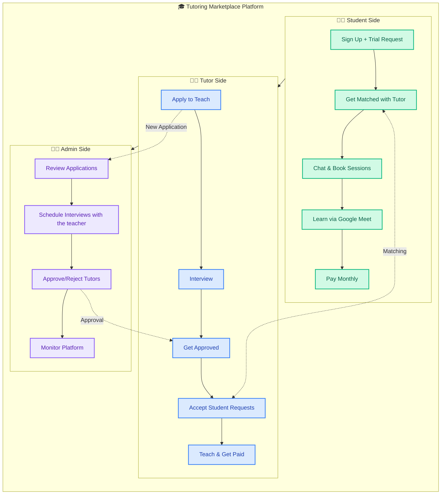
```mermaid
flowchart LR
    subgraph Platform[🎓 Tutoring Marketplace Platform]
        direction TB

        subgraph StudentSide[👨‍🎓 Student Side]
            direction LR
            S1[Sign Up + Trial Request] --> S2[Get Matched with Tutor] --> S3[Chat & Book Sessions] --> S4[Learn via Google Meet] --> S5[Pay Monthly]
        end

        subgraph TutorSide[👨‍🏫 Tutor Side]
            direction LR
            T1[Apply to Teach] --> T2[Interview] --> T3[Get Approved] --> T4[Accept Student Requests] --> T5[Teach & Get Paid]
        end

        subgraph AdminSide[👨‍💼 Admin Side]
            direction LR
            A1[Review Applications] --> A2[Schedule Interviews with the teacher] --> A3[Approve/Reject Tutors] --> A4[Monitor Platform]
        end

        StudentSide --> TutorSide --> AdminSide
    end

    S2 <-.->|Matching| T4
    T1 -.->|New Application| A1
    A3 -.->|Approval| T3

    %% Styles - Colorful nodes
    classDef studentStyle fill:#d1fae5,stroke:#10b981,stroke-width:2px,color:#065f46
    classDef tutorStyle fill:#dbeafe,stroke:#3b82f6,stroke-width:2px,color:#1e40af
    classDef adminStyle fill:#ede9fe,stroke:#8b5cf6,stroke-width:2px,color:#5b21b6

    %% Apply styles to nodes
    class S1,S2,S3,S4,S5 studentStyle
    class T1,T2,T3,T4,T5 tutorStyle
    class A1,A2,A3,A4 adminStyle
```

---

## Complete User Journey - Simple View

### Student Journey

1. **Sign Up + Request Trial** → Fill form, verify email
2. **Get Matched** → Tutor accepts request, chat opens
3. **Book Session** → Tutor proposes date/time, student accepts
4. **Learn via Meet** → Join Google Meet session
5. **Pay Monthly** → Invoice at month end

### Tutor Journey

1. **Apply to Teach** → Upload CV + documents
2. **Schedule Interview** → Admin reviews, book slot
3. **Get Approved** → Pass interview, become TUTOR
4. **Accept Requests** → See student requests, accept, teach
5. **Get Paid** → Payout on 5th of each month

### Admin Journey

1. **Review Applications** → Check CV, certificates
2. **Create Interview Slots** → Set available times
3. **Interview Applicants** → Meet via Google Meet
4. **Approve/Reject** → Decision, tutor gets access

---

## How They Connect - The Big Picture

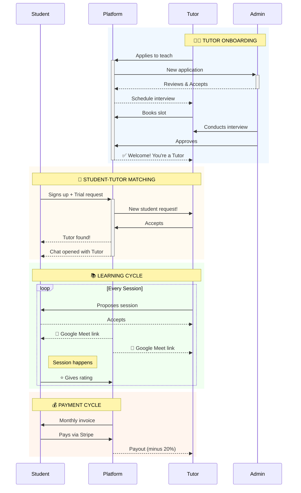
```mermaid
sequenceDiagram
    participant S as Student
    participant P as Platform
    participant T as Tutor
    participant A as Admin

    rect rgb(240, 248, 255)
        Note over T,A: 👨‍🏫 TUTOR ONBOARDING
        T->>+P: Applies to teach
        P->>+A: New application
        A-->>-P: Reviews & Accepts
        P-->>T: Schedule interview
        T->>P: Books slot
        A->>T: Conducts interview
        A->>P: Approves
        P-->>-T: ✅ Welcome! You're a Tutor
    end

    rect rgb(255, 250, 240)
        Note over S,T: 🤝 STUDENT-TUTOR MATCHING
        S->>+P: Signs up + Trial request
        P->>T: New student request!
        T->>P: Accepts
        P-->>S: Tutor found!
        P-->>-S: Chat opened with Tutor
    end

    rect rgb(240, 255, 240)
        Note over S,T: 📚 LEARNING CYCLE
        loop Every Session
            T->>S: Proposes session
            S-->>T: Accepts
            P-->>S: 📅 Google Meet link
            P-->>T: 📅 Google Meet link
            Note right of S: Session happens
            S->>P: ⭐ Gives rating
        end
    end

    rect rgb(255, 245, 238)
        Note over S,P: 💰 PAYMENT CYCLE
        P->>S: Monthly invoice
        S->>P: Pays via Stripe
        P-->>T: Payout (minus 20%)
    end
```

---

## Quick Reference Cards

### Student Card

```
┌─────────────────────────────────────────────────────────────────┐
│  👨‍🎓 STUDENT JOURNEY                                            │
├─────────────────────────────────────────────────────────────────┤
│                                                                 │
│  1. Sign Up ─────────── Fill form + Email verify ───── Once     │
│                                                                 │
│  2. Request Trial ───── Select subject, grade ──────── Once     │
│                                                                 │
│  3. Get Tutor ───────── Wait for tutor to accept ─── 24 hrs max │
│                                                                 │
│  4. Book Session ────── Accept tutor's proposal ───── Anytime   │
│                                                                 │
│  5. Attend ──────────── Click "Join Meeting" ──── 15 min before │
│                                                                 │
│  6. Review ──────────── Rate 5 categories (1-5) ─ After session │
│                                                                 │
│  7. Pay ─────────────── Stripe payment ──────────── Month end   │
│                                                                 │
└─────────────────────────────────────────────────────────────────┘
```

### Tutor Card

```
┌─────────────────────────────────────────────────────────────────┐
│  👨‍🏫 TUTOR JOURNEY                                               │
├─────────────────────────────────────────────────────────────────┤
│                                                                 │
│  1. Apply ───────────── Fill form + Upload docs ──────── Once   │
│                                                                 │
│  2. Interview ───────── Book slot + Google Meet ─ After approval│
│                                                                 │
│  3. Get Approved ────── Admin decision ──────── After interview │
│                                                                 │
│  4. Accept Students ─── Click "Accept" on requests ─── Anytime  │
│                                                                 │
│  5. Teach ───────────── Google Meet session ──── Scheduled time │
│                                                                 │
│  6. Get Paid ────────── Auto Stripe transfer ───── 5th of month │
│                                                                 │
└─────────────────────────────────────────────────────────────────┘
```

### Admin Card

```
┌─────────────────────────────────────────────────────────────────┐
│  👨‍💼 ADMIN JOURNEY                                               │
├─────────────────────────────────────────────────────────────────┤
│                                                                 │
│  1. Review Apps ─────── Check CV, certificates ────────── Daily │
│                                                                 │
│  2. Create Slots ────── Set interview times ────────── As needed│
│                                                                 │
│  3. Interview ───────── Google Meet ─────────────── Scheduled   │
│                                                                 │
│  4. Approve/Reject ──── Decision after interview ─ After interv.│
│                                                                 │
│  5. Monitor ─────────── Dashboard stats ───────────────── Daily │
│                                                                 │
└─────────────────────────────────────────────────────────────────┘
```

---

## Key Numbers

| Metric                   | Value         |
| ------------------------ | ------------- |
| Trial request expiry     | 24 hours      |
| Interview duration       | 30 minutes    |
| Session join window      | 15 min before |
| Platform commission      | 20%           |
| Tutor payout date        | 5th of month  |
| Max subjects per tutor   | 3             |
| Min hours (Regular plan) | 4 hrs/month   |

---

## Pricing Plans Summary

| Plan         | Price  | Commitment                   | Best For      |
| ------------ | ------ | ---------------------------- | ------------- |
| 🟢 Flexible  | €30/hr | No commitment, pay as you go | Trying out    |
| 🔵 Regular   | €28/hr | 1 month min, min 4 hrs/mo    | Regular study |
| 🟣 Long-term | €25/hr | 3 months min, min 4 hrs/mo   | Exam prep     |

---

# 1. Student Journey

## 1.1 Student Signs Up & Requests Free Trial

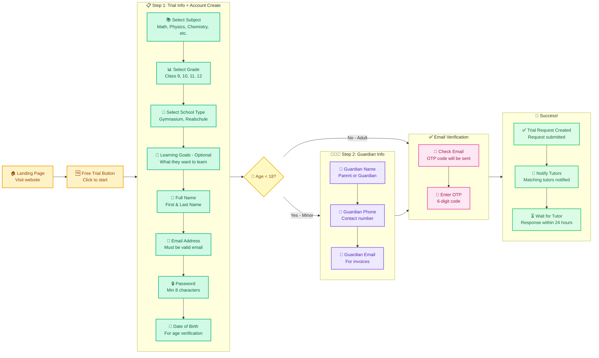
```mermaid
flowchart LR
    A[🏠 Landing Page<br/>Visit website] --> B[🆓 Free Trial Button<br/>Click to start]

    subgraph Step1[📋 Step 1: Trial Info + Account Create]
        direction TB
        C1[📚 Select Subject<br/>Math, Physics, Chemistry, etc.] --> C2[📊 Select Grade<br/>Class 9, 10, 11, 12]
        C2 --> C3[🏫 Select School Type<br/>Gymnasium, Realschule]
        C3 --> C4[📝 Learning Goals - Optional<br/>What they want to learn]
        C4 --> D1[👤 Full Name<br/>First & Last Name]
        D1 --> D2[📧 Email Address<br/>Must be valid email]
        D2 --> D3[🔒 Password<br/>Min 8 characters]
        D3 --> D4[🎂 Date of Birth<br/>For age verification]
    end

    subgraph Step2[👨‍👩‍👦 Step 2: Guardian Info]
        direction TB
        F1[👤 Guardian Name<br/>Parent or Guardian] --> F2[📱 Guardian Phone<br/>Contact number]
        F2 --> F3[📧 Guardian Email<br/>For invoices]
    end

    subgraph Verify[✅ Email Verification]
        direction TB
        G[📧 Check Email<br/>OTP code will be sent] --> G1[🔢 Enter OTP<br/>6-digit code]
    end

    subgraph Success[🎉 Success!]
        direction TB
        H[✅ Trial Request Created<br/>Request submitted] --> I[🔔 Notify Tutors<br/>Matching tutors notified]
        I --> J[⏳ Wait for Tutor<br/>Response within 24 hours]
    end

    B --> Step1
    Step1 --> E{🎂 Age < 18?}
    E -->|Yes - Minor| Step2
    E -->|No - Adult| Verify
    Step2 --> Verify
    Verify --> Success

    %% Colors
    classDef startStyle fill:#fef3c7,stroke:#f59e0b,stroke-width:2px,color:#92400e
    classDef step1Style fill:#d1fae5,stroke:#10b981,stroke-width:2px,color:#065f46
    classDef step2Style fill:#ede9fe,stroke:#8b5cf6,stroke-width:2px,color:#5b21b6
    classDef verifyStyle fill:#fce7f3,stroke:#ec4899,stroke-width:2px,color:#9d174d
    classDef successStyle fill:#dcfce7,stroke:#22c55e,stroke-width:2px,color:#166534
    classDef decisionStyle fill:#fef9c3,stroke:#eab308,stroke-width:2px,color:#854d0e

    class A,B startStyle
    class C1,C2,C3,C4,D1,D2,D3,D4 step1Style
    class F1,F2,F3 step2Style
    class G,G1 verifyStyle
    class H,I,J successStyle
    class E decisionStyle
```

---

## 1.2 Student Gets Matched with Tutor (Uber Style)

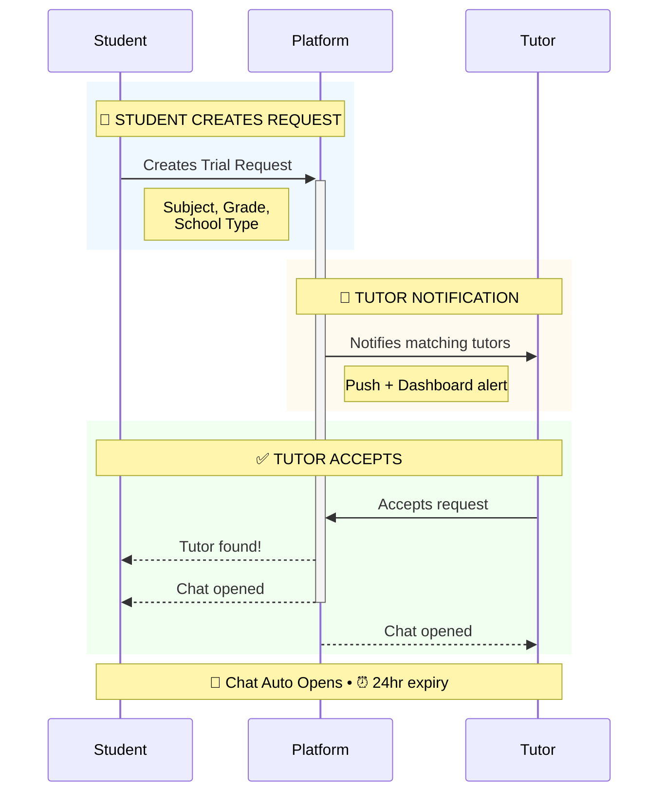
```mermaid
sequenceDiagram
    participant S as Student
    participant P as Platform
    participant T as Tutor

    rect rgb(240, 248, 255)
        Note over S,P: 📝 STUDENT CREATES REQUEST
        S->>+P: Creates Trial Request
        Note right of S: Subject, Grade,<br/>School Type
    end

    rect rgb(255, 250, 240)
        Note over P,T: 🔔 TUTOR NOTIFICATION
        P->>T: Notifies matching tutors
        Note right of P: Push + Dashboard alert
    end

    rect rgb(240, 255, 240)
        Note over S,T: ✅ TUTOR ACCEPTS
        T->>P: Accepts request
        P-->>S: Tutor found!
        P-->>-S: Chat opened
        P-->>T: Chat opened
    end

    Note over S,T: 💬 Chat Auto Opens • ⏰ 24hr expiry
```

---

## 1.3 Student Books a Session (In-Chat)

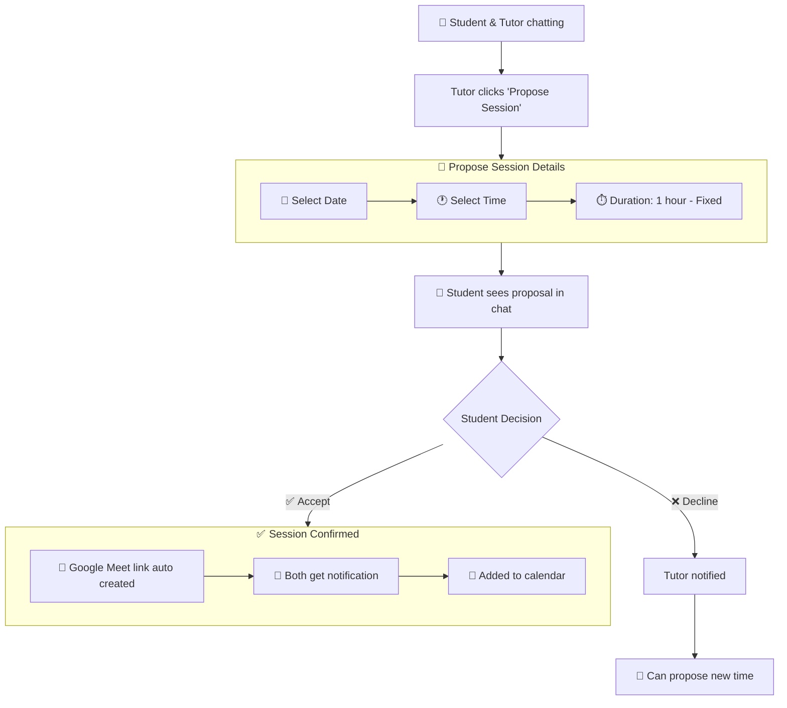
```mermaid
flowchart TD
    A[💬 Student & Tutor chatting] --> B[Tutor clicks 'Propose Session']

    B --> Propose

    subgraph Propose[📅 Propose Session Details]
        C1[📅 Select Date]
        C1 --> C2[🕐 Select Time]
        C2 --> C3[⏱️ Duration: 1 hour - Fixed]
    end

    Propose --> D[📩 Student sees proposal in chat]

    D --> E{Student Decision}

    E -->|✅ Accept| Confirmed
    subgraph Confirmed[✅ Session Confirmed]
        F1[🔗 Google Meet link auto created]
        F1 --> F2[🔔 Both get notification]
        F2 --> F3[📅 Added to calendar]
    end

    E -->|❌ Decline| G[Tutor notified]
    G --> G1[💬 Can propose new time]
```

---

## 1.4 Student Attends Session & Gives Review

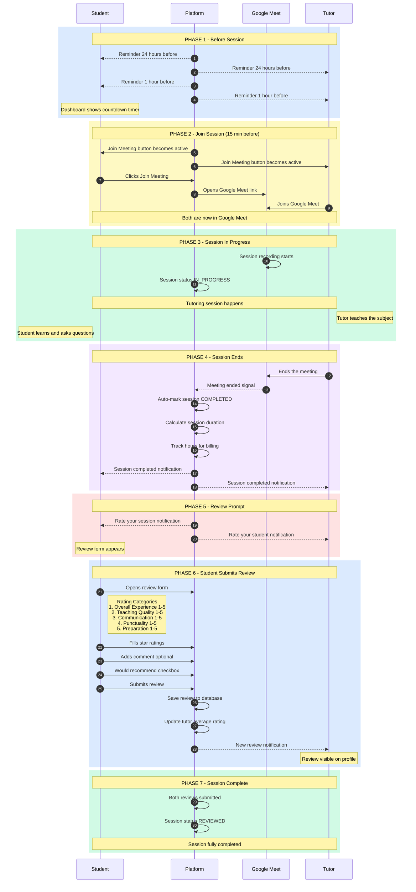
```mermaid
sequenceDiagram
    autonumber
    participant S as Student
    participant P as Platform
    participant G as Google Meet
    participant T as Tutor

    rect rgb(219, 234, 254)
        Note over S,T: PHASE 1 - Before Session
        P-->>S: Reminder 24 hours before
        P-->>T: Reminder 24 hours before
        P-->>S: Reminder 1 hour before
        P-->>T: Reminder 1 hour before
        Note over S: Dashboard shows countdown timer
    end

    rect rgb(254, 249, 195)
        Note over S,T: PHASE 2 - Join Session (15 min before)
        P->>S: Join Meeting button becomes active
        P->>T: Join Meeting button becomes active
        S->>P: Clicks Join Meeting
        P->>G: Opens Google Meet link
        T->>G: Joins Google Meet
        Note over S,T: Both are now in Google Meet
    end

    rect rgb(209, 250, 229)
        Note over S,T: PHASE 3 - Session In Progress
        G->>G: Session recording starts
        P->>P: Session status IN_PROGRESS
        Note over S,T: Tutoring session happens
        Note right of T: Tutor teaches the subject
        Note left of S: Student learns and asks questions
    end

    rect rgb(243, 232, 255)
        Note over S,T: PHASE 4 - Session Ends
        T->>G: Ends the meeting
        G-->>P: Meeting ended signal
        P->>P: Auto-mark session COMPLETED
        P->>P: Calculate session duration
        P->>P: Track hours for billing
        P-->>S: Session completed notification
        P-->>T: Session completed notification
    end

    rect rgb(254, 226, 226)
        Note over S,T: PHASE 5 - Review Prompt
        P-->>S: Rate your session notification
        P-->>T: Rate your student notification
        Note over S: Review form appears
    end

    rect rgb(219, 234, 254)
        Note over S,T: PHASE 6 - Student Submits Review
        S->>P: Opens review form
        Note right of S: Rating Categories<br/>1. Overall Experience 1-5<br/>2. Teaching Quality 1-5<br/>3. Communication 1-5<br/>4. Punctuality 1-5<br/>5. Preparation 1-5
        S->>P: Fills star ratings
        S->>P: Adds comment optional
        S->>P: Would recommend checkbox
        S->>P: Submits review
        P->>P: Save review to database
        P->>P: Update tutor average rating
        P-->>T: New review notification
        Note over T: Review visible on profile
    end

    rect rgb(209, 250, 229)
        Note over S,T: PHASE 7 - Session Complete
        P->>P: Both reviews submitted
        P->>P: Session status REVIEWED
        Note over S,T: Session fully completed
    end
```

### Session Timeline

| Time | Event | Who |
|------|-------|-----|
| -24 hours | Reminder email sent | Both |
| -1 hour | Reminder notification | Both |
| -15 minutes | Join button activates | Both |
| 0 | Session starts | Both join Meet |
| +Duration | Session ends | Tutor ends call |
| +0 min | Auto-complete triggered | Platform |
| +0 min | Review prompt shown | Both |

### Review Categories

| Category | Description | Weight |
|----------|-------------|--------|
| Overall Experience | General satisfaction | 20% |
| Teaching Quality | How well tutor explained | 25% |
| Communication | Clear and responsive | 20% |
| Punctuality | On time for session | 15% |
| Preparation | Was tutor prepared | 20% |

---

## 1.5 Student Subscription & Monthly Billing

| Plan      | Price  | Commitment          | Best For              |
| --------- | ------ | ------------------- | --------------------- |
| Flexible  | €30/hr | None                | চেষ্টা করে দেখতে চায় |
| Regular   | €28/hr | 1 month, min 4 hrs  | Regular study         |
| Long-term | €25/hr | 3 months, min 4 hrs | Exam preparation      |

### Billing Flow Diagram

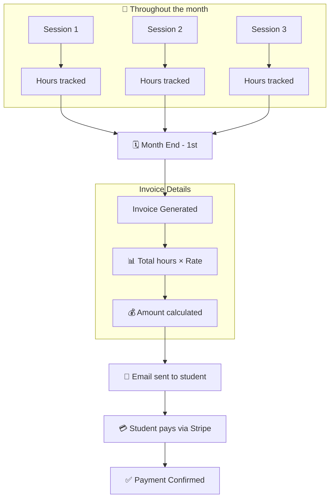
```mermaid
flowchart TD
    subgraph Month[📅 Throughout the month]
        A1[Session 1] --> A2[Hours tracked]
        B1[Session 2] --> B2[Hours tracked]
        C1[Session 3] --> C2[Hours tracked]
    end

    A2 & B2 & C2 --> D[🗓️ Month End - 1st]

    D --> E[Invoice Generated]
    subgraph Invoice[Invoice Details]
        E --> E1[📊 Total hours × Rate]
        E1 --> E2[💰 Amount calculated]
    end

    E2 --> F[📧 Email sent to student]
    F --> G[💳 Student pays via Stripe]
    G --> H[✅ Payment Confirmed]
```

---

## 1.6 Student Dashboard Pages (After Payment)

> Payment করার পরে Student Dashboard এ redirect হবে

### Page Overview

| Page          | কি দেখবে                               | কি করতে পারবে         |
| ------------- | -------------------------------------- | --------------------- |
| Home          | Stats, Next session, Pending reviews   | Quick actions         |
| Messages      | All tutor conversations                | Message, Book session |
| Sessions      | Plan info, Usage, Upcoming & Completed | Join, Cancel, Review  |
| Subscriptions | Plan details, Billing history          | Change plan, Pay      |
| Profile       | Personal info                          | Edit profile          |

---

### 📅 Sessions Page & Rating

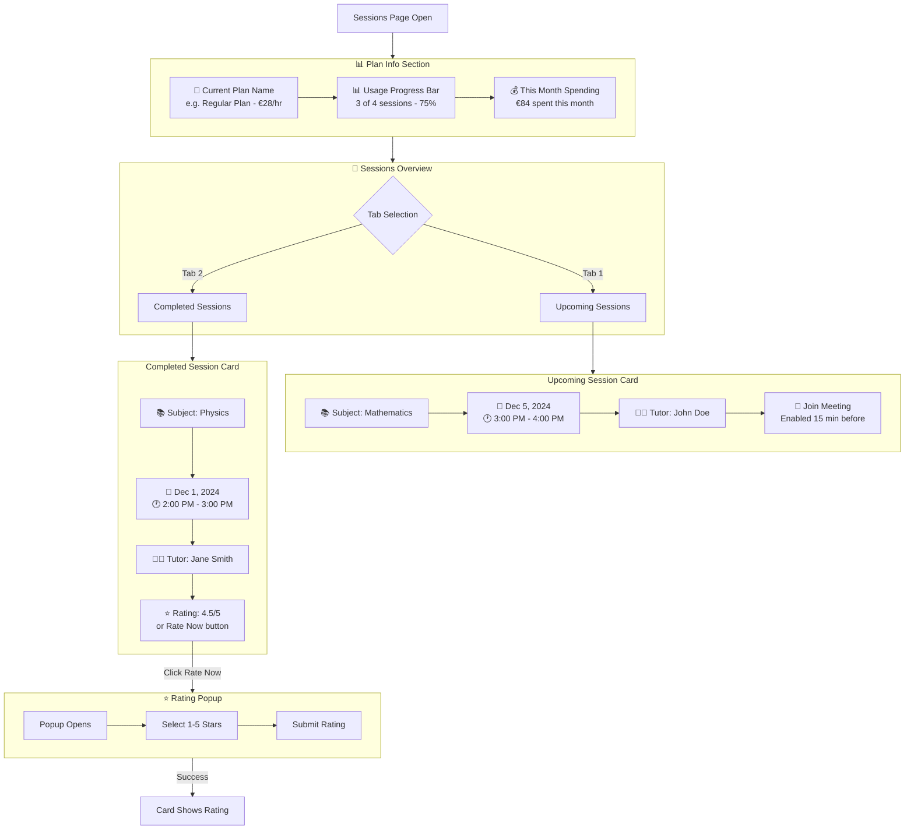
```mermaid
flowchart TD
    A[Sessions Page Open] --> PlanInfo

    subgraph PlanInfo[📊 Plan Info Section]
        B1[🔵 Current Plan Name<br/>e.g. Regular Plan - €28/hr]
        B1 --> B2[📊 Usage Progress Bar<br/>3 of 4 sessions - 75%]
        B2 --> B3[💰 This Month Spending<br/>€84 spent this month]
    end

    PlanInfo --> SessionTabs

    subgraph SessionTabs[📅 Sessions Overview]
        D{Tab Selection}
        D -->|Tab 1| E[Upcoming Sessions]
        D -->|Tab 2| F[Completed Sessions]
    end

    E --> UpcomingDetails
    subgraph UpcomingDetails[Upcoming Session Card]
        E1[📚 Subject: Mathematics]
        E1 --> E2[📅 Dec 5, 2024<br/>🕐 3:00 PM - 4:00 PM]
        E2 --> E3[👨‍🏫 Tutor: John Doe]
        E3 --> E4[🎥 Join Meeting<br/>Enabled 15 min before]
    end

    F --> CompletedDetails
    subgraph CompletedDetails[Completed Session Card]
        F1[📚 Subject: Physics]
        F1 --> F2[📅 Dec 1, 2024<br/>🕐 2:00 PM - 3:00 PM]
        F2 --> F3[👨‍🏫 Tutor: Jane Smith]
        F3 --> F4[⭐ Rating: 4.5/5<br/>or Rate Now button]
    end

    F4 -->|Click Rate Now| RatingPopup
    subgraph RatingPopup[⭐ Rating Popup]
        R1[Popup Opens]
        R1 --> R2[Select 1-5 Stars]
        R2 --> R3[Submit Rating]
    end

    RatingPopup -->|Success| G[Card Shows Rating]
```

---

### 💬 Messages Page

#### Page Structure

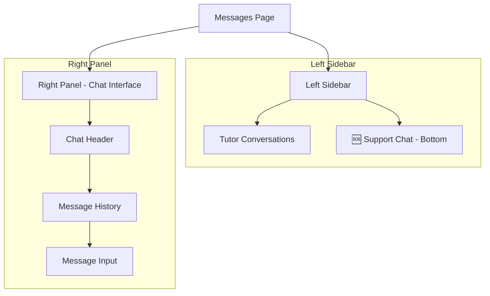
```mermaid
flowchart TD
    A[Messages Page] --> B[Left Sidebar]
    A --> C[Right Panel - Chat Interface]

    subgraph Sidebar[Left Sidebar]
        B --> B1[Tutor Conversations]
        B --> B2[🆘 Support Chat - Bottom]
    end

    subgraph ChatPanel[Right Panel]
        C --> C1[Chat Header]
        C1 --> C2[Message History]
        C2 --> C3[Message Input]
    end
```

---

### 🆘 Support (Direct Admin Chat)

> Support এ click করলে Report submit করা যাবে।
> Report submit করলে Admin Dashboard এ যাবে এবং Admin directly chat করে issue solve করবে।

#### Support Flow

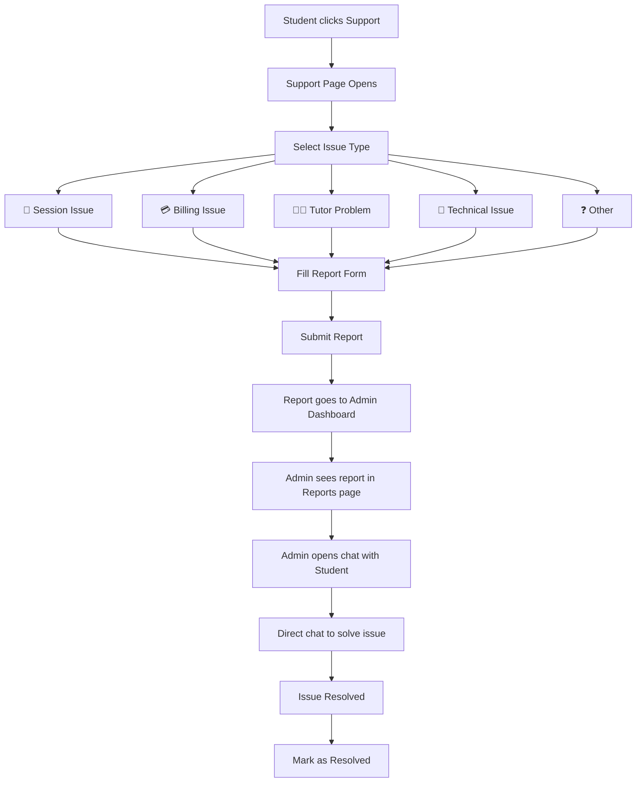
```mermaid
flowchart TD
    A[Student clicks Support] --> B[Support Page Opens]

    B --> C[Select Issue Type]
    C --> C1[📅 Session Issue]
    C --> C2[💳 Billing Issue]
    C --> C3[👨‍🏫 Tutor Problem]
    C --> C4[🔧 Technical Issue]
    C --> C5[❓ Other]

    C1 & C2 & C3 & C4 & C5 --> D[Fill Report Form]
    D --> E[Submit Report]
    E --> F[Report goes to Admin Dashboard]

    F --> G[Admin sees report in Reports page]
    G --> H[Admin opens chat with Student]
    H --> I[Direct chat to solve issue]
    I --> J[Issue Resolved]
    J --> K[Mark as Resolved]
```

#### Report Categories (Student)

| Category            | Description                              |
| ------------------- | ---------------------------------------- |
| 📅 Session Issue    | Session problems, tutor no-show, etc.    |
| 💳 Billing Issue    | Invoice issues, payment problems         |
| 👨‍🏫 Tutor Problem    | Issues with specific tutor               |
| 🔧 Technical Issue  | App/website not working properly         |
| ❓ Other            | Any other issues                         |

#### Data Flow

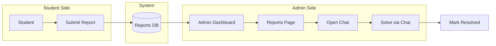
```mermaid
flowchart LR
    subgraph Student[Student Side]
        A[Student] --> B[Submit Report]
    end

    subgraph Backend[System]
        B --> C[(Reports DB)]
    end

    subgraph Admin[Admin Side]
        C --> D[Admin Dashboard]
        D --> E[Reports Page]
        E --> F[Open Chat]
        F --> G[Solve via Chat]
    end

    G --> H[Mark Resolved]
```

#### FAQs (Student)

| Question | Answer |
|----------|--------|
| How do I cancel a session? | Go to Sessions → Select session → Cancel |
| How do I change my subscription? | Go to Subscriptions → Change Plan |
| How do I request a new tutor? | Go to Support → Request new tutor |
| When am I billed? | 1st of each month for previous month's sessions |

---

### 💳 Subscriptions Page

#### Page Structure

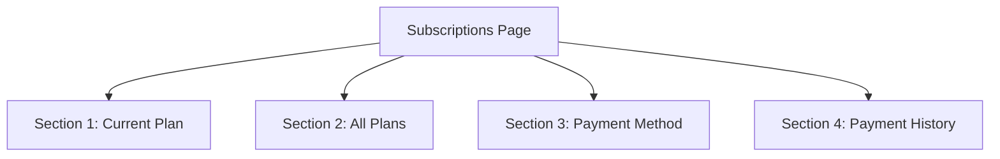
```mermaid
flowchart TD
    A[Subscriptions Page] --> B[Section 1: Current Plan]
    A --> C[Section 2: All Plans]
    A --> D[Section 3: Payment Method]
    A --> E[Section 4: Payment History]
```

#### Plans Comparison Table

| Feature           | 🟢 Flexible | 🔵 Regular    | 🟣 Long-term |
| ----------------- | ----------- | ------------- | ------------ |
| Price per Session | €30         | €28           | €25          |
| Minimum Sessions  | No minimum  | 4 per month   | 4 per month  |
| Commitment Period | None        | 1 month       | 3 months     |
| Best For          | Trying out  | Regular study | Exam prep    |
| Savings           | -           | €2/session    | €5/session   |

#### Change Plan Flow

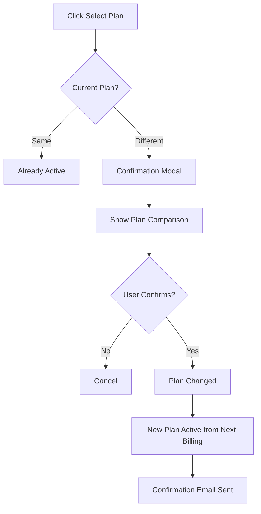
```mermaid
flowchart TD
    A[Click Select Plan] --> B{Current Plan?}
    B -->|Same| C[Already Active]
    B -->|Different| D[Confirmation Modal]

    D --> E[Show Plan Comparison]
    E --> F{User Confirms?}
    F -->|No| G[Cancel]
    F -->|Yes| H[Plan Changed]

    H --> I[New Plan Active from Next Billing]
    I --> J[Confirmation Email Sent]
```

#### Invoice Download

```
Invoice PDF Contains:
├── Invoice Number: INV-2024-11-001
├── Date: Nov 1, 2024
├── Student Info (Name, Email, Address)
├── Plan Details (Regular Plan - €28/session)
├── Session Breakdown:
│   ├── Nov 5 - Mathematics (1 hr) - €28
│   ├── Nov 12 - Mathematics (1 hr) - €28
│   ├── Nov 19 - Physics (1 hr) - €28
│   └── Nov 26 - Physics (1 hr) - €28
├── Subtotal: €112.00
├── Tax (if applicable): €0.00
├── Total: €112.00
└── Payment Status: Paid ✓
```

---

### 👤 Profile Page

#### Page Structure

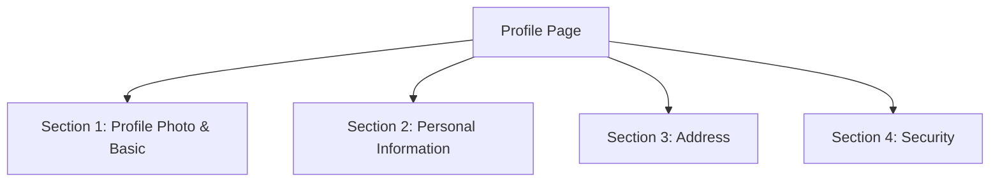
```mermaid
flowchart TD
    A[Profile Page] --> B[Section 1: Profile Photo & Basic]
    A --> C[Section 2: Personal Information]
    A --> D[Section 3: Address]
    A --> E[Section 4: Security]
```

---

### 🔔 Notifications

> Student Dashboard এ Notification bell icon থাকবে

#### Notification Types

| Type             | Icon | Message Example              | Action           |
| ---------------- | ---- | ---------------------------- | ---------------- |
| Session Reminder | 🎥   | "Session starting in 15 min" | [Join Now]       |
| Session Proposed | 📅   | "New session proposed"       | [Accept/Decline] |
| Invoice Ready    | 💳   | "November invoice ready"     | [Pay Now]        |
| Payment Success  | ✅   | "Payment confirmed"          | [View Receipt]   |
| Tutor Message    | 💬   | "New message from John"      | [Reply]          |
| Support Update   | 🆘   | "Ticket #123 updated"        | [View]           |

---

### 🆘 Support Page (Updated)

> Support এ click করলে নিচের options দেখাবে

---

### 📚 Resources Page

> Open source educational database থেকে resources search করতে পারবে

#### Open Source Data Sources

```
Resources sourced from:
├── Khan Academy (khanacademy.org)
├── OpenStax (openstax.org)
├── MIT OpenCourseWare (ocw.mit.edu)
├── CK-12 Foundation (ck12.org)
├── Coursera (coursera.org - free courses)
├── edX (edx.org - free courses)
├── PhET Simulations (phet.colorado.edu)
├── GeoGebra (geogebra.org)
└── Wolfram Alpha (wolframalpha.com)
```

#### Updated Dashboard Navigation

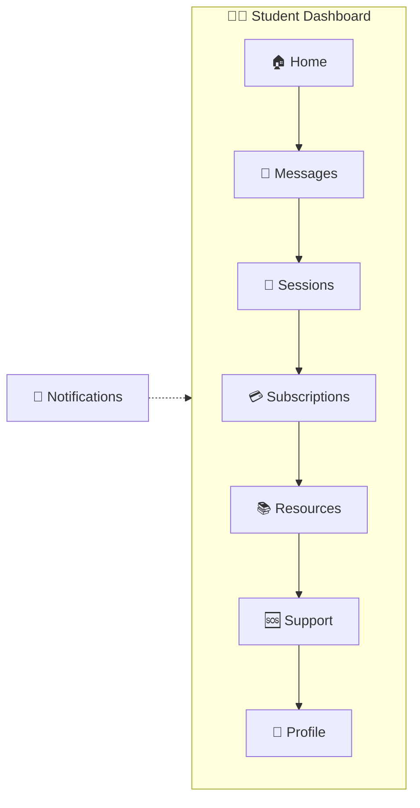
```mermaid
flowchart LR
    subgraph Dashboard[👨‍🎓 Student Dashboard]
        A[🏠 Home] --> B[💬 Messages]
        B --> C[📅 Sessions]
        C --> D[💳 Subscriptions]
        D --> E[📚 Resources]
        E --> F[🆘 Support]
        F --> G[👤 Profile]
    end

    H[🔔 Notifications] -.-> Dashboard
```

---

# 2. Tutor Journey

## 2.1 Tutor Application Gets Reviewed by Admin


```mermaid
sequenceDiagram
    autonumber

    participant AP as 👤 Applicant
    participant P as 🖥️ Platform
    participant A as 👨‍💼 Admin

    %% ═══════════════════════════════════════════════════════════════
    %% PHASE 1: APPLICATION SUBMISSION
    %% ═══════════════════════════════════════════════════════════════
    rect rgb(254, 243, 199)
        Note over AP,A: 📝 PHASE 1: APPLICATION SUBMISSION
        AP->>P: Click "Become a Tutor" button
        AP->>P: Fill Application Form
        Note right of AP: Personal Info:<br/>• Full Name, DOB<br/>• Email, Phone<br/>• Address (Street, ZIP, City)
        AP->>P: Upload Required Documents
        Note right of AP: Documents:<br/>• CV (Required)<br/>• Abitur Certificate (Required)<br/>• Official ID (Required)<br/>• Other Certificates (Optional)
        AP->>P: Select Teaching Subjects (Max 3)
        AP->>P: Submit Application
        P-->>AP: ✅ Application Received
        P-->>AP: Status: SUBMITTED
        P->>A: 🔔 Notification: New Application
    end

    %% ═══════════════════════════════════════════════════════════════
    %% PHASE 2: ADMIN DOCUMENT REVIEW
    %% ═══════════════════════════════════════════════════════════════
    rect rgb(219, 234, 254)
        Note over AP,A: 📋 PHASE 2: ADMIN REVIEWS DOCUMENTS
        A->>P: Open Applications Dashboard
        A->>P: Click on New Application
        A->>P: View & Download Documents
        Note left of A: Review Checklist:<br/>✓ CV - Education & Experience<br/>✓ Abitur - Authentic & Valid<br/>✓ ID - Matches Name<br/>✓ Subjects - Appropriate
        A->>A: 🤔 Make Decision
    end

    %% ═══════════════════════════════════════════════════════════════
    %% DECISION BRANCHES
    %% ═══════════════════════════════════════════════════════════════

    %% ─────────────────────────────────────────────────────────────────
    %% PATH A: REJECTION
    %% ─────────────────────────────────────────────────────────────────
    rect rgb(254, 226, 226)
        Note over AP,A: ❌ PATH A: REJECTION (Documents Not OK)
        A->>P: Select Rejection Reason
        Note left of A: Reasons:<br/>• Incomplete Documents<br/>• Invalid Certificate<br/>• Not Qualified<br/>• Duplicate Application
        A->>P: Write Rejection Message
        A->>P: Click "Reject Application"
        P-->>AP: 📧 Email: Application Rejected
        Note right of AP: Email contains:<br/>• Rejection reason<br/>• Admin's message<br/>• Reapply info (30 days)
        P-->>AP: Status: REJECTED
        Note over AP: ⛔ Process Ends
    end

    %% ─────────────────────────────────────────────────────────────────
    %% PATH B: REVISION REQUIRED
    %% ─────────────────────────────────────────────────────────────────
    rect rgb(254, 249, 195)
        Note over AP,A: 🔄 PATH B: REVISION (Document Issues Found)
        A->>P: Request Document Correction
        Note left of A: Issues:<br/>• Blurry image<br/>• Wrong file uploaded<br/>• Expired document<br/>• Missing pages
        A->>P: Specify which document(s) need fixing
        A->>P: Write correction instructions
        P-->>AP: 📧 Email: Revision Required
        Note right of AP: Email contains:<br/>• Which document is wrong<br/>• What's the issue<br/>• How to fix it
        P-->>AP: Status: REVISION_REQUIRED
        AP->>P: Upload Corrected Document(s)
        P->>A: 🔔 Notification: Documents Updated
        A->>P: Re-review Updated Documents
        Note over A: Back to Decision Point ↩️
    end

    %% ─────────────────────────────────────────────────────────────────
    %% PATH C: ACCEPTANCE
    %% ─────────────────────────────────────────────────────────────────
    rect rgb(209, 250, 229)
        Note over AP,A: ✅ PATH C: ACCEPTANCE (All Documents OK)
        A->>P: Click "Accept Documents"
        P-->>AP: 📧 Email: Schedule Interview
        Note right of AP: Email contains:<br/>• Congratulations!<br/>• Link to dashboard<br/>• Interview booking instructions
        P-->>AP: Status: DOCUMENTS_REVIEWED
        Note over AP: ➡️ Next: Book Interview Slot
    end

    %% ═══════════════════════════════════════════════════════════════
    %% NEXT STEP
    %% ═══════════════════════════════════════════════════════════════
    rect rgb(237, 233, 254)
        Note over AP,P: 📅 NEXT STEP: INTERVIEW SCHEDULING
        AP->>P: Go to Dashboard
        AP->>P: View Available Interview Slots
        AP->>P: Book a Slot
        P-->>AP: Status: INTERVIEW_SCHEDULED
    end
```

### Application Status Flow

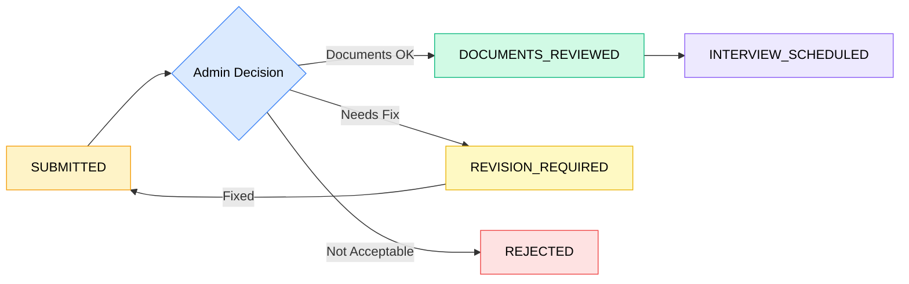
```mermaid
flowchart LR
    A[SUBMITTED] --> B{Admin Decision}
    B -->|Documents OK| C[DOCUMENTS_REVIEWED]
    B -->|Needs Fix| D[REVISION_REQUIRED]
    B -->|Not Acceptable| E[REJECTED]
    D -->|Fixed| A
    C --> F[INTERVIEW_SCHEDULED]

    style A fill:#fef3c7,stroke:#f59e0b,color:#000000
    style B fill:#dbeafe,stroke:#3b82f6,color:#000000
    style C fill:#d1fae5,stroke:#10b981,color:#000000
    style D fill:#fef9c3,stroke:#eab308,color:#000000
    style E fill:#fee2e2,stroke:#ef4444,color:#000000
    style F fill:#ede9fe,stroke:#8b5cf6,color:#000000
```

### Rejection Reasons (Predefined)

| Reason Code | Reason | When to Use |
|-------------|--------|-------------|
| INCOMPLETE_DOCS | Incomplete Documents | Missing required documents |
| INVALID_CERT | Invalid Certificate | Certificate appears fake or expired |
| NOT_QUALIFIED | Not Qualified | Doesn't meet minimum requirements |
| DUPLICATE | Duplicate Application | Already has an existing application |
| OTHER | Other | Custom reason with explanation |

### Email Templates

**Acceptance Email:**
```
Subject: 🎉 Great News - Schedule Your Interview!

Dear [Applicant Name],

Congratulations! Your documents have been reviewed and approved.

Next Step: Schedule your interview
1. Log in to your dashboard
2. Go to "My Application" page
3. Select an available interview slot
4. You'll receive a Google Meet link

Interview slots are available for the next 7 days.

Best regards,
[Platform Name] Team
```

**Rejection Email:**
```
Subject: Application Status Update

Dear [Applicant Name],

Thank you for your interest in becoming a tutor.

After reviewing your application, we regret to inform you
that we cannot proceed at this time.

Reason: [Rejection Reason]
Details: [Admin's message]

You may reapply after 30 days with updated documents.

Best regards,
[Platform Name] Team
```

---

## 2.2 Tutor Schedules Interview

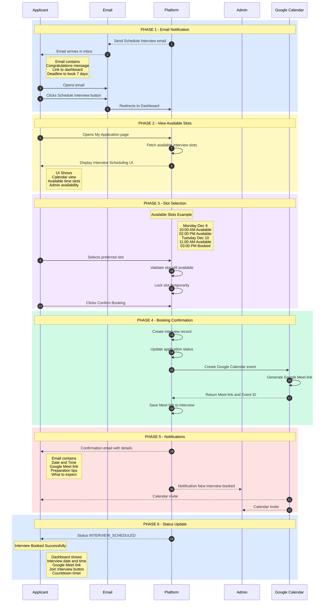
```mermaid
sequenceDiagram
    autonumber
    participant AP as Applicant
    participant E as Email
    participant P as Platform
    participant A as Admin
    participant G as Google Calendar

    rect rgb(219, 234, 254)
        Note over AP,G: PHASE 1 - Email Notification
        P-->>E: Send Schedule Interview email
        E-->>AP: Email arrives in inbox
        Note right of AP: Email contains<br/>Congratulations message<br/>Link to dashboard<br/>Deadline to book 7 days
        AP->>E: Opens email
        AP->>E: Clicks Schedule Interview button
        E->>P: Redirects to Dashboard
    end

    rect rgb(254, 249, 195)
        Note over AP,G: PHASE 2 - View Available Slots
        AP->>P: Opens My Application page
        P->>P: Fetch available interview slots
        P-->>AP: Display Interview Scheduling UI
        Note right of AP: UI Shows<br/>Calendar view<br/>Available time slots<br/>Admin availability
    end

    rect rgb(243, 232, 255)
        Note over AP,G: PHASE 3 - Slot Selection
        Note over P: Available Slots Example
        Note right of P: Monday Dec 9<br/>10:00 AM Available<br/>02:00 PM Available<br/>Tuesday Dec 10<br/>11:00 AM Available<br/>03:00 PM Booked
        AP->>P: Selects preferred slot
        P->>P: Validate slot still available
        P->>P: Lock slot temporarily
        AP->>P: Clicks Confirm Booking
    end

    rect rgb(209, 250, 229)
        Note over AP,G: PHASE 4 - Booking Confirmation
        P->>P: Create interview record
        P->>P: Update application status
        P->>G: Create Google Calendar event
        G->>G: Generate Google Meet link
        G-->>P: Return Meet link and Event ID
        P->>P: Save Meet link to interview
    end

    rect rgb(254, 226, 226)
        Note over AP,G: PHASE 5 - Notifications
        P-->>AP: Confirmation email with details
        Note right of AP: Email contains<br/>Date and Time<br/>Google Meet link<br/>Preparation tips<br/>What to expect
        P-->>A: Notification New interview booked
        G-->>AP: Calendar invite
        G-->>A: Calendar invite
    end

    rect rgb(219, 234, 254)
        Note over AP,G: PHASE 6 - Status Update
        P-->>AP: Status INTERVIEW_SCHEDULED
        Note over AP: Interview Booked Successfully
        Note right of AP: Dashboard shows<br/>Interview date and time<br/>Google Meet link<br/>Join Interview button<br/>Countdown timer
    end
```

### Interview Slot Details

| Field | Description | Example |
|-------|-------------|---------|
| Date | Interview date | December 9, 2024 |
| Time | Interview time (Europe/Berlin) | 10:00 AM |
| Duration | Fixed duration | 30 minutes |
| Platform | Video call platform | Google Meet |
| Status | Slot status | AVAILABLE / BOOKED |

### Email Templates

**Interview Scheduled - Applicant Email:**
```
Subject: 🎥 Interview Scheduled - [Date] at [Time]

Hi [Applicant Name],

Your interview has been successfully scheduled!

📅 Date: [Day], [Date]
🕐 Time: [Time] (Europe/Berlin timezone)
⏱️ Duration: 30 minutes

🔗 Join via Google Meet:
[Google Meet Link]

📝 What to Prepare:
• Brief introduction about yourself
• Your teaching experience and methodology
• Questions about the platform

💡 Tips:
• Join 5 minutes early
• Test your audio/video beforehand
• Have a stable internet connection

Good luck! 🍀

Best regards,
The Tutoring Platform Team
```

**Interview Booked - Admin Notification:**
```
Subject: 📅 New Interview Booked - [Applicant Name]

New interview scheduled:

👤 Applicant: [Name]
📧 Email: [Email]
📅 Date: [Date] at [Time]
🔗 Meet Link: [Link]

View application: [Dashboard Link]
```

---

## 2.3 Tutor Gets Approved After Interview

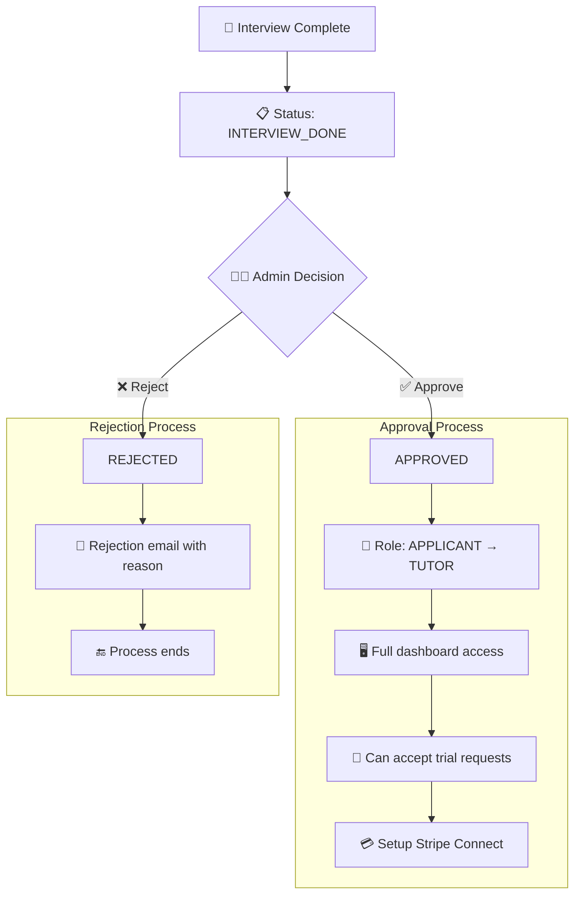
```mermaid
flowchart TD
    A[🎥 Interview Complete] --> B[📋 Status: INTERVIEW_DONE]

    B --> C{👨‍💼 Admin Decision}

    C -->|✅ Approve| D[APPROVED]
    subgraph Approved[Approval Process]
        D --> D1[👤 Role: APPLICANT → TUTOR]
        D1 --> D2[🖥️ Full dashboard access]
        D2 --> D3[🔔 Can accept trial requests]
        D3 --> D4[💳 Setup Stripe Connect]
    end

    C -->|❌ Reject| E[REJECTED]
    subgraph Rejected[Rejection Process]
        E --> E1[📧 Rejection email with reason]
        E1 --> E2[🔚 Process ends]
    end
```

---

## 2.4 Tutor Dashboard Overview (After Approval)

> Approve হওয়ার পরে Tutor মূল Dashboard এ যাবে

### Dashboard Navigation

```mermaid
flowchart LR
    subgraph Dashboard[👨‍🏫 Tutor Dashboard]
        A[🏠 Overview] --> B[📅 Sessions]
        B --> C[👨‍🎓 Students]
        C --> D[💬 Messages]
        D --> E[💰 Earnings]
        E --> F[👤 Profile]
    end

    G[🔔 Notifications] -.-> Dashboard
    H[🆘 Support] -.-> Dashboard
```

### Dashboard Pages Overview

| Page     | কি দেখবে                               | কি করতে পারবে                  |
| -------- | -------------------------------------- | ------------------------------ |
| Overview | Level, Stats, Earnings, Trial Requests | Accept requests, Quick actions |
| Sessions | Upcoming & Completed sessions          | Join, Give feedback            |
| Students | All connected students                 | View progress, Message         |
| Messages | All student conversations              | Chat, Propose session          |
| Earnings | Monthly earnings, Payout history       | View breakdown, Download       |
| Profile  | Personal & Teaching info               | Edit profile                   |

---

### 🏠 Overview Page (Main Dashboard)

#### Page Structure

```mermaid
flowchart TD
    A[Overview Page] --> B[Section 1: Level Progress]
    A --> C[Section 2: Quick Stats]
    A --> D[Section 3: New Trial Requests]
    A --> E[Section 4: Upcoming Sessions]
    A --> F[Section 5: Recent Earnings]
```

---

### 📝 Student Feedback (After Session)

> Session complete হওয়ার পরে Tutor student কে feedback দিতে পারবে

#### Feedback Flow

```mermaid
flowchart TD
    A[Session Completed] --> B[Feedback Prompt]

    B --> C[Feedback Modal Opens]

    subgraph Feedback[📝 Student Feedback]
        C --> D[Step 1: Rating]
        D --> D1[⭐ Overall Progress 1-5]
        D1 --> D2[⭐ Engagement 1-5]
        D2 --> D3[⭐ Understanding 1-5]

        D3 --> E[Step 2: Voice Feedback]
        E --> E1{Record Voice?}
        E1 -->|Yes| E2[🎤 Record up to 60 sec]
        E1 -->|Skip| E3[Skip Audio]

        E2 --> F[Step 3: Text Notes]
        E3 --> F
        F --> F1[📝 Write feedback notes]
    end

    F1 --> G[Submit Feedback]
    G --> H[✅ Success Modal]
    H --> I[Student sees feedback]
```

## 2.5 Tutor Views & Accepts Trial Requests

> Tutor Dashboard এ Trial Requests page এ যাবে matching requests দেখতে

### Page Structure

```mermaid
flowchart TD
    A[Trial Requests Page] --> B[Tab 1: Open Requests]
    A --> C[Tab 2: Accepted Requests]

    B --> D[Show Top 9 Matching Requests]
    D --> E[No Pagination - Only Best Matches]

    C --> F[List of Accepted Students]
```

### Accept Flow

```mermaid
flowchart TD
    A[Click "View Details"] --> B[Modal Opens]

    B --> C[See Student Info]
    C --> D[Read Learning Goal]
    D --> E[Write Introduction Message]

    E --> F{Decision}

    F -->|Accept & Send| G[Request Accepted]
    subgraph Success[Success Actions]
        G --> G1[Introduction sent to student]
        G1 --> G2[Chat auto opens]
        G2 --> G3[Can schedule first session]
    end

    F -->|Decline| H[Request Hidden]
    H --> I[See other requests]
```

### Session Status Flow

```mermaid
flowchart LR
    A[⏳ Awaiting Your Response] --> B[📅 Scheduled]
    B --> C[🟢 Starting Soon]
    C --> D[🔵 In Progress]
    D --> E[📝 Leave a Review]
    E --> F[⏳ Review Submitted]
    F --> G[✅ Completed]

    A -->|Decline| H[❌ Declined]
    B -->|Reschedule| A
    C -->|No one joins| I[⚠️ Expired]
    D -->|No one joins| I
```

**Review Flow:**

- Session শেষ হলে → "Leave a Review" দেখাবে
- Review দিলে → "Review Submitted" (অন্যজনের জন্য wait করবে)
- দুইজনই review দিলে → "Completed" হবে
- কেউ join না করলে → "Expired" হবে

### Status Types

| Status                 | Icon | Meaning                                  | Action Available          |
| ---------------------- | ---- | ---------------------------------------- | ------------------------- |
| Awaiting Your Response | ⏳   | Student proposed time, waiting for tutor | Accept/Reschedule/Decline |
| Scheduled              | 📅   | Session confirmed                        | View details              |
| Starting Soon          | 🟢   | 10 min before session                    | Join Session button       |
| In Progress            | 🔵   | Session is live                          | Join Session button       |
| Leave a Review         | 📝   | Session ended, waiting for your review   | Leave Review button       |
| Review Submitted       | ⏳   | You reviewed, waiting for other person   | View your review          |
| Completed              | ✅   | Both reviewed                            | View reviews              |
| Expired                | ⚠️   | No one joined the session                | -                         |
| Declined               | ❌   | Tutor declined                           | -                         |

---

---

### Status: ⏳ Awaiting Your Response

> Student proposed a date/time, tutor needs to respond

**Actions:**

- **Accept** → Session scheduled, Google Meet link created
- **Reschedule** → Propose new date/time
- **Decline** → Cancel this session request

---

### Session Status Reference

```
┌─────────────────────────────────────────────────────────────────┐
│  SESSION STATUS TYPES                                           │
├─────────────────────────────────────────────────────────────────┤
│                                                                  │
│  📅 Scheduled ────────── Session confirmed by both parties      │
│                                                                  │
│  🟢 Starting Soon ────── 10 minutes before session starts       │
│                                                                  │
│  🔵 In Progress ──────── Session is currently live              │
│                                                                  │
│  📝 Leave a Review ───── Session শেষ, review দিতে হবে            │
│                                                                  │
│  ⏳ Review Submitted ─── অন্যজনের review এর জন্য wait করছেন     │
│                                                                  │
│  ✅ Completed ─────────── দুইজনই review দিয়েছে, session complete │
│                                                                  │
│  ⚠️ Expired ───────────── কেউ session এ join করেনি              │
│                                                                  │
└─────────────────────────────────────────────────────────────────┘
```

---

### Session Scheduling Flow (Complete)

```mermaid
sequenceDiagram
    participant S as Student
    participant P as Platform
    participant T as Tutor

    rect rgb(240, 248, 255)
        Note over S,T: 📝 PROPOSAL PHASE
        S->>P: Proposes date/time
        P->>T: Awaiting Response
    end

    Note over S,T: 🤔 TUTOR DECISION

    rect rgb(220, 255, 220)
        Note over S,T: ✅ Option 1: Tutor Accepts
        T->>P: Accept
        P->>P: Create Meet link
        P-->>S: Session Scheduled!
        P-->>T: Scheduled
    end

    rect rgb(255, 245, 200)
        Note over S,T: 🔄 Option 2: Tutor Reschedules
        T->>P: New time
        P-->>S: New time proposed
        S->>P: Accepts
    end

    rect rgb(255, 220, 220)
        Note over S,T: ❌ Option 3: Tutor Declines
        T->>P: Decline
        P-->>S: Declined
    end

    rect rgb(230, 255, 230)
        Note over S,T: 🟢 STARTING SOON (10 min before)
        P-->>T: Join button active
        P-->>S: Join button active
    end

    Note over S,T: 🔵 SESSION & REVIEW

    rect rgb(220, 255, 220)
        Note over S,T: ✅ Both Join - Session Happens
        Note right of P: Session in progress
        P->>T: In Progress
        P->>S: In Progress
        Note right of P: Session ends
        T->>P: Review student
        S->>P: Review tutor
        P-->>T: Completed
        P-->>S: Completed
    end

    rect rgb(255, 220, 220)
        Note over S,T: ❌ No One Joins - Session Expires
        P-->>T: Expired
        P-->>S: Expired
    end
```

---

---

---

## 2.6 Tutor Teaches a Student

```mermaid
flowchart TD
    A[💬 Chat with student] --> B[🖱️ Click "Propose Session"]

    subgraph Propose[Session Proposal]
        B --> B1[📅 Select Date]
        B1 --> B2[🕐 Select Time]
        B2 --> B3[⏱️ Duration: 1 hour - Fixed]
    end

    B3 --> C{Student accepts?}

    C -->|✅ Yes| D[Session Scheduled]
    subgraph Scheduled[Session Scheduled]
        D --> D1[🔗 Google Meet link created]
        D1 --> D2[🔔 Both notified]
    end

    C -->|❌ No| E[💬 Propose new time]

    D2 --> F[🎥 Join & teach session]
    F --> G[🏁 Session Complete]
    G --> H[⭐ Student reviews]
    H --> I[📊 Rating updated]
```

### Text Flow

```
Chat এ Student এর সাথে কথা বলে
    │
    ▼
"Propose Session" করে
    • Date
    • Time
    • Duration: 1 hour (Fixed)
    │
    ▼
Student Accept করলে
    │
    ▼
Session Scheduled
    • Google Meet link auto create
    │
    ▼
Session Time এ Join করে
    │
    ▼
Session Complete
    │
    ▼
Student Review দেয়
    │
    ▼
Tutor এর Rating Update হয়
```

---

## 2.7 Tutor Gets Paid Monthly

```mermaid
flowchart TD
    subgraph Month[📅 Throughout the month]
        A1[Session 1 - 1hr]
        A2[Session 2 - 1hr]
        A3[Session 3 - 1hr]
        A4[... more sessions - each 1hr]
    end

    A1 & A2 & A3 & A4 --> B[🗓️ Month End - 1st]

    B --> C[System calculates]
    subgraph Calculate[Calculation]
        C --> C1[📊 Total hours: 30]
        C1 --> C2[💰 Gross: 30 × €28 = €840]
        C2 --> C3[📉 Commission 20%: -€168]
        C3 --> C4[✅ Net payout: €672]
    end

    C4 --> D[📋 Payout record created]
    D --> E[🗓️ 5th of next month]
    E --> F[💳 Stripe transfer]
    F --> G[🏦 Money in bank account]
```

### Example Calculation

| Item               | Amount   |
| ------------------ | -------- |
| 30 hours taught    | -        |
| Gross (30 × €28)   | €840     |
| Commission (20%)   | -€168    |
| **Tutor Receives** | **€672** |

---

## 2.8 Tutor Dashboard Pages

| Page          | কি দেখবে                              | কি করতে পারবে              |
| ------------- | ------------------------------------- | -------------------------- |
| Home          | Stats, New requests, Today's sessions | Quick actions              |
| Requests      | All trial requests                    | Accept, Skip, View         |
| Chats         | Student conversations                 | Message, Propose session   |
| Sessions      | Upcoming & Completed                  | Join, View details         |
| Earnings      | Monthly earnings, Payout history      | View, Download             |
| Profile       | Public profile                        | Edit info, Add subjects    |
| Notifications | All notifications                     | Mark read, Click to action |
| Support       | Report, FAQ                           | Submit ticket              |
| Resources     | Open source learning materials        | Search, View               |

---

### 2.7.1 Earnings Page

> প্রতি মাসের earnings table এ দেখাবে, download করতে পারবে

#### Monthly Earnings Table Columns

| Column     | Description                        |
| ---------- | ---------------------------------- |
| Month      | কোন মাস                            |
| Hours      | সেই মাসে কত ঘন্টা পড়িয়েছে        |
| Gross      | মোট আয় (Hours × Hourly Rate)      |
| Commission | Platform এর 20% কমিশন              |
| Net Earned | Tutor যা পাবে (Gross - Commission) |
| Status     | 🟡 Pending / ✅ Paid               |

---

### 2.7.2 Support Page (Direct Admin Chat)

> Tutor এর জন্য support - Report submit করলে Admin Dashboard এ যাবে এবং Admin directly chat করে issue solve করবে।

#### Support Flow

```mermaid
flowchart TD
    A[Tutor clicks Support] --> B[Support Page Opens]

    B --> C[Select Issue Type]
    C --> C1[💰 Payout Issue]
    C --> C2[👨‍🎓 Student Issue]
    C --> C3[🔧 Technical Issue]
    C --> C4[❓ Other]

    C1 & C2 & C3 & C4 --> D[Fill Report Form]
    D --> E[Submit Report]
    E --> F[Report goes to Admin Dashboard]

    F --> G[Admin sees report in Reports page]
    G --> H[Admin opens chat with Tutor]
    H --> I[Direct chat to solve issue]
    I --> J[Issue Resolved]
    J --> K[Mark as Resolved]
```

#### Report Categories (Tutor)

| Category            | Description                              |
| ------------------- | ---------------------------------------- |
| 💰 Payout Issue     | Payout not received, wrong amount, bank details |
| 👨‍🎓 Student Issue    | Problems with specific student           |
| 🔧 Technical Issue  | App/website not working properly         |
| ❓ Other            | Any other issues                         |

#### Data Flow

```mermaid
flowchart LR
    subgraph Tutor[Tutor Side]
        A[Tutor] --> B[Submit Report]
    end

    subgraph Backend[System]
        B --> C[(Reports DB)]
    end

    subgraph Admin[Admin Side]
        C --> D[Admin Dashboard]
        D --> E[Reports Page]
        E --> F[Open Chat]
        F --> G[Solve via Chat]
    end

    G --> H[Mark Resolved]
```

#### FAQs (Tutor)

| Question | Answer |
|----------|--------|
| When will I receive my payout? | 5th of each month |
| How is commission calculated? | 20% platform fee from gross earnings |
| How do I level up? | Complete more lessons to increase hourly rate |
| What if student doesn't show? | Report and session will be credited |

---

### 2.7.3 Resources Page

> Tutor এর জন্য teaching resources (Same as Student - Open source database)

---

# 3. Admin Journey

## 3.1 Admin Daily Responsibilities

| Task                | Frequency      | Priority |
| ------------------- | -------------- | -------- |
| Review applications | Daily          | High     |
| Schedule interviews | Daily          | High     |
| Conduct interviews  | As scheduled   | High     |
| Monitor platform    | Daily          | Medium   |
| Handle issues       | As needed      | Medium   |
| Generate reports    | Weekly/Monthly | Low      |

---

## 3.2 Admin Reviews Tutor Applications

```mermaid
flowchart TD
    A[📥 New Application arrives] --> B[👨‍💼 Admin reviews]

    subgraph Review[Review Process]
        B --> B1[📄 Check CV]
        B1 --> B2[🎓 Verify Abitur certificate]
        B2 --> B3[📜 Check other certificates]
        B3 --> B4[📝 Review experience]
    end

    B4 --> C{Decision}

    C -->|✅ Good| D[Accept Application]
    subgraph Accept[Acceptance]
        D --> D1[📧 Email sent to applicant]
        D1 --> D2[📅 Can schedule interview]
    end

    C -->|❌ Not Good| E[Reject Application]
    subgraph Reject[Rejection]
        E --> E1[📝 Write rejection reason]
        E1 --> E2[📧 Email sent to applicant]
    end
```

---

## 3.3 Admin Conducts Tutor Interviews

```mermaid
flowchart TD
    A["👨‍💼 Admin creates interview slots
    when he is free to take interviews"] --> Slots

subgraph Slots["Admin’s Available Interview Slots (set from Admin Dashboard)"]
    B[📅 Admin selects available time slots]
    B --> B1[🕒 Date & Time]
end


    Slots --> C[📋 Approved applicants see slots]
    C --> D[🖱️ Applicant books a slot]
    D --> E[🔔 Admin gets notification]
    E --> F[🎥 Interview on Google Meet]

    F --> G{👨‍💼 Decision}

    G -->|✅ Approve| Approve
    subgraph Approve[Approval]
        H[Applicant becomes Tutor]
        H --> H1[👤 Role changed to TUTOR]
        H1 --> H2[📧 Welcome email sent]
    end

    G -->|❌ Reject| RejectFlow
    subgraph RejectFlow[Rejection]
        I[Application rejected]
        I --> I1[📝 Reason documented]
        I1 --> I2[📧 Rejection email sent]
    end
```

---

## 3.4 Admin Manages Users (Students & Tutors)

```mermaid
flowchart TD
    subgraph Students[👨‍🎓 Students Management]
        A1[📋 View student list] --> A2[🔍 Search/Filter]
        A2 --> A3[👁️ View details]
        A3 --> A4{Action}
        A4 --> A5[🚫 Block student]
        A4 --> A6[✅ Unblock student]
        A4 --> A7[📊 View sessions]
        A4 --> A8[💳 View payments]
    end

    subgraph Tutors[👨‍🏫 Tutors Management]
        B1[📋 View tutor list] --> B2[🔍 Search/Filter]
        B2 --> B3[👁️ View details]
        B3 --> B4{Action}
        B4 --> B5[🚫 Block tutor]
        B4 --> B6[✅ Unblock tutor]
        B4 --> B7[📊 View sessions]
        B4 --> B8[💰 View earnings]
        B4 --> B9[⭐ View reviews]
    end
```

---

## 3.5 Admin Dashboard Pages Overview

| Page         | Purpose                                   |
| ------------ | ----------------------------------------- |
| Overview     | Stats, Charts, Recent activity            |
| Students     | List, View, Block/Unblock                 |
| Tutors       | List, View, Block/Unblock                 |
| Sessions     | All sessions, Filter by status            |
| Applications | Review, Accept/Reject, Schedule interview |
| Transactions | Payment history, Payouts                  |
| Meetings     | Interview slots management                |
| **Reports**  | **User reports, Chat with users, Resolve issues** |
| Settings     | Platform settings, Terms, Profile         |

---

## 3.6 Admin Handles Support Reports & Chats with Users

> Student/Tutor থেকে আসা সব reports এখানে দেখাবে এবং Admin chat করে issue solve করবে।

### Reports Flow

```mermaid
flowchart TD
    subgraph Users[User Submits Report]
        A1[Student submits report] --> B
        A2[Tutor submits report] --> B
    end

    B[(Reports DB)] --> C[Admin Dashboard - Reports Page]

    C --> D[View Report Details]
    D --> E[Open Chat with User]
    E --> F[Chat to understand & solve issue]
    F --> G{Issue Solved?}
    G -->|Yes| H[Mark as Resolved]
    G -->|No| F
    H --> I[User gets notification]
```

### Reports Page Features

| Feature | Description |
|---------|-------------|
| All Reports List | সব reports এক জায়গায় |
| Filter by Status | Open, In Progress, Resolved, Closed |
| Filter by Category | Session, Billing, Tutor, Technical, Other |
| Filter by User Type | Student, Tutor |
| Search | Report ID, User name দিয়ে search |
| Priority | High, Medium, Low |

### Report Statuses

| Status | Icon | Meaning |
|--------|------|---------|
| Open | 🔴 | নতুন report, কেউ দেখেনি |
| In Progress | 🟡 | Admin দেখছে/chat করছে |
| Resolved | 🟢 | Issue solved |
| Closed | ⚫ | বন্ধ করা হয়েছে |

### Admin Actions on Report

```mermaid
flowchart LR
    A[View Report] --> B{Actions}
    B --> C[💬 Open Chat]
    B --> D[📋 Assign Priority]
    B --> E[📝 Add Internal Note]
    B --> F[✅ Mark Resolved]
    B --> G[🔄 Reassign]
```

### Chat Flow (Admin Side)

```mermaid
sequenceDiagram
    participant U as User (Student/Tutor)
    participant P as Platform
    participant A as Admin

    U->>P: Submit Report
    P->>A: Notification: New Report
    A->>P: Open Report
    A->>P: Click "Open Chat"
    P->>U: Notification: Admin responded

    loop Chat until resolved
        A->>P: Send message
        P->>U: Show message
        U->>P: Reply
        P->>A: Show reply
    end

    A->>P: Mark as Resolved
    P->>U: Notification: Issue Resolved
```

### Priority Assignment

| Priority | When to use |
|----------|-------------|
| 🔴 High | Payment issue, Tutor no-show, Urgent problems |
| 🟡 Medium | Session quality, Technical issues |
| 🟢 Low | General questions, Minor issues |

### Report Resolution

Admin report resolve করার সময়:
1. Issue কি ছিল তা note করবে
2. কিভাবে solve হলো তা লিখবে
3. Resolution select করবে (Refund, Credit, Warning, etc.)
4. Mark as Resolved করবে
5. User notification পাবে

### Common Resolutions

| Resolution Type | When to use |
|-----------------|-------------|
| Session Credited | Tutor no-show, Session ended early |
| Refund Issued | Billing error, Overcharge |
| Tutor Warning | Quality issue, Late to session |
| Tutor Reassigned | Student requested new tutor |
| Information Provided | FAQ-type question answered |
| No Action Needed | False report, Already resolved |

---

# 4. Key Flows Summary

## 4.1 Student Complete Journey

```mermaid
flowchart LR
    A[📝 Sign Up] --> B[🎯 Request Trial]
    B --> C[✅ Tutor Accepts]
    C --> D[💬 Chat Opens]
    D --> E[📅 Book Session]
    E --> F[🎥 Attend Session]
    F --> G[⭐ Give Review]
    G --> H[💳 Monthly Payment]
```

## 4.2 Tutor Complete Journey

```mermaid
flowchart LR
    A[📝 Apply] --> B[📄 Documents Reviewed]
    B --> C[📅 Interview Scheduled]
    C --> D[🎥 Interview Done]
    D --> E[✅ Approved]
    E --> F[🔔 Accept Requests]
    F --> G[👨‍🏫 Teach]
    G --> H[💰 Get Paid Monthly]
```

## 4.3 Session Lifecycle (Simple)

```mermaid
flowchart LR
    A[📤 Proposed] --> B[✅ Accepted]
    B --> C[📅 Scheduled]
    C --> D[🎥 In Progress]
    D --> E[🏁 Completed]
    E --> F[⭐ Reviewed]
```

---

## 4.4 Complete Session Flow (Detailed)

> পুরো site এ Session কিভাবে handle হয় - শুরু থেকে শেষ পর্যন্ত

### Phase 1: Trial Request থেকে Chat Open

```mermaid
                flowchart LR
    %% Student Section
    subgraph Student[👨‍🎓 Student]
        A[Sign Up] --> B[Create Trial Request]
        B --> C[Select Subject, Grade, School]
    end

    %% Platform Section
    subgraph Platform[🖥️ Platform]
        C --> D[Find Matching Tutors]
        D --> E[Notify Top 9 Tutors]
    end

    %% Tutor Section
    subgraph Tutor[👨‍🏫 Tutor]
        E --> F[Tutor sees request]
        F --> G{Accept?}
        G -->|Yes| H[Write Intro Message]
        G -->|No| I[Skip - next tutor sees]
    end

    %% Chat Section
    H --> J[💬 Chat Opens between Student & Tutor]

    %% Loop for other tutors
    I --> F

    %% Optional: After chat, trial scheduling
    J --> K[Schedule Trial Class]
               
```

### Phase 2: Session Booking (In Chat)

```mermaid
sequenceDiagram
    participant S as 👨‍🎓 Student
    participant P as 🖥️ Platform
    participant T as 👨‍🏫 Tutor

    Note over S,T: 💬 Chat is now open

    rect rgb(240, 255, 240)
        Note over S,T: SESSION PROPOSAL
        S->>T: "Can we do a session on Wednesday?"
        T->>P: Clicks "Schedule Session"
        T->>P: Selects Date & Time
        Note right of T: Duration: 1 hour (Fixed)
        P->>S: Shows session proposal in chat
    end

    Note over S,T: 📋 STUDENT RESPONSE

    rect rgb(220, 255, 220)
        Note over S,T: ✅ Option 1: Student Accepts
        S->>P: Clicks "Accept"
        P->>P: Creates Google Meet link
        P->>T: Session Confirmed!
        P->>S: Session Confirmed!
    end

    rect rgb(255, 220, 220)
        Note over S,T: ❌ Option 2: Student Declines
        S->>P: Clicks "Decline"
        P->>T: Student declined
        T->>P: Can propose new time
    end

    rect rgb(255, 245, 200)
        Note over S,T: 🔄 Option 3: Student Reschedules
        S->>P: Proposes different time
        P->>T: New time proposed
    end
```

### Phase 3: Before Session Starts

```mermaid
flowchart TD
    A[📅 Session Scheduled] --> B[⏰ 24 hours before]
    B --> C[🔔 Reminder notification to both]

    C --> D[⏰ 1 hour before]
    D --> E[🔔 Another reminder to both]

    E --> F[⏰ 10 minutes before]
    F --> G[🟢 Status: Starting Soon]
    G --> H[🔗 Join Session button appears]

    H --> I{Both join?}
    I -->|Yes| J[🎥 Session Starts]
    I -->|No one joins| K[⚠️ Session Expired]
```

### Phase 4: During Session

```mermaid
sequenceDiagram
    participant S as 👨‍🎓 Student
    participant G as 🎥 Google Meet
    participant T as 👨‍🏫 Tutor
    participant P as 🖥️ Platform

    S->>G: Joins Google Meet
    T->>G: Joins Google Meet
    P->>P: Status: 🔵 In Progress

    rect rgb(230, 245, 255)
        Note over S,T: 📚 1 HOUR SESSION
        S->>T: Learning happens
        T->>S: Teaching happens
    end

    Note over G: Session time ends
    G->>S: Meeting ends
    G->>T: Meeting ends
    P->>P: Status: 📝 Leave a Review
```

### Phase 5: After Session - Review Flow

```mermaid
flowchart TD
    A[🏁 Session Ends] --> B[📝 Leave a Review - Both see this]

    B --> C{Who reviews first?}

    C --> D[Person A submits review]
    D --> E[Person A: ⏳ Review Submitted]
    E --> F[Waiting for other person...]

    C --> G[Person B submits review]
    G --> H[Person B: ⏳ Review Submitted]
    H --> I[Waiting for other person...]

    F --> J{Both reviewed?}
    I --> J

    J -->|Yes| K[✅ Session Completed]
    K --> L[Both can see each other's reviews]

    J -->|Timeout| M[Auto-complete after 7 days]
```

### Phase 6: Complete Session State Machine

```mermaid
stateDiagram-v2
    [*] --> Proposed: Tutor proposes session

    Proposed --> Scheduled: Student accepts
    Proposed --> Declined: Student declines
    Proposed --> Rescheduled: Student proposes new time

    Rescheduled --> Scheduled: Both agree on time

    Scheduled --> StartingSoon: 10 min before
    StartingSoon --> InProgress: Both join
    StartingSoon --> Expired: No one joins

    InProgress --> LeaveReview: Session time ends

    LeaveReview --> ReviewSubmitted: One person reviews
    ReviewSubmitted --> Completed: Both reviewed

    LeaveReview --> Completed: Auto-complete (7 days)

    Declined --> [*]
    Expired --> [*]
    Completed --> [*]
```

### Data Flow Summary

```mermaid
flowchart LR
    subgraph Creation[Session Created]
        A[Trial Request] --> B[Tutor Accepts]
        B --> C[Chat Opens]
        C --> D[Session Proposed]
    end

    subgraph Scheduling[Session Scheduled]
        D --> E[Student Accepts]
        E --> F[Google Meet Created]
        F --> G[Calendar Events]
        G --> H[Reminders Scheduled]
    end

    subgraph Execution[Session Happens]
        H --> I[Join Session]
        I --> J[Google Meet]
        J --> K[Session Complete]
    end

    subgraph Review[Reviews & Payment]
        K --> L[Both Review]
        L --> M[Session Completed]
        M --> N[Added to Monthly Bill]
        N --> O[Tutor Gets Paid]
    end
```

### Key Points Summary

| Phase | What Happens | Who Does It |
|-------|--------------|-------------|
| 1. Request | Trial request created | Student |
| 2. Match | Tutor accepts request | Tutor |
| 3. Chat | Chat opens automatically | Platform |
| 4. Propose | Session date/time proposed | Tutor (usually) |
| 5. Accept | Session confirmed | Student |
| 6. Schedule | Google Meet link created | Platform |
| 7. Remind | Notifications sent | Platform |
| 8. Join | Both join session | Both |
| 9. Teach | 1 hour session | Both |
| 10. Review | Rate each other | Both |
| 11. Complete | Session marked done | Platform |
| 12. Bill | Added to monthly invoice | Platform |
| 13. Pay | Student pays monthly | Student |
| 14. Payout | Tutor receives money | Platform |

---

## 4.5 Payment Lifecycle

```mermaid
flowchart LR
    A[📚 Sessions Taken] --> B[🗓️ Month End]
    B --> C[📄 Invoice Generated]
    C --> D[💳 Student Pays]
    D --> E[📋 Tutor Payout Created]
    E --> F[💰 Tutor Receives - 5th]
```

---

# 5. Status Reference

## User Status

### State Diagram

```mermaid
stateDiagram-v2
    [*] --> PENDING_VERIFICATION: 📝 Sign up
    PENDING_VERIFICATION --> ACTIVE: ✅ Email verified
    ACTIVE --> RESTRICTED: 🚫 Admin blocks
    RESTRICTED --> ACTIVE: ✅ Admin unblocks
```

### Status Table

| Status               | Meaning            |
| -------------------- | ------------------ |
| ACTIVE               | Normal user        |
| RESTRICTED           | Blocked by admin   |
| PENDING_VERIFICATION | Email not verified |

## Tutor Application Flow

### State Diagram

```mermaid
stateDiagram-v2
    [*] --> SUBMITTED: 📝 Apply
    SUBMITTED --> DOCUMENTS_REVIEWED: ✅ Admin accepts
    SUBMITTED --> REJECTED: ❌ Admin rejects
    DOCUMENTS_REVIEWED --> INTERVIEW_SCHEDULED: 📅 Books slot
    INTERVIEW_SCHEDULED --> INTERVIEW_DONE: 🎥 Interview complete
    INTERVIEW_DONE --> APPROVED: ✅ Admin approves
    INTERVIEW_DONE --> REJECTED: ❌ Admin rejects
    APPROVED --> [*]: 👨‍🏫 Becomes Tutor
```

### Status Table

| Status              | Phase | Next Step          |
| ------------------- | ----- | ------------------ |
| SUBMITTED           | 1     | Wait for review    |
| DOCUMENTS_REVIEWED  | 2     | Schedule interview |
| INTERVIEW_SCHEDULED | 2     | Attend interview   |
| INTERVIEW_DONE      | 2     | Wait for decision  |
| APPROVED            | 3     | Start teaching!    |
| REJECTED            | -     | End                |

## Session Status

### State Diagram

```mermaid
stateDiagram-v2
    [*] --> PENDING: 📤 Tutor proposes
    PENDING --> SCHEDULED: ✅ Student accepts
    PENDING --> CANCELLED: ❌ Student declines
    SCHEDULED --> IN_PROGRESS: 🎥 Session starts
    SCHEDULED --> CANCELLED: 🚫 Either cancels
    IN_PROGRESS --> COMPLETED: 🏁 Session ends
```

### Status Table

| Status      | Meaning                     |
| ----------- | --------------------------- |
| PENDING     | Proposed, waiting accept    |
| SCHEDULED   | Confirmed, waiting for time |
| IN_PROGRESS | Currently happening         |
| COMPLETED   | Finished                    |
| CANCELLED   | Cancelled by student/tutor  |

## Trial Request Status

### State Diagram

```mermaid
stateDiagram-v2
    [*] --> PENDING: 📝 Student creates
    PENDING --> ACCEPTED: ✅ Tutor accepts
    PENDING --> EXPIRED: ⏰ 24 hours pass
    PENDING --> CANCELLED: ❌ Student cancels
```

### Status Table

| Status    | Meaning           |
| --------- | ----------------- |
| PENDING   | Waiting for tutor |
| ACCEPTED  | Tutor accepted    |
| EXPIRED   | 24 hours passed   |
| CANCELLED | Student cancelled |

---

# 6. Questions for Client

| #   | Question                      | Current Setting / Notes                                      |
| --- | ----------------------------- | ------------------------------------------------------------ |
| 1   | Logo and brand colors?        | Need for UI design - primary, secondary, accent colors       |
| 2   | Maximum subjects per tutor?   | Currently set to 3 subjects max - is this okay?              |
| 3   | Commission percentage?        | Currently 20% platform fee - do you want to change this?     |
| 4   | Tutor payout date?            | Currently 5th of each month - is this okay?                  |
| 5   | Interview duration?           | Currently 30 minutes - is this enough?                       |
| 6   | Cancellation policy details?  | How many hours before session can student/tutor cancel free? |
| 7   | Refund policy?                | Under what conditions should refunds be issued?              |
| 8   | Session reminder timing?      | Currently 24hr and 1hr before - change these?                |
| 9   | Minimum tutor qualifications? | What documents are mandatory? Currently CV + Abitur          |
| 10  | Student age requirements?     | Any minimum age to sign up? Parent consent for minors?       |

## Already Decided

| Setting                  | Value                                    |
| ------------------------ | ---------------------------------------- |
| Trial session duration   | 30 minutes                               |
| Regular session duration | **1 hour (Fixed)**                       |
| Trial request expiry     | 24 hours                                 |
| Session join window      | 15 minutes before                        |
| Pricing plans            | Flexible €30, Regular €28, Long-term €25 |

---

_Document Version: 5.1_
_Last Updated: December 2, 2024_
