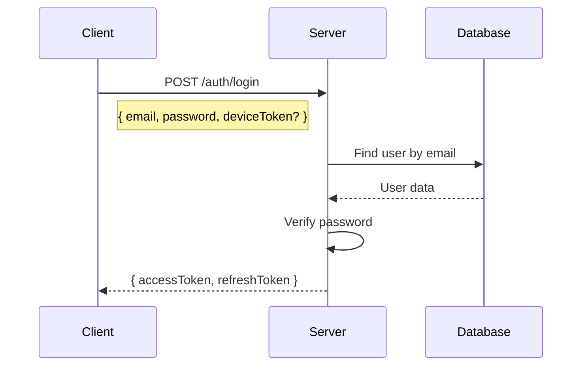
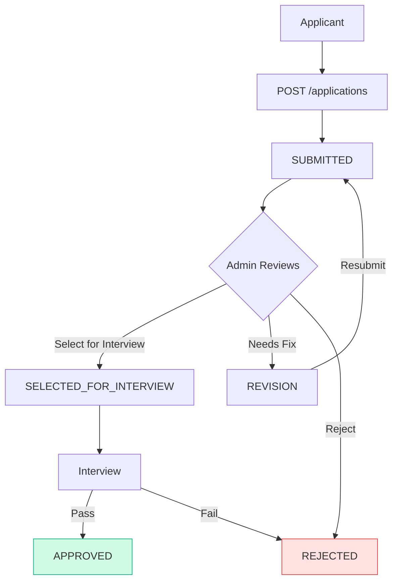
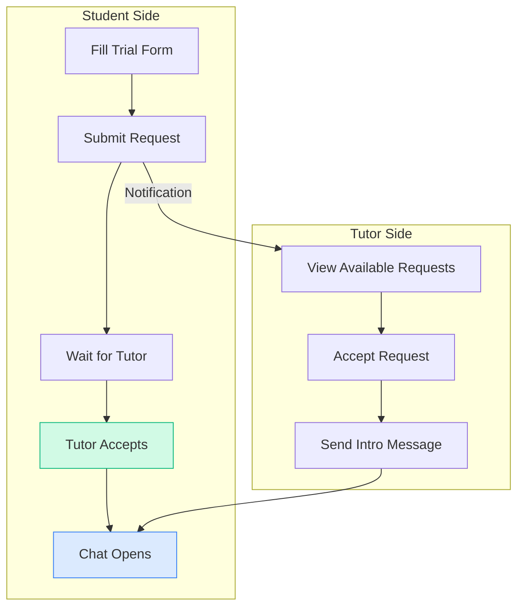
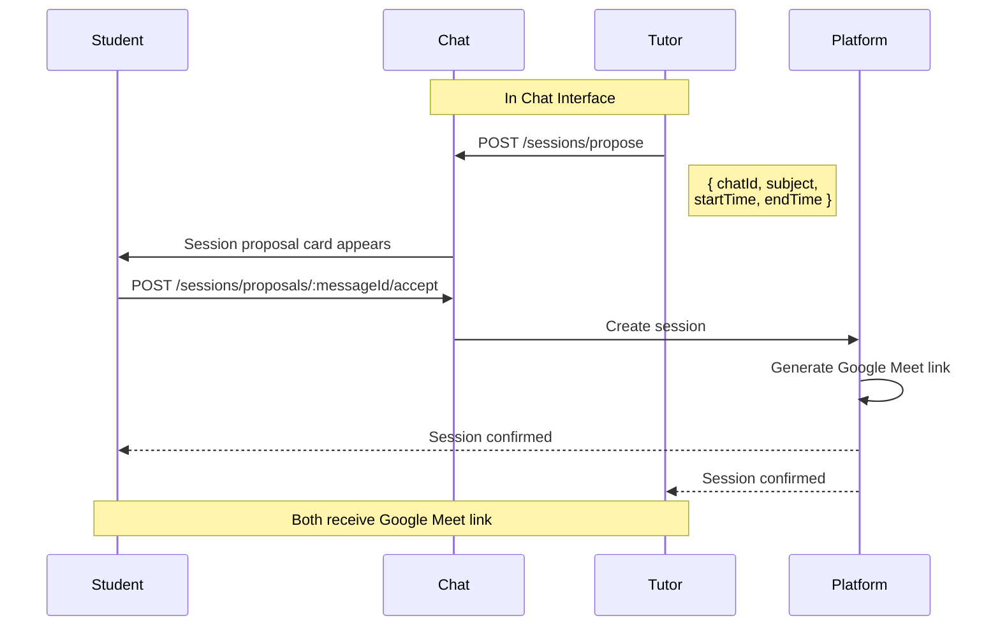
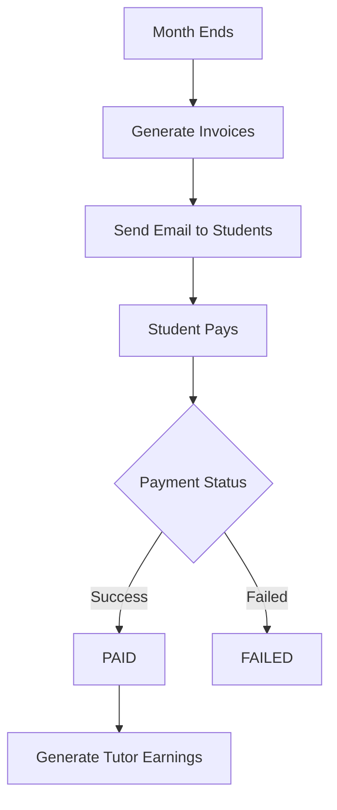
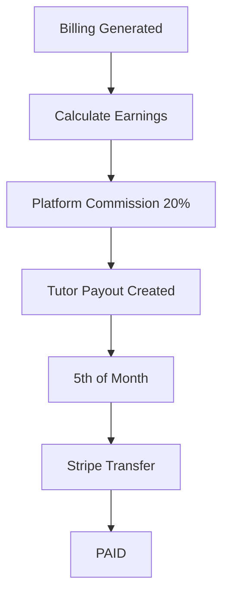

# API Documentation - Tutoring Marketplace

> This document is for Frontend Developers and API Integration.
> Complete API reference with request/response examples.

---

## Base URL

```
https://api.yourdomain.com/api/v1
```

---

# API Overview

## Quick Reference

| Module            | Path               | Description                     |
| ----------------- | ------------------ | ------------------------------- |
| Auth              | `/auth`            | Login, Register, Password Reset |
| User              | `/user`            | Profile, User Management        |
| Subjects          | `/subjects`        | Teaching Subjects               |
| Applications      | `/applications`    | Tutor Applications              |
| Interview Slots   | `/interview-slots` | Interview Scheduling            |
| Trial Requests    | `/trial-requests`  | Uber-style Trial Matching       |
| Session Requests  | `/session-requests`| Session Request Management      |
| Sessions          | `/sessions`        | Tutoring Sessions               |
| Subscriptions     | `/subscriptions`   | Student Plans                   |
| Reviews           | `/reviews`         | Session Reviews                 |
| Tutor Feedback    | `/tutor-feedback`  | Tutor-to-Student Feedback       |
| Chats             | `/chats`           | Chat Management                 |
| Messages          | `/messages`        | Messaging                       |
| Notifications     | `/notifications`   | User Notifications              |
| Payments          | `/payments`        | Stripe Payments                 |
| Billings          | `/billings`        | Monthly Billing                 |
| Earnings          | `/earnings`        | Tutor Payouts                   |
| Admin             | `/admin`           | Admin Dashboard                 |
| Bookmarks         | `/bookmarks`       | User Bookmarks                  |
| Calls             | `/calls`           | Video Call Management           |
| Whiteboard        | `/whiteboard`      | Whiteboard Sessions             |

---

## Authentication

All protected endpoints require JWT token in header:

```
Authorization: Bearer <access_token>
```

### User Roles

| Role      | Code          | Description              |
| --------- | ------------- | ------------------------ |
| Student   | `STUDENT`     | Users who learn          |
| Tutor     | `TUTOR`       | Approved instructors     |
| Applicant | `APPLICANT`   | Pending tutor applicants |
| Admin     | `SUPER_ADMIN` | Platform administrators  |

---

# 1. Authentication API — /auth

## 1.1 Login



### Request

```
POST /api/v1/auth/login
Content-Type: application/json
```

```json
{
  "email": "student@example.com",
  "password": "password123",
  "deviceToken": "optional_device_token_for_push_notifications"
}
```

### Response (200 OK)

```json
{
  "success": true,
  "statusCode": 200,
  "message": "User logged in successfully.",
  "data": {
    "accessToken": "eyJhbGciOiJIUzI1NiIsInR5cCI6IkpXVCJ9...",
    "refreshToken": "eyJhbGciOiJIUzI1NiIsInR5cCI6IkpXVCJ9..."
  }
}
```

### Error Cases

| Status | Message |
|--------|---------|
| 400 | User doesn't exist! |
| 400 | Please verify your account, then try to login again |
| 400 | Your account has been deactivated. Contact support. |
| 400 | Password is incorrect |

---

## 1.2 All Auth Endpoints

| Method | Endpoint               | Description               | Access        |
| ------ | ---------------------- | ------------------------- | ------------- |
| POST   | `/login`               | User login                | Public        |
| POST   | `/logout`              | User logout               | Authenticated |
| POST   | `/forget-password`     | Request password reset    | Public        |
| POST   | `/verify-email`        | Verify email with OTP     | Public        |
| POST   | `/reset-password`      | Reset password with token | Public        |
| POST   | `/change-password`     | Change password           | Authenticated |
| POST   | `/resend-verify-email` | Resend verification       | Public        |
| POST   | `/refresh-token`       | Get new access token      | Public        |

### Logout

```
POST /api/v1/auth/logout
Authorization: Bearer <token>
```

```json
{
  "deviceToken": "device_token_to_remove"
}
```

**Response (200 OK):**
```json
{
  "success": true,
  "statusCode": 200,
  "message": "User logged out successfully."
}
```

### Forget Password

```
POST /api/v1/auth/forget-password
```

```json
{
  "email": "user@example.com"
}
```

**Response (200 OK):**
```json
{
  "success": true,
  "statusCode": 200,
  "message": "Please check your email. We have sent you a one-time passcode (OTP).",
  "data": null
}
```

### Verify Email

```
POST /api/v1/auth/verify-email
```

```json
{
  "email": "user@example.com",
  "oneTimeCode": 123456
}
```

> **Note:** `oneTimeCode` is a number (6-digit OTP), NOT a string token.

**Response (200 OK) - For New Email Verification:**
```json
{
  "success": true,
  "statusCode": 200,
  "message": "Email verify successfully",
  "data": null
}
```

**Response (200 OK) - For Password Reset Flow:**
```json
{
  "success": true,
  "statusCode": 200,
  "message": "Verification Successful: Please securely store and utilize this code for reset password",
  "data": "crypto_reset_token_string"
}
```

### Reset Password

```
POST /api/v1/auth/reset-password
Authorization: <reset_token_from_verify_email>
```

> **Important:** The reset token goes directly in the Authorization header (NOT as Bearer token).

```json
{
  "newPassword": "newPassword123",
  "confirmPassword": "newPassword123"
}
```

### Change Password

```
POST /api/v1/auth/change-password
Authorization: Bearer <token>
```

```json
{
  "currentPassword": "oldPassword123",
  "newPassword": "newPassword456",
  "confirmPassword": "newPassword456"
}
```

### Resend Verify Email

```
POST /api/v1/auth/resend-verify-email
```

```json
{
  "email": "user@example.com"
}
```

### Refresh Token

```
POST /api/v1/auth/refresh-token
```

Token can be sent via:
1. **httpOnly Cookie** (preferred) - automatically sent
2. **Request Body:**
```json
{
  "refreshToken": "eyJhbGciOiJIUzI1NiIsInR5cCI6IkpXVCJ9..."
}
```

**Response (200 OK):**
```json
{
  "success": true,
  "statusCode": 200,
  "message": "Token refreshed successfully.",
  "data": {
    "accessToken": "new_jwt_token",
    "refreshToken": "new_jwt_token"
  }
}
```

---

# 2. User API — /user

## 2.1 User Registration

```
POST /api/v1/user
Content-Type: multipart/form-data
```

**Rate Limit:** 20 requests per minute

| Field          | Type   | Required | Description                              |
| -------------- | ------ | -------- | ---------------------------------------- |
| name           | string | Yes      | Full name (min 2 chars)                  |
| email          | string | Yes      | Valid email address                      |
| password       | string | Yes      | 8+ chars, uppercase, lowercase, number, special char |
| phone          | string | No       | 7-15 digits                              |
| gender         | string | No       | "male" or "female"                       |
| dateOfBirth    | string | No       | Date of birth                            |
| location       | string | No       | Location                                 |
| role           | string | No       | "STUDENT" (default) or "TUTOR"           |
| profilePicture | file   | No       | Profile image                            |

**Response (201 Created):**
```json
{
  "success": true,
  "statusCode": 201,
  "message": "User created successfully",
  "data": {
    "_id": "user_123",
    "name": "Ahmed Khan",
    "email": "ahmed@example.com",
    "role": "STUDENT",
    "status": "ACTIVE",
    "verified": false,
    "studentProfile": {
      "hasUsedFreeTrial": false,
      "hasCompletedTrial": false,
      "trialRequestsCount": 0,
      "sessionRequestsCount": 0,
      "totalHoursTaken": 0,
      "totalSpent": 0
    }
  }
}
```

## 2.2 User Profile Endpoints

| Method | Endpoint         | Description            | Access                    |
| ------ | ---------------- | ---------------------- | ------------------------- |
| GET    | `/profile`       | Get own profile        | STUDENT, TUTOR, ADMIN     |
| PATCH  | `/profile`       | Update own profile     | STUDENT, TUTOR, ADMIN     |
| GET    | `/my-statistics` | Get tutor statistics   | TUTOR only                |

### Get Own Profile

```
GET /api/v1/user/profile
Authorization: Bearer <token>
```

**Response:**

```json
{
  "success": true,
  "data": {
    "_id": "user_123",
    "name": "Ahmed Khan",
    "email": "ahmed@example.com",
    "role": "STUDENT",
    "phone": "+49 123 456789",
    "profilePicture": "https://...",
    "studentProfile": {
      "currentPlan": "REGULAR",
      "hasUsedFreeTrial": true,
      "hasCompletedTrial": true,
      "trialRequestsCount": 1,
      "sessionRequestsCount": 5,
      "totalHoursTaken": 12,
      "totalSpent": 336.0
    }
  }
}
```

### Update Profile

```
PATCH /api/v1/user/profile
Authorization: Bearer <token>
Content-Type: multipart/form-data
```

| Field          | Type   | Description     |
| -------------- | ------ | --------------- |
| name           | string | Full name       |
| email          | string | Email address   |
| phone          | string | Phone number    |
| profilePicture | file   | Profile image   |
| dateOfBirth    | string | Date of birth   |
| gender         | string | male/female     |
| location       | string | Location        |

### Get Tutor Statistics (Tutor Only)

```
GET /api/v1/user/my-statistics
Authorization: Bearer <token>
```

**Response:**

```json
{
  "success": true,
  "data": {
    "currentLevel": "INTERMEDIATE",
    "sessionsToNextLevel": 15,
    "nextLevel": "EXPERT",
    "totalSessions": 35,
    "completedSessions": 35,
    "totalHoursTaught": 42,
    "totalStudents": 12,
    "averageRating": 4.7,
    "ratingsCount": 28,
    "totalEarnings": 840.0,
    "pendingEarnings": 120.0,
    "pendingFeedbackCount": 2,
    "overdueFeedbackCount": 0
  }
}
```

### Tutor Level System

| Level        | Required Sessions | Benefits                |
| ------------ | ----------------- | ----------------------- |
| STARTER      | 0-20 sessions     | Basic profile           |
| INTERMEDIATE | 21-50 sessions    | Priority matching       |
| EXPERT       | 51+ sessions      | Featured listing, badge |

## 2.3 Admin User Management

| Method | Endpoint                    | Description             | Access |
| ------ | --------------------------- | ----------------------- | ------ |
| GET    | `/`                         | Get all users           | Admin  |
| GET    | `/:id`                      | Get user by ID (admin)  | Admin  |
| GET    | `/:id/user`                 | Get public user details | Public (Rate Limited 60/min) |
| PATCH  | `/:id/block`                | Block user              | Admin  |
| PATCH  | `/:id/unblock`              | Unblock user            | Admin  |
| GET    | `/students`                 | Get all students        | Admin  |
| PATCH  | `/students/:id/block`       | Block student           | Admin  |
| PATCH  | `/students/:id/unblock`     | Unblock student         | Admin  |
| GET    | `/tutors`                   | Get all tutors          | Admin  |
| PATCH  | `/tutors/:id/block`         | Block tutor             | Admin  |
| PATCH  | `/tutors/:id/unblock`       | Unblock tutor           | Admin  |
| PATCH  | `/tutors/:id/subjects`      | Update tutor subjects   | Admin  |

### Update Tutor Subjects (Admin Only)

```
PATCH /api/v1/user/tutors/:id/subjects
Authorization: Bearer <admin_token>
```

```json
{
  "subjects": ["subject_id_1", "subject_id_2", "subject_id_3"]
}
```

---

# 3. Subject API — /subjects

## 3.1 Subject Endpoints

| Method | Endpoint      | Description         | Access |
| ------ | ------------- | ------------------- | ------ |
| GET    | `/active`     | Get active subjects | Public |
| GET    | `/`           | Get all subjects    | Public |
| GET    | `/:subjectId` | Get single subject  | Public |
| POST   | `/`           | Create subject      | Admin  |
| PATCH  | `/:subjectId` | Update subject      | Admin  |
| DELETE | `/:subjectId` | Delete subject      | Admin  |

### Get Active Subjects

```
GET /api/v1/subjects/active
```

**Response:**

```json
{
  "success": true,
  "data": [
    {
      "_id": "subject_1",
      "name": "Mathematics",
      "isActive": true,
      "createdAt": "2024-01-15T10:00:00.000Z",
      "updatedAt": "2024-01-15T10:00:00.000Z"
    }
  ]
}
```

### Create Subject (Admin)

```
POST /api/v1/subjects
Authorization: Bearer <admin_token>
```

```json
{
  "name": "Chemistry"
}
```

---

# 4. Tutor Application API — /applications

## 4.1 Application Flow



## 4.2 Application Endpoints

| Method | Endpoint                    | Description            | Access    |
| ------ | --------------------------- | ---------------------- | --------- |
| POST   | `/`                         | Submit application     | Public    |
| GET    | `/my-application`           | Get own application    | Applicant |
| GET    | `/`                         | Get all applications   | Admin     |
| GET    | `/:id`                      | Get single application | Admin     |
| PATCH  | `/:id/select-for-interview` | Select for interview   | Admin     |
| PATCH  | `/:id/approve`              | Approve application    | Admin     |
| PATCH  | `/:id/reject`               | Reject application     | Admin     |
| PATCH  | `/:id/revision`             | Request revision       | Admin     |
| DELETE | `/:id`                      | Delete application     | Admin     |

### Submit Application

```
POST /api/v1/applications
Content-Type: multipart/form-data
```

| Field               | Type   | Required | Description                    |
| ------------------- | ------ | -------- | ------------------------------ |
| name                | string | Yes      | Full name (min 2 chars)        |
| email               | string | Yes      | Email address                  |
| password            | string | Yes      | 8+ chars with complexity       |
| birthDate           | string | Yes      | Date of birth                  |
| phone               | string | Yes      | Phone number (min 5 chars)     |
| street              | string | Yes      | Street name (min 2 chars)      |
| houseNumber         | string | Yes      | House number                   |
| zipCode             | string | Yes      | ZIP code (min 4 chars)         |
| city                | string | Yes      | City (min 2 chars)             |
| subjects            | array  | Yes      | Subject IDs (min 1)            |
| cv                  | string | Yes      | CV document URL                |
| abiturCertificate   | string | Yes      | Abitur certificate URL         |
| officialIdDocument  | string | Yes      | Official ID URL                |

**Response (201 Created):**

```json
{
  "success": true,
  "statusCode": 201,
  "message": "Application submitted successfully",
  "data": {
    "_id": "app_123",
    "status": "SUBMITTED",
    "createdAt": "2024-12-01T10:00:00Z"
  }
}
```

### Application Status Values

| Status                    | Description                                    |
| ------------------------- | ---------------------------------------------- |
| `SUBMITTED`               | Application received                           |
| `REVISION`                | Admin requests changes to documents            |
| `SELECTED_FOR_INTERVIEW`  | Admin selected after initial review            |
| `APPROVED`                | Approved after interview, user becomes TUTOR   |
| `REJECTED`                | Application rejected                           |

**Status Flow:**
```
SUBMITTED → SELECTED_FOR_INTERVIEW → APPROVED
    │               │
    ↓               ↓
REVISION ──────→ REJECTED
    │
    ↓
SUBMITTED (resubmit)
```

---

# 5. Interview Slot API — /interview-slots

## 5.1 Interview Slot Endpoints

| Method | Endpoint          | Description         | Access           |
| ------ | ----------------- | ------------------- | ---------------- |
| GET    | `/`               | Get available slots | Applicant, Admin |
| GET    | `/:id`            | Get single slot     | Applicant, Admin |
| PATCH  | `/:id/book`       | Book slot           | Applicant        |
| PATCH  | `/:id/cancel`     | Cancel booking      | Applicant, Admin |
| PATCH  | `/:id/reschedule` | Reschedule slot     | Applicant        |
| POST   | `/`               | Create slot         | Admin            |
| PATCH  | `/:id/complete`   | Complete interview  | Admin            |
| PATCH  | `/:id`            | Update slot         | Admin            |
| DELETE | `/:id`            | Delete slot         | Admin            |

### Book Slot

```
PATCH /api/v1/interview-slots/:id/book
Authorization: Bearer <applicant_token>
```

```json
{
  "applicationId": "app_123"
}
```

### Cancel Slot

```
PATCH /api/v1/interview-slots/:id/cancel
Authorization: Bearer <token>
```

```json
{
  "cancellationReason": "Unable to attend due to scheduling conflict"
}
```

> **Note:** Cancellation reason must be at least 10 characters. Must cancel at least 1 hour before the interview.

### Reschedule Slot

```
PATCH /api/v1/interview-slots/:id/reschedule
Authorization: Bearer <applicant_token>
```

```json
{
  "newSlotId": "new_slot_id"
}
```

### Create Slot (Admin)

```
POST /api/v1/interview-slots
Authorization: Bearer <admin_token>
```

```json
{
  "startTime": "2024-12-15T10:00:00Z",
  "endTime": "2024-12-15T10:30:00Z",
  "notes": "Optional admin notes"
}
```

### Interview Slot Status Values

| Status      | Description           |
| ----------- | --------------------- |
| `AVAILABLE` | Slot is open          |
| `BOOKED`    | Slot is booked        |
| `COMPLETED` | Interview completed   |
| `CANCELLED` | Slot was cancelled    |

---

# 6. Trial Request API — /trial-requests

## 6.1 Uber-style Matching Flow



## 6.2 Trial Request Endpoints

| Method | Endpoint          | Description           | Access                |
| ------ | ----------------- | --------------------- | --------------------- |
| POST   | `/`               | Create trial request  | Public/Student        |
| PATCH  | `/:id/cancel`     | Cancel request        | Student               |
| PATCH  | `/:id/extend`     | Extend by 7 days      | Student/Guest         |
| GET    | `/available`      | Get matching requests | Tutor (verified)      |
| GET    | `/my-accepted`    | Get accepted requests | Tutor                 |
| PATCH  | `/:id/accept`     | Accept request        | Tutor                 |
| GET    | `/:id`            | Get single request    | Student, Tutor, Admin |
| POST   | `/expire-old`     | Expire old (cron)     | Admin                 |
| POST   | `/send-reminders` | Send reminders (cron) | Admin                 |
| POST   | `/auto-delete`    | Auto-delete (cron)    | Admin                 |

### Create Trial Request

```
POST /api/v1/trial-requests
```

**Request Fields:**

| Field | Type | Required | Description |
|-------|------|----------|-------------|
| studentInfo.name | string | Yes | Full name (2-100 chars) |
| studentInfo.email | string | Yes (18+) | Email address |
| studentInfo.password | string | Yes (18+) | Password (min 6 chars) |
| studentInfo.isUnder18 | boolean | Yes | Is student under 18? |
| studentInfo.dateOfBirth | string | No | Date of birth |
| studentInfo.guardianInfo | object | Yes (if under 18) | Guardian details |
| subject | string | Yes | Subject ID |
| gradeLevel | enum | Yes | GRADE_1 to GRADE_13, or UNIVERSITY_* |
| schoolType | enum | Yes | School type (see below) |
| description | string | Yes | 10-500 characters |
| preferredLanguage | enum | Yes | "ENGLISH" or "GERMAN" |
| learningGoals | string | No | Max 1000 chars |
| preferredDateTime | string | No | Preferred date/time |
| documents | string[] | No | Document URLs |

**For Adult (18+):**

```json
{
  "studentInfo": {
    "name": "Ahmed Khan",
    "email": "ahmed@example.com",
    "password": "password123",
    "isUnder18": false,
    "dateOfBirth": "2000-05-15"
  },
  "subject": "subject_id_123",
  "gradeLevel": "GRADE_10",
  "schoolType": "GYMNASIUM",
  "description": "I need help with quadratic equations and calculus (min 10 chars)",
  "preferredLanguage": "GERMAN",
  "learningGoals": "Prepare for Abitur exam"
}
```

**For Minor (Under 18):**

> **Important:** For students under 18, the account is created using the guardian's email/password. The guardian info must include name, email, password, and phone.

```json
{
  "studentInfo": {
    "name": "Max Mueller",
    "isUnder18": true,
    "dateOfBirth": "2010-03-20",
    "guardianInfo": {
      "name": "Hans Mueller",
      "email": "hans@example.com",
      "password": "password123",
      "phone": "+49 123 456789"
    }
  },
  "subject": "subject_id_123",
  "gradeLevel": "GRADE_8",
  "schoolType": "REALSCHULE",
  "description": "Help with algebra basics (min 10 chars)",
  "preferredLanguage": "GERMAN"
}
```

### Grade Levels

| Value | Description |
|-------|-------------|
| GRADE_1 to GRADE_13 | German school grades |
| UNIVERSITY_SEMESTER_1 to UNIVERSITY_SEMESTER_5_PLUS | University levels |

### School Types

| Value | Description |
|-------|-------------|
| GRUNDSCHULE | Primary school |
| HAUPTSCHULE | Secondary general school |
| REALSCHULE | Intermediate school |
| GYMNASIUM | Grammar school |
| GESAMTSCHULE | Comprehensive school |
| BERUFSSCHULE | Vocational school |
| UNIVERSITY | Higher education |
| OTHER | Other |

### Get Available Requests (Tutor)

```
GET /api/v1/trial-requests/available
Authorization: Bearer <tutor_token>
```

> **Note:** Only verified tutors can see requests. Only requests matching tutor's subjects are shown.

**Response:**

```json
{
  "success": true,
  "pagination": {
    "page": 1,
    "limit": 10,
    "total": 5
  },
  "data": [
    {
      "_id": "req_123",
      "studentInfo": {
        "name": "Ahmed Khan",
        "isUnder18": true,
        "dateOfBirth": "2008-05-15T00:00:00Z",
        "guardianInfo": {
          "name": "Hassan Khan",
          "email": "parent@example.com",
          "phone": "+49 123 456789"
        }
      },
      "subject": {
        "_id": "subj_1",
        "name": "Mathematics"
      },
      "gradeLevel": "GRADE_10",
      "schoolType": "GYMNASIUM",
      "description": "Need help with quadratic equations",
      "preferredLanguage": "GERMAN",
      "status": "PENDING",
      "expiresAt": "2024-12-08T10:00:00Z",
      "createdAt": "2024-12-01T10:00:00Z"
    }
  ]
}
```

### Accept Trial Request

```
PATCH /api/v1/trial-requests/:id/accept
Authorization: Bearer <tutor_token>
```

```json
{
  "introductoryMessage": "Hello! I'm excited to help you with Mathematics. When would you like to schedule our first session?"
}
```

**Response:**

```json
{
  "success": true,
  "message": "Trial request accepted successfully. Chat created with student.",
  "data": {
    "_id": "req_123",
    "status": "ACCEPTED",
    "acceptedTutorId": "tutor_456",
    "chatId": "chat_789",
    "acceptedAt": "2024-12-01T12:00:00Z"
  }
}
```

### Trial Request Status Values

| Status     | Description                    |
| ---------- | ------------------------------ |
| `PENDING`  | Waiting for tutor acceptance   |
| `ACCEPTED` | Tutor accepted, chat created   |
| `EXPIRED`  | No tutor accepted in time      |
| `CANCELLED`| Student cancelled the request  |

---

# 6.5 Session Requests API — /session-requests

> For existing students to request new sessions with tutors.

## 6.5.1 Session Request Endpoints

| Method | Endpoint          | Description               | Access                |
| ------ | ----------------- | ------------------------- | --------------------- |
| POST   | `/`               | Create session request    | Student               |
| GET    | `/my-requests`    | Get my session requests   | Student               |
| PATCH  | `/:id/cancel`     | Cancel request            | Student               |
| PATCH  | `/:id/extend`     | Extend request expiry     | Student               |
| GET    | `/matching`       | Get matching requests     | Tutor                 |
| PATCH  | `/:id/accept`     | Accept request            | Tutor                 |
| GET    | `/`               | Get all requests          | Admin                 |
| GET    | `/:id`            | Get single request        | Student, Tutor, Admin |
| POST   | `/expire-old`     | Expire old requests       | Admin                 |
| POST   | `/send-reminders` | Send reminder emails      | Admin                 |
| POST   | `/auto-delete`    | Auto-delete expired       | Admin                 |

### Create Session Request

```
POST /api/v1/session-requests
Authorization: Bearer <student_token>
```

```json
{
  "subject": "subject_id_123",
  "description": "Need help with calculus (min 10 chars)",
  "preferredDateTime": "2024-12-20T14:00:00Z"
}
```

### Get Matching Requests (Tutor)

```
GET /api/v1/session-requests/matching
Authorization: Bearer <tutor_token>
```

Returns pending session requests that match the tutor's subjects.

### Accept Session Request (Tutor)

```
PATCH /api/v1/session-requests/:id/accept
Authorization: Bearer <tutor_token>
```

Creates a chat between student and tutor.

---

# 7. Session API — /sessions

## 7.1 Session Booking Flow (In-Chat)



## 7.2 Session Endpoints

| Method | Endpoint                       | Description            | Access                |
| ------ | ------------------------------ | ---------------------- | --------------------- |
| POST   | `/propose`                     | Propose session        | Tutor                 |
| POST   | `/proposals/:messageId/accept` | Accept proposal        | Student               |
| POST   | `/proposals/:messageId/reject` | Reject proposal        | Student               |
| GET    | `/my-upcoming`                 | Get upcoming sessions  | Student, Tutor        |
| GET    | `/my-completed`                | Get completed sessions | Student, Tutor        |
| GET    | `/`                            | Get all sessions       | Student, Tutor, Admin |
| GET    | `/:id`                         | Get single session     | Student, Tutor, Admin |
| PATCH  | `/:id/cancel`                  | Cancel session         | Student, Tutor        |
| PATCH  | `/:id/reschedule`              | Request reschedule     | Student, Tutor        |
| PATCH  | `/:id/approve-reschedule`      | Approve reschedule     | Student, Tutor        |
| PATCH  | `/:id/reject-reschedule`       | Reject reschedule      | Student, Tutor        |
| PATCH  | `/:id/complete`                | Mark completed         | Admin                 |
| POST   | `/auto-complete`               | Auto-complete (cron)   | Admin                 |
| POST   | `/auto-transition`             | Auto-transition (cron) | Admin                 |

### Propose Session (Tutor)

```
POST /api/v1/sessions/propose
Authorization: Bearer <tutor_token>
```

```json
{
  "chatId": "chat_123",
  "subject": "Mathematics - Algebra",
  "startTime": "2024-12-15T14:00:00Z",
  "endTime": "2024-12-15T15:00:00Z",
  "description": "We'll cover quadratic equations today"
}
```

**Response (201 Created):**

```json
{
  "success": true,
  "statusCode": 201,
  "message": "Session proposal sent successfully",
  "data": {
    "_id": "message_123",
    "chatId": "chat_123",
    "type": "session_proposal",
    "sessionProposal": {
      "subject": "Mathematics - Algebra",
      "startTime": "2024-12-15T14:00:00Z",
      "endTime": "2024-12-15T15:00:00Z",
      "duration": 60,
      "price": 30,
      "status": "PROPOSED",
      "expiresAt": "2024-12-16T14:00:00Z"
    }
  }
}
```

### Accept Session Proposal (Student)

```
POST /api/v1/sessions/proposals/:messageId/accept
Authorization: Bearer <student_token>
```

**Response (201 Created):**

```json
{
  "success": true,
  "statusCode": 201,
  "message": "Session booked successfully. Google Meet link will be generated.",
  "data": {
    "_id": "session_123",
    "studentId": "user_1",
    "tutorId": "user_2",
    "subject": "Mathematics - Algebra",
    "startTime": "2024-12-15T14:00:00Z",
    "endTime": "2024-12-15T15:00:00Z",
    "duration": 60,
    "pricePerHour": 30,
    "totalPrice": 30,
    "status": "SCHEDULED",
    "googleMeetLink": "https://meet.google.com/abc-defg-hij"
  }
}
```

### Reject Session Proposal (Student)

```
POST /api/v1/sessions/proposals/:messageId/reject
Authorization: Bearer <student_token>
```

```json
{
  "rejectionReason": "I don't feel comfortable with this time slot (min 10 chars)"
}
```

### Get Upcoming Sessions

```
GET /api/v1/sessions/my-upcoming
Authorization: Bearer <token>
```

**Response:**

```json
{
  "success": true,
  "data": [
    {
      "_id": "session_123",
      "subject": "Mathematics",
      "startTime": "2024-12-15T14:00:00Z",
      "endTime": "2024-12-15T15:00:00Z",
      "duration": 60,
      "pricePerHour": 28.0,
      "totalPrice": 28.0,
      "status": "SCHEDULED",
      "googleMeetLink": "https://meet.google.com/abc-defg-hij",
      "studentId": {
        "_id": "user_1",
        "name": "Ahmed Khan",
        "profilePicture": "https://..."
      },
      "tutorId": {
        "_id": "user_2",
        "name": "John Doe",
        "profilePicture": "https://..."
      }
    }
  ],
  "pagination": {
    "page": 1,
    "limit": 10,
    "total": 5
  }
}
```

### Request Reschedule

```
PATCH /api/v1/sessions/:id/reschedule
Authorization: Bearer <token>
```

```json
{
  "newStartTime": "2024-12-16T14:00:00Z",
  "reason": "I have a doctor's appointment at the original time"
}
```

> **Note:** Cannot reschedule within 10 minutes of start time.

### Session Status Flow

```
AWAITING_RESPONSE  ──> SCHEDULED ──> STARTING_SOON ──> IN_PROGRESS ──> COMPLETED
       │                   │              │                │
       │                   │              │                ▼
       ▼                   ▼              │             EXPIRED
    EXPIRED            CANCELLED          │
                                          │
                           ┌──────────────┴──────────────┐
                           │                             │
                           ▼                             ▼
                       NO_SHOW              RESCHEDULE_REQUESTED
```

### Session Status Values

| Status                 | Description                    |
| ---------------------- | ------------------------------ |
| `AWAITING_RESPONSE`    | Tutor proposed, waiting        |
| `SCHEDULED`            | Session booked                 |
| `STARTING_SOON`        | Within 10 minutes of start     |
| `IN_PROGRESS`          | Currently happening            |
| `COMPLETED`            | Session finished               |
| `CANCELLED`            | Cancelled by either party      |
| `EXPIRED`              | End time passed without completion |
| `NO_SHOW`              | Student didn't attend          |
| `RESCHEDULE_REQUESTED` | One party requested reschedule |

### Session Pricing

Price is determined by **student's subscription tier**:
- **FLEXIBLE**: €30/hour (default)
- **REGULAR**: €28/hour
- **LONG_TERM**: €25/hour

---

# 8. Subscription API — /subscriptions

## 8.1 Subscription Plans

```
┌─────────────────┬─────────────────┬─────────────────┐
│   FLEXIBLE      │   REGULAR       │  LONG_TERM      │
├─────────────────┼─────────────────┼─────────────────┤
│    €30/hr       │    €28/hr       │    €25/hr       │
│                 │                 │                 │
│  No commitment  │  1 month min    │  3 months min   │
│  Pay as you go  │  Min 4 hrs/mo   │  Min 4 hrs/mo   │
│                 │                 │                 │
│  Best for:      │  Best for:      │  Best for:      │
│  Trying out     │  Regular study  │  Exam prep      │
└─────────────────┴─────────────────┴─────────────────┘
```

## 8.2 Subscription Endpoints

| Method | Endpoint           | Description             | Access  |
| ------ | ------------------ | ----------------------- | ------- |
| POST   | `/subscribe`       | Subscribe to plan       | Student |
| GET    | `/my-subscription` | Get active subscription | Student |
| GET    | `/my-plan-usage`   | Get plan usage details  | Student |
| PATCH  | `/:id/cancel`      | Cancel subscription     | Student |
| GET    | `/`                | Get all subscriptions   | Admin   |
| GET    | `/:id`             | Get single subscription | Admin   |
| POST   | `/expire-old`      | Expire old (cron)       | Admin   |

### Subscribe to Plan

```
POST /api/v1/subscriptions/subscribe
Authorization: Bearer <student_token>
```

```json
{
  "tier": "REGULAR"
}
```

**Response (201 Created):**

```json
{
  "success": true,
  "statusCode": 201,
  "message": "Subscription created successfully",
  "data": {
    "_id": "sub_123",
    "studentId": "user_123",
    "tier": "REGULAR",
    "pricePerHour": 28,
    "commitmentMonths": 1,
    "minimumHours": 4,
    "startDate": "2024-12-01T00:00:00Z",
    "endDate": "2025-01-01T00:00:00Z",
    "status": "ACTIVE",
    "totalHoursTaken": 0
  }
}
```

### Get Plan Usage

```
GET /api/v1/subscriptions/my-plan-usage
Authorization: Bearer <student_token>
```

**Response:**

```json
{
  "success": true,
  "statusCode": 200,
  "message": "Plan usage retrieved successfully",
  "data": {
    "plan": {
      "name": "REGULAR",
      "pricePerHour": 28,
      "commitmentMonths": 1,
      "minimumHours": 4,
      "status": "ACTIVE",
      "startDate": "2024-12-01T00:00:00Z",
      "endDate": "2025-01-01T00:00:00Z"
    },
    "usage": {
      "hoursUsed": 2.5,
      "sessionsCompleted": 3,
      "hoursRemaining": 1.5,
      "sessionsRemaining": 2
    },
    "spending": {
      "currentMonthSpending": 70,
      "totalSpending": 95,
      "bufferCharges": 5
    },
    "upcoming": {
      "scheduledSessions": 2,
      "upcomingHours": 2.5
    }
  }
}
```

### Cancel Subscription

```
PATCH /api/v1/subscriptions/:id/cancel
Authorization: Bearer <student_token>
```

```json
{
  "cancellationReason": "Found a better plan elsewhere (min 10 chars)"
}
```

### Subscription Status Values

| Status      | Description                      |
| ----------- | -------------------------------- |
| `ACTIVE`    | Subscription is active           |
| `EXPIRED`   | Subscription period ended        |
| `CANCELLED` | Student cancelled subscription   |

---

# 9. Reviews API — /reviews

## 9.1 Review Endpoints

| Method | Endpoint                | Description       | Access                    |
| ------ | ----------------------- | ----------------- | ------------------------- |
| POST   | `/`                     | Create review     | Student                   |
| GET    | `/my-reviews`           | Get my reviews    | Student                   |
| PATCH  | `/:id`                  | Update review     | Student (own only)        |
| DELETE | `/:id`                  | Delete review     | Student (own only)        |
| GET    | `/tutor/:tutorId`       | Get tutor reviews | Student, Tutor, Admin     |
| GET    | `/tutor/:tutorId/stats` | Get tutor stats   | Student, Tutor, Admin     |
| GET    | `/:id`                  | Get single review | Student, Admin            |
| PATCH  | `/:id/visibility`       | Toggle visibility | Admin                     |

### Create Review

```
POST /api/v1/reviews
Authorization: Bearer <student_token>
```

```json
{
  "sessionId": "session_123",
  "overallRating": 5,
  "teachingQuality": 5,
  "communication": 4,
  "punctuality": 5,
  "preparedness": 5,
  "comment": "Excellent tutor! Explained everything clearly.",
  "wouldRecommend": true,
  "isPublic": true
}
```

### Review Rating Fields

| Field           | Type    | Required | Range |
| --------------- | ------- | -------- | ----- |
| overallRating   | number  | Yes      | 1-5   |
| teachingQuality | number  | Yes      | 1-5   |
| communication   | number  | Yes      | 1-5   |
| punctuality     | number  | Yes      | 1-5   |
| preparedness    | number  | Yes      | 1-5   |
| comment         | string  | No       | max 1000 chars |
| wouldRecommend  | boolean | Yes      | -     |
| isPublic        | boolean | No       | default: true |

### Get Tutor Statistics

```
GET /api/v1/reviews/tutor/:tutorId/stats
```

**Response:**

```json
{
  "success": true,
  "data": {
    "averageRating": 4.7,
    "totalReviews": 45,
    "categoryAverages": {
      "overallRating": 4.8,
      "teachingQuality": 4.9,
      "communication": 4.5,
      "punctuality": 4.7,
      "preparedness": 4.6
    },
    "ratingDistribution": {
      "5": 32,
      "4": 10,
      "3": 2,
      "2": 1,
      "1": 0
    },
    "recommendationRate": 96
  }
}
```

---

# 10. Tutor Feedback API — /tutor-feedback

## 10.1 Tutor-to-Student Feedback

> Tutors must provide feedback for students after each session.
> Feedback is due by the 3rd of the following month.

## 10.2 Feedback Endpoints

| Method | Endpoint              | Description             | Access         |
| ------ | --------------------- | ----------------------- | -------------- |
| POST   | `/`                   | Submit feedback         | Tutor          |
| GET    | `/pending`            | Get pending feedbacks   | Tutor          |
| GET    | `/my-feedbacks`       | Get submitted feedbacks | Tutor          |
| GET    | `/received`           | Get received feedbacks  | Student        |
| GET    | `/session/:sessionId` | Get feedback by session | Tutor, Student |

### Submit Feedback

```
POST /api/v1/tutor-feedback
Authorization: Bearer <tutor_token>
```

**Text Feedback:**

```json
{
  "sessionId": "session_123",
  "rating": 4,
  "feedbackType": "TEXT",
  "feedbackText": "Great progress today! Ahmed showed strong understanding of the quadratic formula. (min 10 chars, max 2000 chars)"
}
```

**Audio Feedback:**

```json
{
  "sessionId": "session_123",
  "rating": 5,
  "feedbackType": "AUDIO",
  "feedbackAudioUrl": "https://storage.example.com/audio/feedback_123.mp3",
  "audioDuration": 45
}
```

### Feedback Validation Rules

| Field            | Rules                              |
| ---------------- | ---------------------------------- |
| rating           | Required, 1-5                      |
| feedbackType     | Required, "TEXT" or "AUDIO"        |
| feedbackText     | Required if TEXT, 10-2000 chars    |
| feedbackAudioUrl | Required if AUDIO, valid URL       |
| audioDuration    | Optional, max 60 seconds           |

### Get Pending Feedbacks

```
GET /api/v1/tutor-feedback/pending
Authorization: Bearer <tutor_token>
```

**Response:**

```json
{
  "success": true,
  "data": [
    {
      "_id": "feedback_1",
      "sessionId": {
        "subject": "Mathematics",
        "startTime": "2024-12-10T14:00:00Z"
      },
      "studentId": {
        "name": "Ahmed Khan",
        "profilePicture": "https://..."
      },
      "status": "PENDING",
      "dueDate": "2025-01-03T23:59:59Z"
    }
  ]
}
```

### Feedback Status Values

| Status      | Description                       |
| ----------- | --------------------------------- |
| `PENDING`   | Feedback not yet submitted        |
| `SUBMITTED` | Feedback has been submitted       |

---

# 11. Chat & Message API

## 11.1 Chat Endpoints (`/chats`)

| Method | Endpoint        | Description   | Access         |
| ------ | --------------- | ------------- | -------------- |
| POST   | `/:otherUserId` | Create chat   | Student, Tutor |
| GET    | `/`             | Get all chats | Student, Tutor |

### Create Chat

```
POST /api/v1/chats/:otherUserId
Authorization: Bearer <token>
```

### Get All Chats

```
GET /api/v1/chats
Authorization: Bearer <token>
```

**Query Parameters:**
- `search` - Search by participant name

**Response:**

```json
{
  "success": true,
  "data": [
    {
      "_id": "chat_123",
      "participants": [
        {
          "_id": "user_1",
          "name": "Ahmed Khan",
          "profilePicture": "https://..."
        },
        {
          "_id": "user_2",
          "name": "John Doe",
          "profilePicture": "https://..."
        }
      ],
      "status": true,
      "lastMessage": {
        "text": "See you tomorrow!",
        "createdAt": "2024-12-01T15:30:00Z"
      },
      "unreadCount": 2,
      "createdAt": "2024-11-01T10:00:00Z",
      "updatedAt": "2024-12-01T15:30:00Z"
    }
  ]
}
```

## 11.2 Message Endpoints (`/messages`)

| Method | Endpoint             | Description  | Access         |
| ------ | -------------------- | ------------ | -------------- |
| POST   | `/`                  | Send message | Student, Tutor |
| GET    | `/:id`               | Get messages by chat ID | Student, Tutor |
| POST   | `/chat/:chatId/read` | Mark as read | Student, Tutor |

### Send Message

```
POST /api/v1/messages
Authorization: Bearer <token>
Content-Type: multipart/form-data
```

| Field       | Type   | Description              |
| ----------- | ------ | ------------------------ |
| chatId      | string | Chat ID                  |
| text        | string | Message text (optional)  |
| image       | file[] | Image attachments        |
| media       | file[] | Audio/video attachments  |
| doc         | file[] | Document attachments     |

### Message Types

| Type               | Description              |
| ------------------ | ------------------------ |
| `text`             | Plain text message       |
| `image`            | Image attachment         |
| `media`            | Audio/Video              |
| `doc`              | Document file            |
| `mixed`            | Text + Attachments       |
| `session_proposal` | Session booking proposal |

---

# 12. Notification API — /notifications

## 12.1 Notification Endpoints

| Method | Endpoint          | Description             | Access         |
| ------ | ----------------- | ----------------------- | -------------- |
| GET    | `/`               | Get notifications       | Student, Tutor |
| PATCH  | `/:id/read`       | Mark as read            | Student, Tutor |
| PATCH  | `/read-all`       | Mark all read           | Student, Tutor |
| GET    | `/admin`          | Get admin notifications | Admin          |
| PATCH  | `/admin/:id/read` | Mark admin read         | Admin          |
| PATCH  | `/admin/read-all` | Mark all admin read     | Admin          |

### Get Notifications

```
GET /api/v1/notifications
Authorization: Bearer <token>
```

**Response:**

```json
{
  "success": true,
  "data": [
    {
      "_id": "notif_1",
      "type": "BOOKING",
      "title": "Session starting in 15 minutes",
      "text": "Your Mathematics session with John Doe is starting soon",
      "receiver": "user_123",
      "referenceId": "session_123",
      "isRead": false,
      "createdAt": "2024-12-01T13:45:00Z"
    }
  ]
}
```

### Notification Types

| Type                 | Description                     |
| -------------------- | ------------------------------- |
| `ADMIN`              | Admin announcements             |
| `SYSTEM`             | System notifications            |
| `BOOKING`            | Session/booking related         |
| `PAYMENT_PENDING`    | Payment required                |
| `BID`                | Bid notifications (legacy)      |
| `BID_ACCEPTED`       | Bid accepted (legacy)           |
| `TASK`               | Task notifications (legacy)     |
| `DELIVERY_SUBMITTED` | Delivery notifications (legacy) |

---

# 13. Payment API — /payments

## 13.1 Payment Endpoints

| Method | Endpoint                    | Description           | Access                    |
| ------ | --------------------------- | --------------------- | ------------------------- |
| POST   | `/webhook`                  | Stripe webhook        | Public                    |
| POST   | `/stripe/account`           | Create Stripe account | Tutor                     |
| GET    | `/stripe/onboarding`        | Get onboarding link   | Tutor, Admin              |
| GET    | `/stripe/onboarding-status` | Check status          | Student, Tutor, Admin     |
| GET    | `/history`                  | Get payment history   | Student, Tutor, Admin     |
| GET    | `/:paymentId`               | Get payment           | Student, Tutor, Admin     |
| POST   | `/refund/:paymentId`        | Refund payment        | Student, Admin            |
| GET    | `/`                         | Get all payments      | Admin                     |
| GET    | `/stats`                    | Get payment stats     | Admin                     |
| DELETE | `/account/:accountId`       | Delete Stripe account | Admin                     |

### Create Stripe Account (Tutor)

```
POST /api/v1/payments/stripe/account
Authorization: Bearer <tutor_token>
```

```json
{
  "userId": 123,
  "accountType": "freelancer"
}
```

**Response:**

```json
{
  "success": true,
  "data": {
    "stripeAccountId": "acct_1234567890",
    "onboardingUrl": "https://connect.stripe.com/..."
  }
}
```

### Get Payment History

```
GET /api/v1/payments/history
Authorization: Bearer <token>
```

**Query Parameters:**
- `page` - Page number
- `limit` - Items per page
- `status` - Filter by status

**Response:**

```json
{
  "success": true,
  "data": [
    {
      "_id": "payment_123",
      "amount": 112.0,
      "currency": "EUR",
      "status": "COMPLETED",
      "type": "MONTHLY_BILLING",
      "billingId": "billing_456",
      "createdAt": "2024-12-01T10:00:00Z"
    }
  ]
}
```

---

# 14. Billing API — /billings

## 14.1 Billing Flow



## 14.2 Billing Endpoints

| Method | Endpoint           | Description              | Access         |
| ------ | ------------------ | ------------------------ | -------------- |
| GET    | `/my-billings`     | Get student billings     | Student        |
| GET    | `/:id`             | Get single billing       | Student, Admin |
| POST   | `/generate`        | Generate billings (cron) | Admin          |
| GET    | `/`                | Get all billings         | Admin          |
| PATCH  | `/:id/mark-paid`   | Mark as paid             | Admin          |
| PATCH  | `/:id/mark-failed` | Mark as failed           | Admin          |

### Generate Billings (Admin Cron)

```
POST /api/v1/billings/generate
Authorization: Bearer <admin_token>
```

```json
{
  "month": 12,
  "year": 2024
}
```

### Get My Billings

```
GET /api/v1/billings/my-billings
Authorization: Bearer <student_token>
```

**Query Parameters:**
- `status` - Filter by status (PENDING, PAID, FAILED)
- `page`, `limit` - Pagination
- `sort` - Sort field (e.g., `-billingYear,-billingMonth`)

**Response:**

```json
{
  "success": true,
  "data": [
    {
      "_id": "billing_123",
      "invoiceNumber": "INV-2412-ABC123",
      "billingMonth": 12,
      "billingYear": 2024,
      "periodStart": "2024-12-01T00:00:00Z",
      "periodEnd": "2024-12-31T23:59:59Z",
      "totalSessions": 4,
      "totalHours": 4,
      "subscriptionTier": "REGULAR",
      "pricePerHour": 28,
      "subtotal": 112.0,
      "tax": 0,
      "total": 112.0,
      "status": "PENDING",
      "lineItems": [
        {
          "sessionId": "session_1",
          "subject": "Mathematics",
          "tutorName": "Dr. Sarah Ahmed",
          "date": "2024-12-05T10:00:00Z",
          "duration": 60,
          "pricePerHour": 28,
          "amount": 28.0
        }
      ],
      "invoiceUrl": "https://storage.example.com/invoices/INV-2412-ABC123.pdf"
    }
  ]
}
```

### Mark Billing as Paid (Admin)

```
PATCH /api/v1/billings/:id/mark-paid
Authorization: Bearer <admin_token>
```

```json
{
  "stripePaymentIntentId": "pi_xxx",
  "paymentMethod": "card"
}
```

### Mark Billing as Failed (Admin)

```
PATCH /api/v1/billings/:id/mark-failed
Authorization: Bearer <admin_token>
```

```json
{
  "failureReason": "Card declined"
}
```

### Billing Status Values

| Status     | Description              |
| ---------- | ------------------------ |
| `PENDING`  | Generated, not yet paid  |
| `PAID`     | Payment successful       |
| `FAILED`   | Payment failed           |
| `REFUNDED` | Payment refunded         |

---

# 15. Earnings API — /earnings

## 15.1 Tutor Earnings Flow



## 15.2 Earnings Endpoints

| Method | Endpoint               | Description              | Access       |
| ------ | ---------------------- | ------------------------ | ------------ |
| GET    | `/my-earnings`         | Get tutor earnings       | Tutor        |
| GET    | `/:id`                 | Get single earning       | Tutor, Admin |
| POST   | `/generate`            | Generate earnings (cron) | Admin        |
| GET    | `/`                    | Get all earnings         | Admin        |
| PATCH  | `/:id/initiate-payout` | Initiate payout          | Admin        |
| PATCH  | `/:id/mark-paid`       | Mark as paid             | Admin        |
| PATCH  | `/:id/mark-failed`     | Mark as failed           | Admin        |

### Generate Earnings (Admin Cron)

```
POST /api/v1/earnings/generate
Authorization: Bearer <admin_token>
```

```json
{
  "month": 12,
  "year": 2024,
  "commissionRate": 0.2
}
```

### Get My Earnings

```
GET /api/v1/earnings/my-earnings
Authorization: Bearer <tutor_token>
```

**Response:**

```json
{
  "success": true,
  "data": [
    {
      "_id": "earning_123",
      "payoutMonth": 12,
      "payoutYear": 2024,
      "periodStart": "2024-12-01T00:00:00Z",
      "periodEnd": "2024-12-31T23:59:59Z",
      "totalSessions": 20,
      "totalHours": 20,
      "grossEarnings": 560.0,
      "platformCommission": 112.0,
      "commissionRate": 0.2,
      "netEarnings": 448.0,
      "status": "PENDING",
      "payoutReference": "PAY-2412-XYZ789",
      "lineItems": [
        {
          "sessionId": "session_1",
          "studentName": "Ahmed Khan",
          "subject": "Mathematics",
          "completedAt": "2024-12-05T11:00:00Z",
          "duration": 60,
          "sessionPrice": 28.0,
          "tutorEarning": 22.4
        }
      ]
    }
  ]
}
```

### Payout Status Values

| Status       | Description                          |
| ------------ | ------------------------------------ |
| `PENDING`    | Earnings calculated, not yet paid    |
| `PROCESSING` | Payout initiated in Stripe           |
| `PAID`       | Successfully transferred to tutor    |
| `FAILED`     | Payout failed                        |
| `REFUNDED`   | Payment was refunded                 |

### Earnings Calculation

```
┌─────────────────────────────────────────────────────────────────┐
│                     EARNINGS CALCULATION                        │
├─────────────────────────────────────────────────────────────────┤
│                                                                 │
│  Gross Earnings:      €560.00   (20 hours × €28)               │
│  Platform Commission: -€112.00  (20%)                          │
│  ─────────────────────────────────────────────                 │
│  Net Earnings:        €448.00   (Tutor receives)               │
│                                                                 │
│  Payout Date: 5th of next month                                │
│                                                                 │
└─────────────────────────────────────────────────────────────────┘
```

---

# 16. Admin API — /admin

> **Access:** SUPER_ADMIN only

## 16.1 Dashboard Statistics Endpoints

| Method | Endpoint             | Description               |
| ------ | -------------------- | ------------------------- |
| GET    | `/dashboard`         | Full dashboard (combined) |
| GET    | `/overview-stats`    | Growth metrics with period comparison |
| GET    | `/monthly-revenue`   | Detailed monthly revenue  |
| GET    | `/revenue-by-month`  | Revenue history           |
| GET    | `/popular-subjects`  | Most requested subjects   |
| GET    | `/top-tutors`        | Highest rated tutors      |
| GET    | `/top-students`      | Most active students      |
| GET    | `/user-growth`       | User registration trend   |
| GET    | `/user-distribution` | Users by role breakdown   |

### Get Dashboard

```
GET /api/v1/admin/dashboard
Authorization: Bearer <admin_token>
```

**Response:**

```json
{
  "success": true,
  "statusCode": 200,
  "message": "Dashboard data retrieved successfully",
  "data": {
    "users": {
      "totalUsers": 175,
      "totalStudents": 150,
      "totalTutors": 25,
      "totalApplicants": 8,
      "newUsersThisMonth": 15,
      "activeStudents": 120,
      "activeTutors": 20
    },
    "applications": {
      "totalApplications": 50,
      "pendingApplications": 5,
      "approvedApplications": 25,
      "rejectedApplications": 20,
      "applicationsThisMonth": 3
    },
    "sessions": {
      "totalSessions": 500,
      "completedSessions": 420,
      "upcomingSessions": 50,
      "cancelledSessions": 30,
      "sessionsThisMonth": 45,
      "totalHoursThisMonth": 67.5
    },
    "revenue": {
      "totalRevenue": 14000.0,
      "revenueThisMonth": 1260.0,
      "revenueLastMonth": 1120.0,
      "pendingBillings": 5,
      "totalPlatformCommission": 2800.0,
      "platformCommissionThisMonth": 252.0
    },
    "subscriptions": {
      "totalActiveSubscriptions": 100,
      "flexiblePlanCount": 30,
      "regularPlanCount": 50,
      "longTermPlanCount": 20
    },
    "recentActivity": {
      "newStudents": 12,
      "newTutors": 3,
      "newApplications": 5,
      "completedSessions": 45
    }
  }
}
```

### Get Overview Stats

```
GET /api/v1/admin/overview-stats?period=month
Authorization: Bearer <admin_token>
```

**Query Parameters:**
- `period` - day, week, month, quarter, year (default: month)

**Response:**

```json
{
  "success": true,
  "data": {
    "revenue": {
      "total": 14000.0,
      "thisPeriodCount": 1260.0,
      "lastPeriodCount": 1120.0,
      "growth": 140.0,
      "formattedGrowth": "+140.00",
      "growthType": "increase"
    },
    "students": {
      "total": 150,
      "thisPeriodCount": 15,
      "lastPeriodCount": 12,
      "growth": 3,
      "formattedGrowth": "+3",
      "growthType": "increase"
    },
    "tutors": {
      "total": 25,
      "thisPeriodCount": 3,
      "lastPeriodCount": 2,
      "growth": 1,
      "formattedGrowth": "+1",
      "growthType": "increase"
    }
  }
}
```

### Get Monthly Revenue (Advanced)

```
GET /api/v1/admin/monthly-revenue?year=2024&months=1,2,3&tutorId=xxx&studentId=xxx&subscriptionTier=REGULAR
Authorization: Bearer <admin_token>
```

**Query Parameters:**
- `year` - Year (default: current year)
- `months` - Comma-separated months (1-12)
- `tutorId` - Filter by tutor
- `studentId` - Filter by student
- `subscriptionTier` - FLEXIBLE, REGULAR, LONG_TERM
- `subject` - Filter by subject

### Get Popular Subjects

```
GET /api/v1/admin/popular-subjects?limit=10
Authorization: Bearer <admin_token>
```

**Response:**

```json
{
  "success": true,
  "data": [
    {
      "subject": "Mathematics",
      "sessionCount": 120,
      "totalRevenue": 5040.0,
      "averageRating": 4.8
    }
  ]
}
```

### Get Top Tutors

```
GET /api/v1/admin/top-tutors?limit=10&sortBy=sessions
Authorization: Bearer <admin_token>
```

**Query Parameters:**
- `limit` - Number of tutors (default: 10)
- `sortBy` - sessions or earnings (default: sessions)

### Get Top Students

```
GET /api/v1/admin/top-students?limit=10&sortBy=spending
Authorization: Bearer <admin_token>
```

**Query Parameters:**
- `limit` - Number of students (default: 10)
- `sortBy` - spending or sessions (default: spending)

### Get User Growth

```
GET /api/v1/admin/user-growth?year=2024&months=1,2,3
Authorization: Bearer <admin_token>
```

### Get User Distribution

```
GET /api/v1/admin/user-distribution?groupBy=role
Authorization: Bearer <admin_token>
```

**Query Parameters:**
- `groupBy` - role, status, or both (default: role)

**Response:**

```json
{
  "success": true,
  "data": {
    "total": 185,
    "byRole": [
      { "role": "STUDENT", "count": 150, "percentage": 81.08 },
      { "role": "TUTOR", "count": 25, "percentage": 13.51 },
      { "role": "APPLICANT", "count": 8, "percentage": 4.32 },
      { "role": "SUPER_ADMIN", "count": 2, "percentage": 1.08 }
    ]
  }
}
```

## 16.2 CSV Exports

All export endpoints return CSV files with `Content-Type: text/csv`.

| Method | Endpoint                       | Description           | Query Filters                  |
| ------ | ------------------------------ | --------------------- | ------------------------------ |
| GET    | `/export/users`                | Export users          | role                           |
| GET    | `/export/applications`         | Export applications   | status                         |
| GET    | `/export/sessions`             | Export sessions       | status, startDate, endDate     |
| GET    | `/export/billings`             | Export billings       | status, year, month            |
| GET    | `/export/earnings`             | Export earnings       | status, year, month            |
| GET    | `/export/subscriptions`        | Export subscriptions  | status                         |
| GET    | `/export/trial-requests`       | Export trial requests | status                         |

### Export Users

```
GET /api/v1/admin/export/users?role=STUDENT
Authorization: Bearer <admin_token>
```

**CSV Columns:**
```
name, email, role, phone, emailVerified, joinedAt
```

### Export Sessions

```
GET /api/v1/admin/export/sessions?status=COMPLETED&startDate=2024-12-01&endDate=2024-12-31
Authorization: Bearer <admin_token>
```

**CSV Columns:**
```
studentName, studentEmail, tutorName, tutorEmail, subject, startTime, endTime,
durationMinutes, pricePerHour, totalPrice, status, completedAt
```

---

# 17. Bookmarks API — /bookmarks

| Method | Endpoint       | Description              | Access         |
| ------ | -------------- | ------------------------ | -------------- |
| POST   | `/`            | Toggle bookmark          | Student, Tutor |
| GET    | `/my-bookmarks`| Get user's bookmarks     | Student, Tutor |

### Toggle Bookmark

```
POST /api/v1/bookmarks
Authorization: Bearer <token>
```

```json
{
  "targetId": "tutor_id_123",
  "targetModel": "User"
}
```

### Get My Bookmarks

```
GET /api/v1/bookmarks/my-bookmarks
Authorization: Bearer <token>
```

**Query Parameters:**
- `limit`, `page` - Pagination
- `sortBy`, `sortOrder` - Sorting
- `targetModel` - Filter by model type
- `category` - Filter by category
- `searchTerm` - Search

---

# 18. Calls API — /calls

> Video/Audio call management using Agora.

## 18.1 Call Endpoints

| Method | Endpoint              | Description              | Access        |
| ------ | --------------------- | ------------------------ | ------------- |
| POST   | `/initiate`           | Initiate a new call      | Authenticated |
| POST   | `/:callId/accept`     | Accept incoming call     | Authenticated |
| POST   | `/:callId/reject`     | Reject incoming call     | Authenticated |
| POST   | `/:callId/end`        | End ongoing call         | Authenticated |
| POST   | `/:callId/cancel`     | Cancel call (before accept) | Authenticated |
| POST   | `/:callId/refresh-token` | Refresh Agora token   | Authenticated |
| GET    | `/history`            | Get call history         | Authenticated |
| GET    | `/:callId`            | Get call details         | Authenticated |
| GET    | `/:callId/participants` | Get active participants | Authenticated |

### Initiate Call

```
POST /api/v1/calls/initiate
Authorization: Bearer <token>
```

```json
{
  "receiverId": "user_id_123",
  "callType": "video"
}
```

### Accept Call

```
POST /api/v1/calls/:callId/accept
Authorization: Bearer <token>
```

### End Call

```
POST /api/v1/calls/:callId/end
Authorization: Bearer <token>
```

### Get Call History

```
GET /api/v1/calls/history
Authorization: Bearer <token>
```

**Query Parameters:**
- `page`, `limit` - Pagination
- `status` - Filter by status
- `callType` - Filter by type (video/audio)

---

# 19. Whiteboard API — /whiteboard

> Collaborative whiteboard for tutoring sessions.

## 19.1 Whiteboard Endpoints

| Method | Endpoint                   | Description              | Access        |
| ------ | -------------------------- | ------------------------ | ------------- |
| POST   | `/rooms`                   | Create whiteboard room   | Authenticated |
| GET    | `/rooms`                   | Get user's rooms         | Authenticated |
| POST   | `/calls/:callId/room`      | Get/create room for call | Authenticated |
| POST   | `/rooms/:roomId/token`     | Get room access token    | Authenticated |
| GET    | `/rooms/:roomId/snapshots` | Get room snapshots       | Authenticated |
| POST   | `/rooms/:roomId/snapshot`  | Take snapshot            | Authenticated |
| DELETE | `/rooms/:roomId`           | Delete/close room        | Authenticated |

### Create Whiteboard Room

```
POST /api/v1/whiteboard/rooms
Authorization: Bearer <token>
```

```json
{
  "name": "Math Session Whiteboard",
  "sessionId": "session_id_123"
}
```

### Get Room Token

```
POST /api/v1/whiteboard/rooms/:roomId/token
Authorization: Bearer <token>
```

### Take Snapshot

```
POST /api/v1/whiteboard/rooms/:roomId/snapshot
Authorization: Bearer <token>
```

```json
{
  "name": "Algebra Notes"
}
```

---

# Error Handling

## Standard Error Response

```json
{
  "success": false,
  "statusCode": 400,
  "message": "Validation error",
  "errorMessages": [
    {
      "path": "email",
      "message": "Invalid email format"
    }
  ]
}
```

## HTTP Status Codes

| Code | Meaning          |
| ---- | ---------------- |
| 200  | Success          |
| 201  | Created          |
| 400  | Bad Request      |
| 401  | Unauthorized     |
| 403  | Forbidden        |
| 404  | Not Found        |
| 409  | Conflict         |
| 422  | Validation Error |
| 500  | Server Error     |

---

# Rate Limiting

| Endpoint         | Limit        | Window   |
| ---------------- | ------------ | -------- |
| `/user` (create) | 20 requests  | 1 minute |
| `/user/:id/user` | 60 requests  | 1 minute |
| Default          | 100 requests | 1 minute |

---

# Webhook Events (Stripe)

```
POST /api/v1/payments/webhook
```

| Event                           | Description            |
| ------------------------------- | ---------------------- |
| `payment_intent.succeeded`      | Payment completed      |
| `payment_intent.payment_failed` | Payment failed         |
| `account.updated`               | Stripe account updated |
| `payout.paid`                   | Payout completed       |
| `payout.failed`                 | Payout failed          |

---

# Key Numbers & Business Rules

## Platform Configuration

| Metric               | Value         | Description                      |
| -------------------- | ------------- | -------------------------------- |
| Trial request expiry | 7 days        | Auto-expires if no tutor accepts |
| Interview duration   | 30 minutes    | Standard interview slot length   |
| Session buffer       | 10 minutes    | STARTING_SOON status trigger     |
| Platform commission  | 20%           | Deducted from tutor earnings     |
| Tutor payout date    | 5th of month  | Automatic Stripe transfer        |
| Reschedule deadline  | 10 min before | Cannot reschedule after this     |
| Proposal expiry      | 24 hours      | Session proposal validity        |

## Subscription Plans

| Plan      | Price/Hour | Commitment    | Min Hours   |
| --------- | ---------- | ------------- | ----------- |
| FLEXIBLE  | €30/hr     | No commitment | None        |
| REGULAR   | €28/hr     | 1 month       | 4 hrs/month |
| LONG_TERM | €25/hr     | 3 months      | 4 hrs/month |

## Tutor Feedback System

> **Important:** This applies to **Tutors only**. After each session, tutors must submit feedback about the student.

| Rule                | Value                | Description                    |
| ------------------- | -------------------- | ------------------------------ |
| Feedback deadline   | 3rd of next month    | Tutor must submit by this date |
| Late submission     | Allowed but flagged  | Marked as `isLate: true`       |
| No feedback penalty | **Payment withheld** | Tutor won't receive payout     |
| Feedback types      | Text or Audio        | Audio max 60 seconds           |
| Rating scale        | 1-5                  | Required field                 |
| Text length         | 10-2000 chars        | For TEXT feedback type         |

## Tutor Levels

| Level        | Required Sessions | Benefits                |
| ------------ | ----------------- | ----------------------- |
| STARTER      | 0-20 sessions     | Basic profile           |
| INTERMEDIATE | 21-50 sessions    | Priority matching       |
| EXPERT       | 51+ sessions      | Featured listing, badge |

---

_Last Updated: December 2024_
_API Version: v1_
