# User Journeys - Tutoring Marketplace

> এই document টি Client এবং UI/UX Designer দের জন্য।
> সহজ ভাষায় User Journey বোঝানো হয়েছে।

---

## Platform Overview

| User Type | Role | Main Goal |
|-----------|------|-----------|
| Student | শিক্ষার্থী | Tutor থেকে শেখা |
| Tutor | শিক্ষক | Student দের পড়ানো |
| Admin | Platform Manager | সব কিছু manage করা |

---

# Overall Journey Summary

## Platform এক নজরে

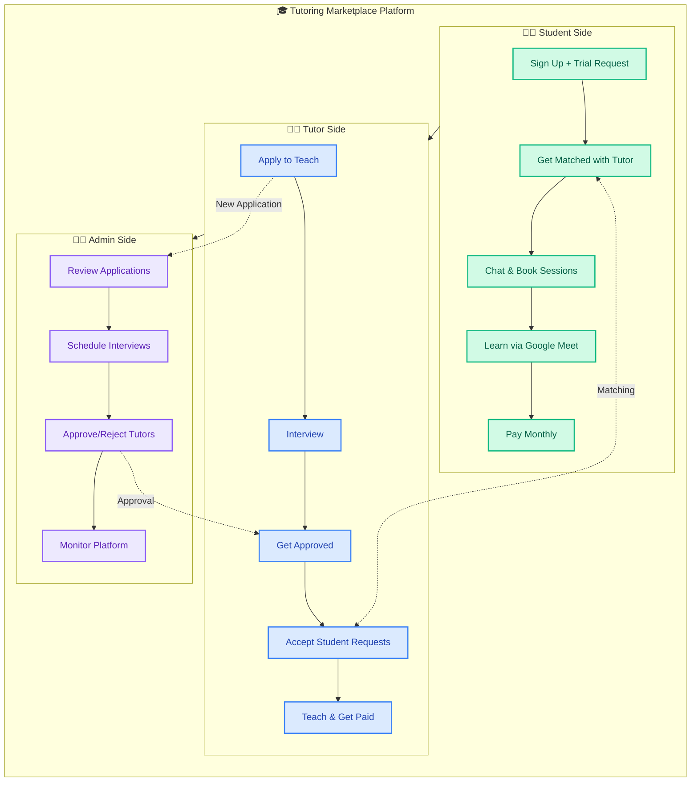

---

## Complete User Journey - Simple View

### 👨‍🎓 Student Journey (5 Steps)

```
┌─────────────────────────────────────────────────────────────────────────────┐
│                                                                             │
│  STEP 1          STEP 2          STEP 3          STEP 4          STEP 5    │
│  ───────         ───────         ───────         ───────         ───────   │
│                                                                             │
│  📝 Sign Up      🔔 Get         💬 Chat &       🎥 Learn        💳 Pay     │
│  + Request       Matched        Book            via Meet        Monthly    │
│  Trial           with Tutor     Session                                    │
│                                                                             │
│     │               │               │               │               │      │
│     ▼               ▼               ▼               ▼               ▼      │
│                                                                             │
│  Fill form      Tutor accepts   Tutor proposes  Join Google    Invoice at │
│  + Verify       your request    date/time       Meet session   month end  │
│  email          → Chat opens    → You accept                              │
│                                                                             │
└─────────────────────────────────────────────────────────────────────────────┘
```

### 👨‍🏫 Tutor Journey (5 Steps)

```
┌─────────────────────────────────────────────────────────────────────────────┐
│                                                                             │
│  STEP 1          STEP 2          STEP 3          STEP 4          STEP 5    │
│  ───────         ───────         ───────         ───────         ───────   │
│                                                                             │
│  📝 Apply        📅 Schedule    ✅ Get          🔔 Accept       💰 Get     │
│  to Teach        Interview      Approved        Requests        Paid       │
│                                                                             │
│     │               │               │               │               │      │
│     ▼               ▼               ▼               ▼               ▼      │
│                                                                             │
│  Upload CV      Admin reviews   Pass interview  See student     Payout on │
│  + Documents    → Book slot     → Become TUTOR  requests →      5th of    │
│                 → Google Meet                   Accept → Teach  each month│
│                                                                             │
└─────────────────────────────────────────────────────────────────────────────┘
```

### 👨‍💼 Admin Journey (4 Steps)

```
┌─────────────────────────────────────────────────────────────────────────────┐
│                                                                             │
│  STEP 1              STEP 2              STEP 3              STEP 4        │
│  ───────             ───────             ───────             ───────       │
│                                                                             │
│  📋 Review           📅 Create           🎥 Interview        ✅ Approve    │
│  Applications        Interview Slots     Applicants          or Reject    │
│                                                                             │
│     │                    │                   │                   │         │
│     ▼                    ▼                   ▼                   ▼         │
│                                                                             │
│  Check CV,           Set available       Meet via            Decision →   │
│  certificates        times for           Google Meet         Tutor gets   │
│  → Accept/Reject     applicants                              access       │
│                                                                             │
└─────────────────────────────────────────────────────────────────────────────┘
```

---

## How They Connect - The Big Picture

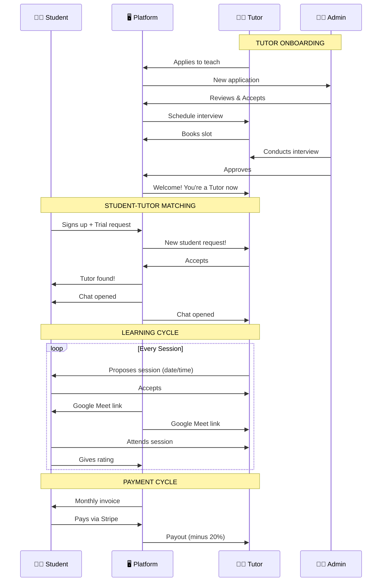

---

## Quick Reference Cards

### Student Card

```
┌─────────────────────────────────────────────────────────────────┐
│  👨‍🎓 STUDENT JOURNEY                                            │
├─────────────────────────────────────────────────────────────────┤
│                                                                 │
│  1. Sign Up ─────────── Fill form + Email verify ───── Once     │
│                                                                 │
│  2. Request Trial ───── Select subject, grade ──────── Once     │
│                                                                 │
│  3. Get Tutor ───────── Wait for tutor to accept ─── 24 hrs max │
│                                                                 │
│  4. Book Session ────── Accept tutor's proposal ───── Anytime   │
│                                                                 │
│  5. Attend ──────────── Click "Join Meeting" ──── 15 min before │
│                                                                 │
│  6. Review ──────────── Rate 5 categories (1-5) ─ After session │
│                                                                 │
│  7. Pay ─────────────── Stripe payment ──────────── Month end   │
│                                                                 │
└─────────────────────────────────────────────────────────────────┘
```

### Tutor Card

```
┌─────────────────────────────────────────────────────────────────┐
│  👨‍🏫 TUTOR JOURNEY                                               │
├─────────────────────────────────────────────────────────────────┤
│                                                                 │
│  1. Apply ───────────── Fill form + Upload docs ──────── Once   │
│                                                                 │
│  2. Interview ───────── Book slot + Google Meet ─ After approval│
│                                                                 │
│  3. Get Approved ────── Admin decision ──────── After interview │
│                                                                 │
│  4. Accept Students ─── Click "Accept" on requests ─── Anytime  │
│                                                                 │
│  5. Teach ───────────── Google Meet session ──── Scheduled time │
│                                                                 │
│  6. Get Paid ────────── Auto Stripe transfer ───── 5th of month │
│                                                                 │
└─────────────────────────────────────────────────────────────────┘
```

### Admin Card

```
┌─────────────────────────────────────────────────────────────────┐
│  👨‍💼 ADMIN JOURNEY                                               │
├─────────────────────────────────────────────────────────────────┤
│                                                                 │
│  1. Review Apps ─────── Check CV, certificates ────────── Daily │
│                                                                 │
│  2. Create Slots ────── Set interview times ────────── As needed│
│                                                                 │
│  3. Interview ───────── Google Meet ─────────────── Scheduled   │
│                                                                 │
│  4. Approve/Reject ──── Decision after interview ─ After interv.│
│                                                                 │
│  5. Monitor ─────────── Dashboard stats ───────────────── Daily │
│                                                                 │
└─────────────────────────────────────────────────────────────────┘
```

---

## Key Numbers

| Metric | Value |
|--------|-------|
| Trial request expiry | 24 hours |
| Interview duration | 30 minutes |
| Session join window | 15 min before |
| Platform commission | 20% |
| Tutor payout date | 5th of month |
| Max subjects per tutor | 3 |
| Min hours (Regular plan) | 4 hrs/month |

---

## Pricing Plans Summary

```
┌─────────────────┬─────────────────┬─────────────────┐
│   🟢 FLEXIBLE   │   🔵 REGULAR    │  🟣 LONG-TERM   │
├─────────────────┼─────────────────┼─────────────────┤
│    €30/hr       │    €28/hr       │    €25/hr       │
│                 │                 │                 │
│  No commitment  │  1 month min    │  3 months min   │
│  Pay as you go  │  Min 4 hrs/mo   │  Min 4 hrs/mo   │
│                 │                 │                 │
│  Best for:      │  Best for:      │  Best for:      │
│  Trying out     │  Regular study  │  Exam prep      │
└─────────────────┴─────────────────┴─────────────────┘
```

---

# 1. Student Journey

## 1.1 New Student - First Time Experience

### Flow Diagram

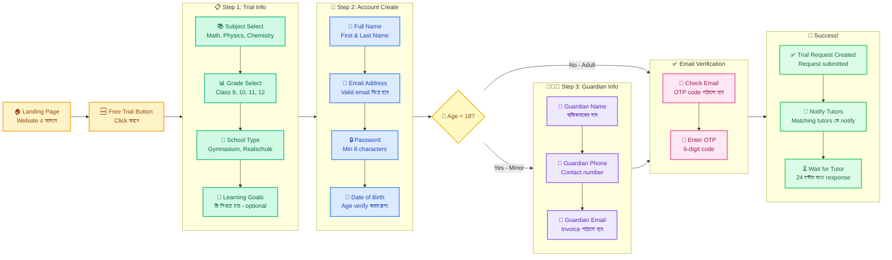

### Text Flow

```
Landing Page
    │
    ▼
"Free Trial" Button Click
    │
    ▼
Step 1: Trial Info
    • Subject select করবে (Math, Physics, etc.)
    • Grade select করবে (Class 9, 10, etc.)
    • School type select করবে (Gymnasium, Realschule)
    • কি শিখতে চায় লিখবে (optional)
    │
    ▼
Step 2: Account Create
    • Name
    • Email
    • Password
    • Date of Birth
    │
    ▼
Step 3: Guardian Info (if under 18)
    • Guardian Name
    • Guardian Phone
    • Guardian Email
    │
    ▼
Email Verification
    • Email এ code যাবে
    • Code enter করবে
    │
    ▼
Trial Request Created!
    • System tutor দের notify করবে
    • Student wait করবে
```

---

## 1.2 Trial Request Matching (Uber Style)

### Flow Diagram

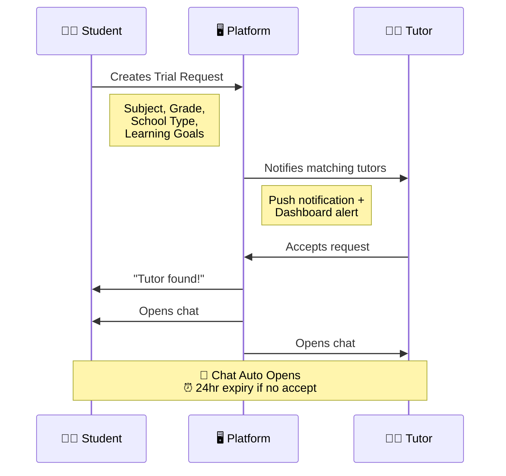

### Text Flow

```
Student                          System                           Tutor
   │                               │                                │
   │  Trial Request তৈরি করে       │                                │
   │──────────────────────────────>│                                │
   │                               │                                │
   │                               │  Matching tutors কে notify     │
   │                               │───────────────────────────────>│
   │                               │                                │
   │                               │              Tutor Accept করে  │
   │                               │<───────────────────────────────│
   │                               │                                │
   │   Notification: "Tutor found!"│                                │
   │<──────────────────────────────│                                │
   │                               │                                │
   │                    Chat Auto Open হয়                          │
   │<──────────────────────────────────────────────────────────────>│
```

> ⏰ Trial request 24 ঘন্টা পর expire হয়ে যাবে

---

## 1.3 Booking a Session (In-Chat)

### Flow Diagram

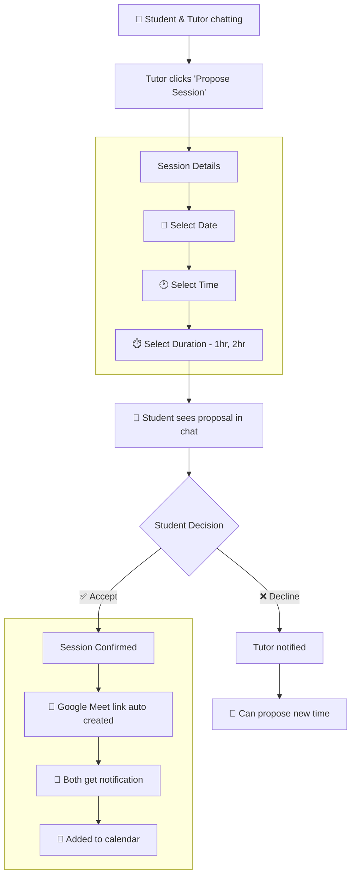

### Text Flow

```
Student & Tutor Chat এ কথা বলছে
    │
    ▼
Tutor "Propose Session" করবে
    • Date select
    • Time select
    • Duration select (1hr, 2hr)
    │
    ▼
Student Chat এ Session Proposal দেখবে
    │
    ├── Accept করলে ──> Session Confirmed
    │                      • Google Meet link auto create
    │                      • Both get notification
    │
    └── Decline করলে ──> Tutor কে জানানো হবে
                          • New time propose করতে পারবে
```

---

## 1.4 Student Attends Session & Gives Review

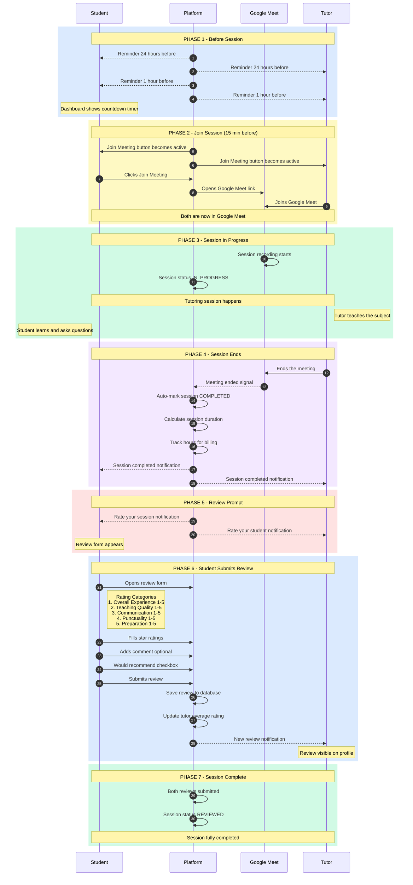

### Session Timeline

| Time | Event | Who |
|------|-------|-----|
| -24 hours | Reminder email sent | Both |
| -1 hour | Reminder notification | Both |
| -15 minutes | Join button activates | Both |
| 0 | Session starts | Both join Meet |
| +Duration | Session ends | Tutor ends call |
| +0 min | Auto-complete triggered | Platform |
| +0 min | Review prompt shown | Both |

### Review Categories

| Category | Description | Weight |
|----------|-------------|--------|
| Overall Experience | General satisfaction | 20% |
| Teaching Quality | How well tutor explained | 25% |
| Communication | Clear and responsive | 20% |
| Punctuality | On time for session | 15% |
| Preparation | Was tutor prepared | 20% |

---

## 1.5 Subscription & Billing

### Plans Available

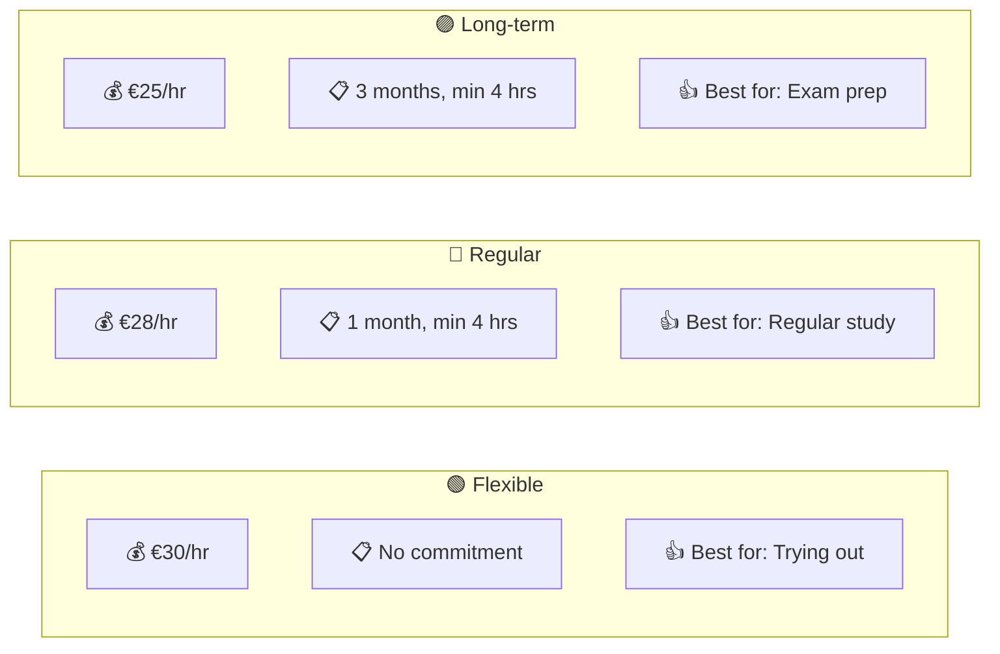

| Plan | Price | Commitment | Best For |
|------|-------|------------|----------|
| Flexible | €30/hr | None | চেষ্টা করে দেখতে চায় |
| Regular | €28/hr | 1 month, min 4 hrs | Regular study |
| Long-term | €25/hr | 3 months, min 4 hrs | Exam preparation |

### Billing Flow Diagram

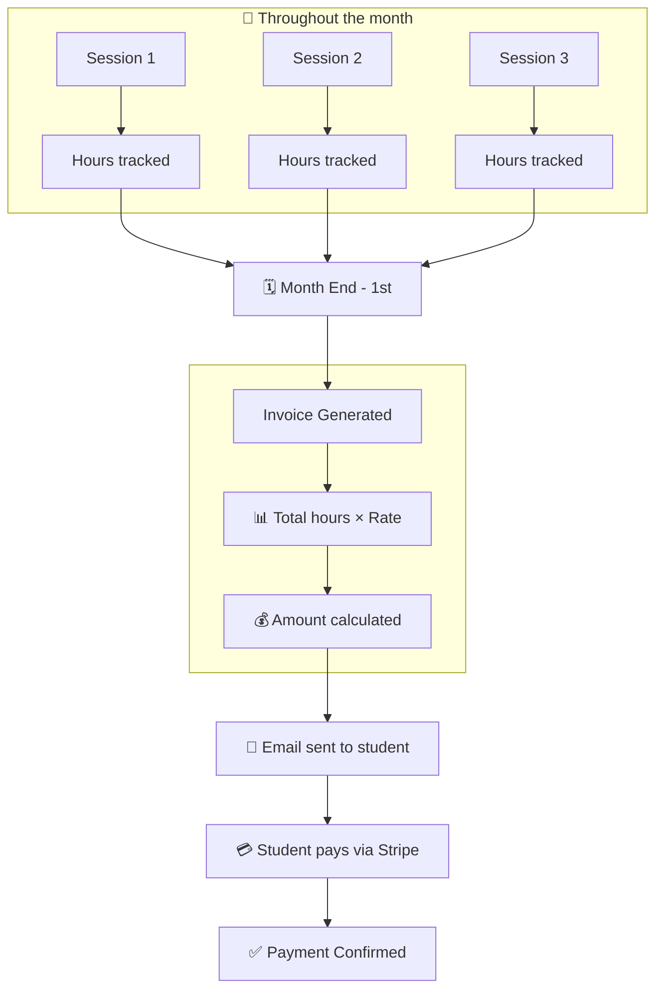

### Billing Text Flow

```
সারা মাস জুড়ে
    │
    ├── Session নেয় ──> Hours track হয়
    ├── Session নেয় ──> Hours track হয়
    └── Session নেয় ──> Hours track হয়
    │
    ▼
মাস শেষে (1st তারিখ)
    │
    ▼
Invoice Generate হয়
    • Total hours × Rate = Amount
    │
    ▼
Email এ Invoice পাঠানো হয়
    │
    ▼
Student Pay করে (Stripe)
    │
    ▼
Payment Confirmed
```

---

## 1.6 Student Dashboard Pages

> Payment করার পরে Student Dashboard এ redirect হবে

### Dashboard Navigation

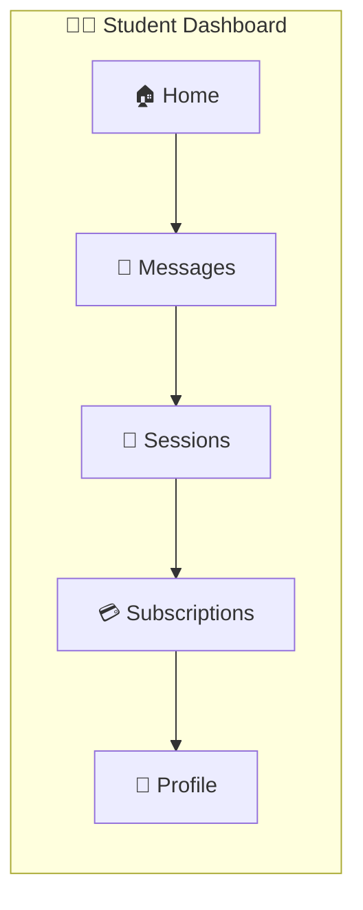

### Page Overview

| Page | কি দেখবে | কি করতে পারবে |
|------|----------|---------------|
| Home | Stats, Next session, Pending reviews | Quick actions |
| Messages | All tutor conversations | Message, Book session |
| Sessions | Plan info, Usage, Upcoming & Completed | Join, Cancel, Review |
| Subscriptions | Plan details, Billing history | Change plan, Pay |
| Profile | Personal info | Edit profile |

---

### 📅 Sessions Page & Rating

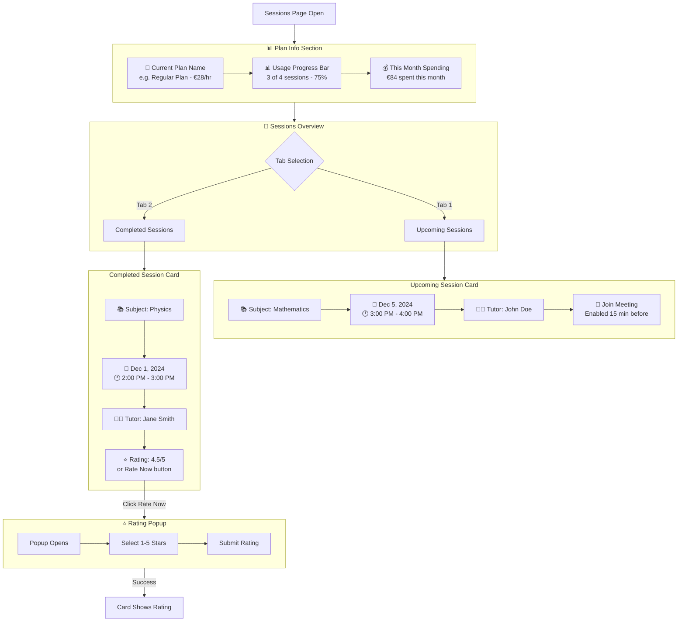

---

### 💬 Messages Page

#### Page Structure

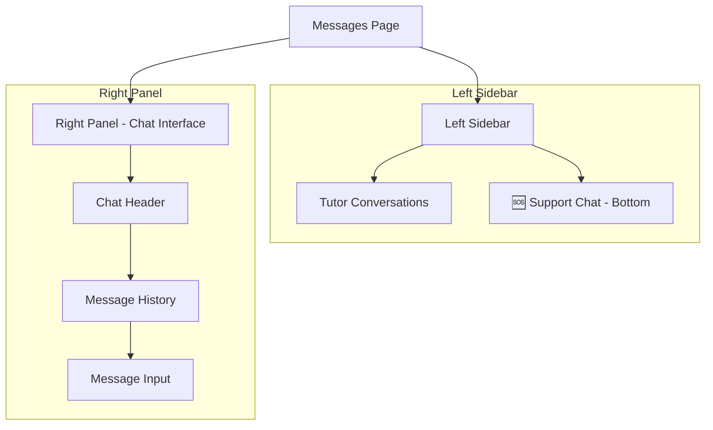

#### Messages Page Layout

```
┌─────────────────────────────────────────────────────────────────┐
│                        💬 Messages                               │
├─────────────────────────────────────────────────────────────────┤
│                                                                  │
│  ┌──────────────────┐  ┌────────────────────────────────────┐   │
│  │ CONVERSATIONS    │  │ Chat with John Doe                 │   │
│  │                  │  │                                    │   │
│  │ ┌──────────────┐ │  │ ┌────────────────────────────────┐│   │
│  │ │👨‍🏫 John Doe   │ │  │ │ Hi! Ready for tomorrow?       ││   │
│  │ │ Math Teacher │ │  │ │                    10:30 AM   ││   │
│  │ │ "See you..." │ │  │ └────────────────────────────────┘│   │
│  │ └──────────────┘ │  │                                    │   │
│  │                  │  │ ┌────────────────────────────────┐│   │
│  │ ┌──────────────┐ │  │ │        Yes! Can't wait 😊      ││   │
│  │ │👨‍🏫 Jane Smith │ │  │ │ 10:32 AM                      ││   │
│  │ │ Physics      │ │  │ └────────────────────────────────┘│   │
│  │ │ "Great job!" │ │  │                                    │   │
│  │ └──────────────┘ │  │                                    │   │
│  │                  │  ├────────────────────────────────────┤   │
│  │ ──────────────── │  │ Type a message...         [Send]  │   │
│  │                  │  └────────────────────────────────────┘   │
│  │ ┌──────────────┐ │                                           │
│  │ │🆘 Support    │ │                                           │
│  │ │ Get Help     │ │                                           │
│  │ └──────────────┘ │                                           │
│  └──────────────────┘                                           │
│                                                                  │
└─────────────────────────────────────────────────────────────────┘
```

---

### 🆘 Support Chat (Chatbot)

> Support Chat এ click করলে Basic Chatbot open হবে যেটা common questions handle করবে।
> Chatbot solve করতে না পারলে Report তৈরি হবে যা Admin Dashboard এ যাবে।

#### Support Chat Flow

```mermaid
flowchart TD
    A[Click "Support"] --> B[Support Chat Opens]

    subgraph Chatbot[🤖 Support Chatbot]
        B --> C[Bot: Hi! How can I help?]
        C --> D[Show Quick Options]

        subgraph Options[Quick Options]
            D --> D1[📅 Session Issue]
            D --> D2[💳 Billing Question]
            D --> D3[👨‍🏫 Tutor Problem]
            D --> D4[🔧 Technical Issue]
            D --> D5[❓ Other]
        end

        D1 --> E[Bot asks follow-up questions]
        D2 --> E
        D3 --> E
        D4 --> E
        D5 --> E

        E --> F{Bot can solve?}
        F -->|Yes| G[Bot provides solution]
        F -->|No| H[Create Support Ticket]
    end

    G --> I[Issue Resolved ✓]
    H --> J[Ticket sent to Admin]
    J --> K[Admin sees in Dashboard]
```

#### Support Chat - Initial View

```
┌─────────────────────────────────────────────────────────────────┐
│  🆘 Support Chat                                         [X]    │
├─────────────────────────────────────────────────────────────────┤
│                                                                  │
│  ┌────────────────────────────────────────────────────────────┐ │
│  │ 🤖 Hi! I'm here to help.                                   │ │
│  │    What do you need assistance with?                       │ │
│  └────────────────────────────────────────────────────────────┘ │
│                                                                  │
│  ┌─────────────────┐  ┌─────────────────┐                       │
│  │ 📅 Session      │  │ 💳 Billing      │                       │
│  │    Issue        │  │    Question     │                       │
│  └─────────────────┘  └─────────────────┘                       │
│                                                                  │
│  ┌─────────────────┐  ┌─────────────────┐                       │
│  │ 👨‍🏫 Tutor       │  │ 🔧 Technical    │                       │
│  │    Problem      │  │    Issue        │                       │
│  └─────────────────┘  └─────────────────┘                       │
│                                                                  │
│  ┌─────────────────────────────────────┐                        │
│  │ ❓ Other / Custom Question          │                        │
│  └─────────────────────────────────────┘                        │
│                                                                  │
├─────────────────────────────────────────────────────────────────┤
│  Type your message...                              [Send]       │
└─────────────────────────────────────────────────────────────────┘
```

#### Support Chat - Conversation Example

```
┌─────────────────────────────────────────────────────────────────┐
│  🆘 Support Chat                                         [X]    │
├─────────────────────────────────────────────────────────────────┤
│                                                                  │
│  ┌────────────────────────────────────────────────────────────┐ │
│  │ 🤖 Hi! I'm here to help.                                   │ │
│  └────────────────────────────────────────────────────────────┘ │
│                                                                  │
│                    ┌────────────────────────────────────────┐   │
│                    │ I selected: 📅 Session Issue          │   │
│                    └────────────────────────────────────────┘   │
│                                                                  │
│  ┌────────────────────────────────────────────────────────────┐ │
│  │ 🤖 What's the issue with your session?                     │ │
│  │                                                             │ │
│  │    [Can't join meeting]  [Tutor didn't show up]            │ │
│  │    [Wrong time]          [Need to cancel]                  │ │
│  └────────────────────────────────────────────────────────────┘ │
│                                                                  │
│                    ┌────────────────────────────────────────┐   │
│                    │ Tutor didn't show up                   │   │
│                    └────────────────────────────────────────┘   │
│                                                                  │
│  ┌────────────────────────────────────────────────────────────┐ │
│  │ 🤖 I'm sorry to hear that! Which session was it?          │ │
│  │                                                             │ │
│  │    [📅 Dec 1 - Math - John Doe]                            │ │
│  │    [📅 Nov 28 - Chemistry - Bob Wilson]                    │ │
│  └────────────────────────────────────────────────────────────┘ │
│                                                                  │
├─────────────────────────────────────────────────────────────────┤
│  Type your message...                              [Send]       │
└─────────────────────────────────────────────────────────────────┘
```

#### Support Chat - Create Ticket (When Bot Can't Solve)

```
┌─────────────────────────────────────────────────────────────────┐
│  🆘 Support Chat                                         [X]    │
├─────────────────────────────────────────────────────────────────┤
│                                                                  │
│  ┌────────────────────────────────────────────────────────────┐ │
│  │ 🤖 I understand this needs human attention.                │ │
│  │    Let me create a support ticket for you.                 │ │
│  └────────────────────────────────────────────────────────────┘ │
│                                                                  │
│  ┌────────────────────────────────────────────────────────────┐ │
│  │ 📝 SUPPORT TICKET PREVIEW                                  │ │
│  │                                                             │ │
│  │ Category:  Session Issue                                   │ │
│  │ Problem:   Tutor didn't show up                            │ │
│  │ Session:   Dec 1 - Math - John Doe                         │ │
│  │                                                             │ │
│  │ Additional Details (optional):                             │ │
│  │ ┌──────────────────────────────────────────────────────┐  │ │
│  │ │ I waited for 30 minutes but tutor never joined...   │  │ │
│  │ └──────────────────────────────────────────────────────┘  │ │
│  │                                                             │ │
│  │              [Cancel]    [📤 Submit Ticket]                │ │
│  └────────────────────────────────────────────────────────────┘ │
│                                                                  │
├─────────────────────────────────────────────────────────────────┤
│  Type your message...                              [Send]       │
└─────────────────────────────────────────────────────────────────┘
```

#### Support Chat - Ticket Submitted

```
┌─────────────────────────────────────────────────────────────────┐
│  🆘 Support Chat                                         [X]    │
├─────────────────────────────────────────────────────────────────┤
│                                                                  │
│  ┌────────────────────────────────────────────────────────────┐ │
│  │                     ✅ Ticket Created!                      │ │
│  │                                                             │ │
│  │              Ticket ID: #SUP-2024-1234                     │ │
│  │                                                             │ │
│  │   Our team will review your issue and get back to you      │ │
│  │   within 24 hours via email.                               │ │
│  │                                                             │ │
│  │              [View My Tickets]  [Close]                    │ │
│  └────────────────────────────────────────────────────────────┘ │
│                                                                  │
└─────────────────────────────────────────────────────────────────┘
```

#### Chatbot Question Categories

| Category | Bot Questions | Can Bot Solve? |
|----------|---------------|----------------|
| 📅 Session Issue | Which session? What happened? | Sometimes (reschedule link) |
| 💳 Billing Question | Which invoice? What's wrong? | Sometimes (FAQ answers) |
| 👨‍🏫 Tutor Problem | Which tutor? What's the issue? | No → Create Ticket |
| 🔧 Technical Issue | What's not working? Browser? | Sometimes (troubleshooting) |
| ❓ Other | Describe your issue | No → Create Ticket |

#### Data Flow to Admin Dashboard

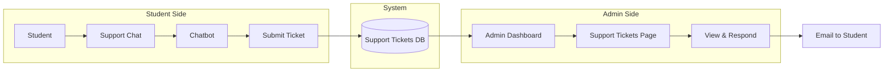

#### Support Ticket Data Structure

```
Support Ticket {
    ticketId: "#SUP-2024-1234"

    // Student Info
    studentId: "user_123"
    studentName: "Ahmed Khan"
    studentEmail: "ahmed@email.com"

    // Issue Details
    category: "session_issue"
    problem: "tutor_no_show"
    relatedSession: "session_456"  // Optional
    relatedTutor: "tutor_789"      // Optional

    // Description
    description: "I waited for 30 minutes..."

    // Status
    status: "open" | "in_progress" | "resolved" | "closed"
    priority: "low" | "medium" | "high"

    // Timestamps
    createdAt: "2024-12-01T10:30:00Z"
    updatedAt: "2024-12-01T10:30:00Z"

    // Admin Response
    assignedTo: "admin_id"         // Optional
    adminNotes: "..."              // Internal notes
    resolution: "..."              // Final resolution
}
```

---

### 💳 Subscriptions Page

#### Page Structure

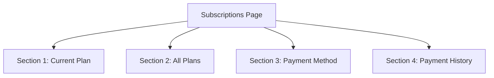

#### Section 1: Current Plan (Active Plan Badge)

```
┌─────────────────────────────────────────────────────────────────┐
│                     💳 Subscriptions                             │
├─────────────────────────────────────────────────────────────────┤
│                                                                  │
│  ┌────────────────────────────────────────────────────────────┐ │
│  │ 📋 YOUR CURRENT PLAN                              [Active] │ │
│  │                                                             │ │
│  │  🔵 Regular Plan                                           │ │
│  │                                                             │ │
│  │  ┌─────────────┬─────────────┬─────────────┐              │ │
│  │  │ €28/session │ Min 4/month │ 1 month     │              │ │
│  │  │   Price     │  Sessions   │  Period     │              │ │
│  │  └─────────────┴─────────────┴─────────────┘              │ │
│  │                                                             │ │
│  │  Started: Nov 1, 2024    Renews: Dec 1, 2024              │ │
│  │                                                             │ │
│  └────────────────────────────────────────────────────────────┘ │
│                                                                  │
```

#### Section 2: All Plans Comparison

```
│  ┌────────────────────────────────────────────────────────────┐ │
│  │ 📊 ALL PLANS                                               │ │
│  │                                                             │ │
│  │  ┌──────────────────┐ ┌──────────────────┐ ┌──────────────────┐
│  │  │ 🟢 FLEXIBLE      │ │ 🔵 REGULAR       │ │ 🟣 LONG-TERM     │
│  │  │                  │ │    ✓ Current     │ │                  │
│  │  │  €30/session     │ │  €28/session     │ │  €25/session     │
│  │  │                  │ │                  │ │                  │
│  │  │  Min Sessions:   │ │  Min Sessions:   │ │  Min Sessions:   │
│  │  │  No minimum      │ │  4 per month     │ │  4 per month     │
│  │  │                  │ │                  │ │                  │
│  │  │  Period:         │ │  Period:         │ │  Period:         │
│  │  │  No commitment   │ │  1 month         │ │  3 months        │
│  │  │                  │ │                  │ │                  │
│  │  │  Best for:       │ │  Best for:       │ │  Best for:       │
│  │  │  Try first       │ │  Regular study   │ │  Exam prep       │
│  │  │                  │ │                  │ │                  │
│  │  │  [Select Plan]   │ │  [Current Plan]  │ │  [Select Plan]   │
│  │  └──────────────────┘ └──────────────────┘ └──────────────────┘
│  │                                                             │ │
│  └────────────────────────────────────────────────────────────┘ │
│                                                                  │
```

#### Section 3: Payment Method

```
│  ┌────────────────────────────────────────────────────────────┐ │
│  │ 💳 PAYMENT METHOD                                          │ │
│  │                                                             │ │
│  │  ┌──────────────────────────────────────────────────────┐  │ │
│  │  │  💳 •••• •••• •••• 4242                               │  │ │
│  │  │     Visa                    Expires: 12/26            │  │ │
│  │  │                                           [Default]   │  │ │
│  │  └──────────────────────────────────────────────────────┘  │ │
│  │                                                             │ │
│  │  ┌──────────────────────────────────────────────────────┐  │ │
│  │  │  💳 •••• •••• •••• 5678                               │  │ │
│  │  │     Mastercard              Expires: 08/25            │  │ │
│  │  │                                      [Set as Default] │  │ │
│  │  └──────────────────────────────────────────────────────┘  │ │
│  │                                                             │ │
│  │                      [+ Add New Card]                      │ │
│  │                                                             │ │
│  └────────────────────────────────────────────────────────────┘ │
│                                                                  │
```

#### Section 4: Payment History (with Invoice Download)

```
│  ┌────────────────────────────────────────────────────────────┐ │
│  │ 📜 PAYMENT HISTORY                                         │ │
│  │                                                             │ │
│  │  ┌──────────────────────────────────────────────────────┐  │ │
│  │  │ Month      Sessions   Amount    Status    Invoice    │  │ │
│  │  ├──────────────────────────────────────────────────────┤  │ │
│  │  │ Nov 2024   4          €112.00   ✅ Paid   [📄 PDF]   │  │ │
│  │  │ Oct 2024   3          €84.00    ✅ Paid   [📄 PDF]   │  │ │
│  │  │ Sep 2024   2          €56.00    ✅ Paid   [📄 PDF]   │  │ │
│  │  │ Aug 2024   5          €140.00   ✅ Paid   [📄 PDF]   │  │ │
│  │  └──────────────────────────────────────────────────────┘  │ │
│  │                                                             │ │
│  │                    [Load More History]                     │ │
│  │                                                             │ │
│  └────────────────────────────────────────────────────────────┘ │
│                                                                  │
└─────────────────────────────────────────────────────────────────┘
```

#### Full Page Layout

```
┌─────────────────────────────────────────────────────────────────┐
│                     💳 Subscriptions                             │
├─────────────────────────────────────────────────────────────────┤
│                                                                  │
│  ╔════════════════════════════════════════════════════════════╗ │
│  ║ 📋 YOUR CURRENT PLAN                              [Active] ║ │
│  ║                                                             ║ │
│  ║  🔵 Regular Plan                                           ║ │
│  ║  ┌─────────────┬─────────────┬─────────────┐              ║ │
│  ║  │ €28/session │ Min 4/month │ 1 month     │              ║ │
│  ║  └─────────────┴─────────────┴─────────────┘              ║ │
│  ║  Started: Nov 1, 2024    Renews: Dec 1, 2024              ║ │
│  ╚════════════════════════════════════════════════════════════╝ │
│                                                                  │
│  ┌────────────────────────────────────────────────────────────┐ │
│  │ 📊 ALL PLANS                                               │ │
│  │                                                             │ │
│  │ ┌────────────┐  ┌────────────┐  ┌────────────┐            │ │
│  │ │🟢 FLEXIBLE │  │🔵 REGULAR  │  │🟣 LONG-TERM│            │ │
│  │ │            │  │  ✓ Active  │  │            │            │ │
│  │ │ €30/session│  │ €28/session│  │ €25/session│            │ │
│  │ │ No minimum │  │ Min 4/mo   │  │ Min 4/mo   │            │ │
│  │ │ No commit  │  │ 1 month    │  │ 3 months   │            │ │
│  │ │            │  │            │  │            │            │ │
│  │ │ [Select]   │  │ [Current]  │  │ [Select]   │            │ │
│  │ └────────────┘  └────────────┘  └────────────┘            │ │
│  └────────────────────────────────────────────────────────────┘ │
│                                                                  │
│  ┌────────────────────────────────────────────────────────────┐ │
│  │ 💳 PAYMENT METHOD                                          │ │
│  │                                                             │ │
│  │  💳 •••• 4242 (Visa)           Exp: 12/26    [Default]    │ │
│  │  💳 •••• 5678 (Mastercard)     Exp: 08/25    [Set Default]│ │
│  │                                                             │ │
│  │                    [+ Add New Card]                        │ │
│  └────────────────────────────────────────────────────────────┘ │
│                                                                  │
│  ┌────────────────────────────────────────────────────────────┐ │
│  │ 📜 PAYMENT HISTORY                                         │ │
│  │                                                             │ │
│  │  Month     │ Sessions │ Amount  │ Status  │ Invoice       │ │
│  │  ──────────┼──────────┼─────────┼─────────┼─────────────  │ │
│  │  Nov 2024  │    4     │ €112.00 │ ✅ Paid │ [📄 Download] │ │
│  │  Oct 2024  │    3     │ €84.00  │ ✅ Paid │ [📄 Download] │ │
│  │  Sep 2024  │    2     │ €56.00  │ ✅ Paid │ [📄 Download] │ │
│  │                                                             │ │
│  └────────────────────────────────────────────────────────────┘ │
│                                                                  │
└─────────────────────────────────────────────────────────────────┘
```

#### Plans Comparison Table

| Feature | 🟢 Flexible | 🔵 Regular | 🟣 Long-term |
|---------|-------------|------------|--------------|
| Price per Session | €30 | €28 | €25 |
| Minimum Sessions | No minimum | 4 per month | 4 per month |
| Commitment Period | None | 1 month | 3 months |
| Best For | Trying out | Regular study | Exam prep |
| Savings | - | €2/session | €5/session |

#### Add New Card Modal

```
┌─────────────────────────────────────────────────────────┐
│                  💳 Add New Card                         │
├──────────────────────────────────────────────────────────┤
│                                                          │
│  Card Number                                             │
│  ┌──────────────────────────────────────────────────┐   │
│  │ 1234 5678 9012 3456                              │   │
│  └──────────────────────────────────────────────────┘   │
│                                                          │
│  Expiry Date              CVV                            │
│  ┌────────────────┐       ┌────────────────┐            │
│  │ MM / YY        │       │ 123            │            │
│  └────────────────┘       └────────────────┘            │
│                                                          │
│  Cardholder Name                                         │
│  ┌──────────────────────────────────────────────────┐   │
│  │ Ahmed Khan                                       │   │
│  └──────────────────────────────────────────────────┘   │
│                                                          │
│  ☐ Set as default payment method                        │
│                                                          │
├──────────────────────────────────────────────────────────┤
│                                                          │
│         [Cancel]              [💳 Add Card]              │
│                                                          │
└──────────────────────────────────────────────────────────┘
```

#### Change Plan Flow

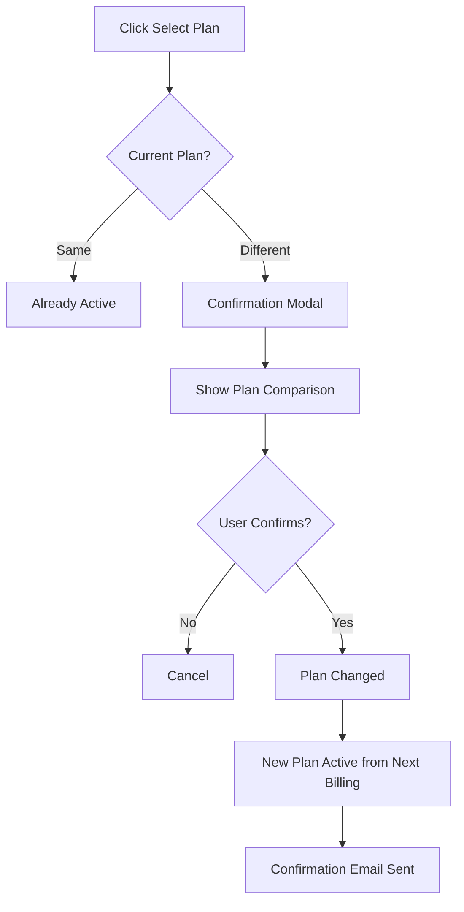

#### Invoice Download

```
Invoice PDF Contains:
├── Invoice Number: INV-2024-11-001
├── Date: Nov 1, 2024
├── Student Info (Name, Email, Address)
├── Plan Details (Regular Plan - €28/session)
├── Session Breakdown:
│   ├── Nov 5 - Mathematics (1 hr) - €28
│   ├── Nov 12 - Mathematics (1 hr) - €28
│   ├── Nov 19 - Physics (1 hr) - €28
│   └── Nov 26 - Physics (1 hr) - €28
├── Subtotal: €112.00
├── Tax (if applicable): €0.00
├── Total: €112.00
└── Payment Status: Paid ✓
```

---

### 👤 Profile Page

#### Page Structure

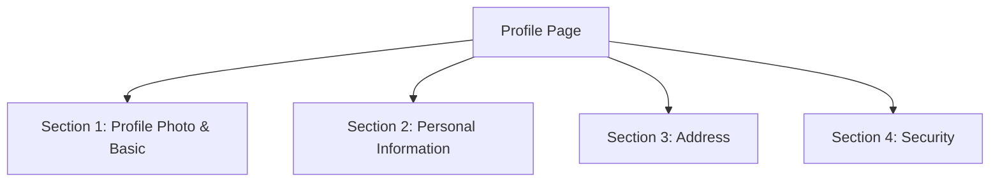

#### Full Profile Page Layout

```
┌─────────────────────────────────────────────────────────────────┐
│                        👤 Profile                                │
├─────────────────────────────────────────────────────────────────┤
│                                                                  │
│                         ┌───────┐                               │
│                         │  📷   │                               │
│                         │ Photo │  [📷 Change Photo]            │
│                         └───────┘                               │
│                        Ahmed Khan                                │
│                     ahmed@email.com                              │
│                                                                  │
│  ┌────────────────────────────────────────────────────────────┐ │
│  │ 📝 PERSONAL INFORMATION                      [✏️ Edit All] │ │
│  │                                                             │ │
│  │  Full Name:      Ahmed Khan                                 │ │
│  │  Email:          ahmed@email.com                            │ │
│  │  Phone:          +49 123 456789                             │ │
│  │  Date of Birth:  15 March 2008                              │ │
│  │  Grade:          10th Grade                                 │ │
│  │                                                             │ │
│  └────────────────────────────────────────────────────────────┘ │
│                                                                  │
│  ┌────────────────────────────────────────────────────────────┐ │
│  │ 🏠 ADDRESS                                   [✏️ Edit All] │ │
│  │                                                             │ │
│  │  Street:         Musterstraße                               │ │
│  │  House Number:   42                                         │ │
│  │  ZIP Code:       10115                                      │ │
│  │  City:           Berlin                                     │ │
│  │  Country:        Germany                                    │ │
│  │                                                             │ │
│  └────────────────────────────────────────────────────────────┘ │
│                                                                  │
│  ┌────────────────────────────────────────────────────────────┐ │
│  │ 🔐 SECURITY                                                │ │
│  │                                                             │ │
│  │  Password:       ••••••••••                [Change]        │ │
│  │  Two-Factor:     Not enabled               [Enable]        │ │
│  │                                                             │ │
│  └────────────────────────────────────────────────────────────┘ │
│                                                                  │
│  ┌────────────────────────────────────────────────────────────┐ │
│  │ ⚙️ PREFERENCES                                             │ │
│  │                                                             │ │
│  │  Language:       English                   [Change]        │ │
│  │  Timezone:       Europe/Berlin (GMT+1)     [Change]        │ │
│  │  Notifications:  Email & Push              [Manage]        │ │
│  │                                                             │ │
│  └────────────────────────────────────────────────────────────┘ │
│                                                                  │
│                          [🚪 Logout]                            │
│                                                                  │
└─────────────────────────────────────────────────────────────────┘
```

#### Edit Personal Information Modal

```
┌─────────────────────────────────────────────────────────┐
│              ✏️ Edit Personal Information                │
├──────────────────────────────────────────────────────────┤
│                                                          │
│  Full Name                                               │
│  ┌──────────────────────────────────────────────────┐   │
│  │ Ahmed Khan                                       │   │
│  └──────────────────────────────────────────────────┘   │
│                                                          │
│  Email                                                   │
│  ┌──────────────────────────────────────────────────┐   │
│  │ ahmed@email.com                                  │   │
│  └──────────────────────────────────────────────────┘   │
│                                                          │
│  Phone                                                   │
│  ┌──────────────────────────────────────────────────┐   │
│  │ +49 123 456789                                   │   │
│  └──────────────────────────────────────────────────┘   │
│                                                          │
│  Date of Birth                                           │
│  ┌──────────────────────────────────────────────────┐   │
│  │ 15 / 03 / 2008                                   │   │
│  └──────────────────────────────────────────────────┘   │
│                                                          │
│  Grade                                                   │
│  ┌──────────────────────────────────────────────────┐   │
│  │ 10th Grade                              ▼        │   │
│  └──────────────────────────────────────────────────┘   │
│                                                          │
├──────────────────────────────────────────────────────────┤
│                                                          │
│         [Cancel]              [💾 Save Changes]          │
│                                                          │
└──────────────────────────────────────────────────────────┘
```

#### Edit Address Modal

```
┌─────────────────────────────────────────────────────────┐
│                    ✏️ Edit Address                       │
├──────────────────────────────────────────────────────────┤
│                                                          │
│  Street Name                                             │
│  ┌──────────────────────────────────────────────────┐   │
│  │ Musterstraße                                     │   │
│  └──────────────────────────────────────────────────┘   │
│                                                          │
│  House Number                                            │
│  ┌──────────────────────────────────────────────────┐   │
│  │ 42                                               │   │
│  └──────────────────────────────────────────────────┘   │
│                                                          │
│  ZIP Code                City                            │
│  ┌────────────────┐      ┌─────────────────────────┐    │
│  │ 10115          │      │ Berlin                  │    │
│  └────────────────┘      └─────────────────────────┘    │
│                                                          │
│  Country                                                 │
│  ┌──────────────────────────────────────────────────┐   │
│  │ Germany                                 ▼        │   │
│  └──────────────────────────────────────────────────┘   │
│                                                          │
├──────────────────────────────────────────────────────────┤
│                                                          │
│         [Cancel]              [💾 Save Changes]          │
│                                                          │
└──────────────────────────────────────────────────────────┘
```

#### Profile Data Structure

```
Student Profile {
    // Basic Info
    profilePhoto: "url_to_photo"
    fullName: "Ahmed Khan"
    email: "ahmed@email.com"
    phone: "+49 123 456789"
    dateOfBirth: "2008-03-15"
    grade: "10th Grade"

    // Address
    address: {
        street: "Musterstraße"
        houseNumber: "42"
        zipCode: "10115"
        city: "Berlin"
        country: "Germany"
    }

    // Guardian (if under 18)
    guardian: {
        name: "Parent Name"
        email: "parent@email.com"
        phone: "+49 987 654321"
    }

    // Preferences
    preferences: {
        language: "en"
        timezone: "Europe/Berlin"
        notifications: {
            email: true
            push: true
            sms: false
        }
    }
}
```

---

### 🔔 Notifications

> Student Dashboard এ Notification bell icon থাকবে

#### Notification Bell (Header)

```
┌─────────────────────────────────────────────────────────────────┐
│  🏠 Home    💬 Messages    📅 Sessions    💳 Sub    👤 Profile   │
│                                                     🔔 (3)      │
└─────────────────────────────────────────────────────────────────┘
                                                        │
                                                        ▼
                                    ┌─────────────────────────────┐
                                    │ 🔔 NOTIFICATIONS            │
                                    ├─────────────────────────────┤
                                    │                             │
                                    │ 🆕 Session starting in 15min│
                                    │    Math with John Doe       │
                                    │    [Join Now]    5 min ago  │
                                    │ ─────────────────────────── │
                                    │                             │
                                    │ 📅 New session proposed     │
                                    │    Physics - Dec 10, 3PM    │
                                    │    [View]        1 hour ago │
                                    │ ─────────────────────────── │
                                    │                             │
                                    │ 💳 Invoice ready            │
                                    │    November 2024 - €112     │
                                    │    [Pay Now]     Yesterday  │
                                    │                             │
                                    ├─────────────────────────────┤
                                    │      [View All Notifications]│
                                    └─────────────────────────────┘
```

#### Notification Types

| Type | Icon | Message Example | Action |
|------|------|-----------------|--------|
| Session Reminder | 🎥 | "Session starting in 15 min" | [Join Now] |
| Session Proposed | 📅 | "New session proposed" | [Accept/Decline] |
| Invoice Ready | 💳 | "November invoice ready" | [Pay Now] |
| Payment Success | ✅ | "Payment confirmed" | [View Receipt] |
| Tutor Message | 💬 | "New message from John" | [Reply] |
| Support Update | 🆘 | "Ticket #123 updated" | [View] |

#### Notifications Page (View All)

```
┌─────────────────────────────────────────────────────────────────┐
│                      🔔 All Notifications                        │
├─────────────────────────────────────────────────────────────────┤
│                                                                  │
│  Filter: [All ▼]  [Unread Only ☐]           [Mark All Read]    │
│                                                                  │
│  ┌────────────────────────────────────────────────────────────┐ │
│  │ 🆕 TODAY                                                    │ │
│  ├────────────────────────────────────────────────────────────┤ │
│  │ 🎥 Session starting in 15 minutes                          │ │
│  │    Mathematics with John Doe                                │ │
│  │    [Join Meeting]                              5 min ago   │ │
│  ├────────────────────────────────────────────────────────────┤ │
│  │ 📅 New session proposal received                           │ │
│  │    Physics - Dec 10, 2024 at 3:00 PM                       │ │
│  │    [Accept] [Decline]                          1 hour ago  │ │
│  └────────────────────────────────────────────────────────────┘ │
│                                                                  │
│  ┌────────────────────────────────────────────────────────────┐ │
│  │ 📅 YESTERDAY                                                │ │
│  ├────────────────────────────────────────────────────────────┤ │
│  │ 💳 Your November invoice is ready                          │ │
│  │    Amount: €112.00                                          │ │
│  │    [Pay Now] [View Invoice]                    Yesterday   │ │
│  ├────────────────────────────────────────────────────────────┤ │
│  │ 💬 New message from Jane Smith                             │ │
│  │    "Great session today! See you next week"                │ │
│  │    [Reply]                                     Yesterday   │ │
│  └────────────────────────────────────────────────────────────┘ │
│                                                                  │
│                       [Load More]                               │
│                                                                  │
└─────────────────────────────────────────────────────────────────┘
```

---

### 🆘 Support Page (Updated)

> Support এ click করলে নিচের options দেখাবে

#### Support Page Layout

```
┌─────────────────────────────────────────────────────────────────┐
│                        🆘 Support Center                         │
├─────────────────────────────────────────────────────────────────┤
│                                                                  │
│  ┌────────────────────────────────────────────────────────────┐ │
│  │ 📝 REPORT AN ISSUE                                         │ │
│  │                                                             │ │
│  │  ┌─────────────────┐  ┌─────────────────┐                  │ │
│  │  │ 💳 Billing      │  │ 📋 Subscription │                  │ │
│  │  │    Issue        │  │    Issue        │                  │ │
│  │  └─────────────────┘  └─────────────────┘                  │ │
│  │                                                             │ │
│  │  ┌─────────────────┐  ┌─────────────────┐                  │ │
│  │  │ 👨‍🏫 Tutor       │  │ 📅 Session      │                  │ │
│  │  │    Problem      │  │    Issue        │                  │ │
│  │  └─────────────────┘  └─────────────────┘                  │ │
│  │                                                             │ │
│  │  ┌─────────────────┐  ┌─────────────────┐                  │ │
│  │  │ 🔧 Technical    │  │ ❓ Other        │                  │ │
│  │  │    Problem      │  │    Issue        │                  │ │
│  │  └─────────────────┘  └─────────────────┘                  │ │
│  │                                                             │ │
│  └────────────────────────────────────────────────────────────┘ │
│                                                                  │
│  ┌────────────────────────────────────────────────────────────┐ │
│  │ 📚 LEARN NEW SUBJECT                                       │ │
│  │                                                             │ │
│  │  Want to learn a new subject? Request a new tutor!         │ │
│  │                                                             │ │
│  │                    [🎓 Request New Tutor]                   │ │
│  │                                                             │ │
│  └────────────────────────────────────────────────────────────┘ │
│                                                                  │
│  ┌────────────────────────────────────────────────────────────┐ │
│  │ ❓ FREQUENTLY ASKED QUESTIONS                              │ │
│  │                                                             │ │
│  │  ▶ How do I cancel a session?                              │ │
│  │  ▶ How do I change my subscription plan?                   │ │
│  │  ▶ How is the monthly billing calculated?                  │ │
│  │  ▶ Can I request a different tutor?                        │ │
│  │  ▶ How do I get a refund?                                  │ │
│  │  ▶ What if my tutor doesn't show up?                       │ │
│  │                                                             │ │
│  │                    [View All FAQs →]                       │ │
│  │                                                             │ │
│  └────────────────────────────────────────────────────────────┘ │
│                                                                  │
│  ┌────────────────────────────────────────────────────────────┐ │
│  │ 📜 MY SUPPORT TICKETS                                      │ │
│  │                                                             │ │
│  │  #SUP-2024-1234   Billing Issue     🟡 In Progress         │ │
│  │  #SUP-2024-1201   Tutor Problem     ✅ Resolved            │ │
│  │                                                             │ │
│  │                    [View All Tickets →]                    │ │
│  │                                                             │ │
│  └────────────────────────────────────────────────────────────┘ │
│                                                                  │
└─────────────────────────────────────────────────────────────────┘
```

#### Request New Tutor Modal

```
┌─────────────────────────────────────────────────────────┐
│              🎓 Request New Tutor                        │
├──────────────────────────────────────────────────────────┤
│                                                          │
│  Which subject do you want to learn?                     │
│  ┌──────────────────────────────────────────────────┐   │
│  │ Select Subject                          ▼        │   │
│  └──────────────────────────────────────────────────┘   │
│     📚 Mathematics                                      │
│     🔬 Physics                                          │
│     🧪 Chemistry                                        │
│     🌍 Geography                                        │
│     📖 German                                           │
│     🇬🇧 English                                         │
│                                                          │
│  What grade are you in?                                 │
│  ┌──────────────────────────────────────────────────┐   │
│  │ 10th Grade                              ▼        │   │
│  └──────────────────────────────────────────────────┘   │
│                                                          │
│  Any specific requirements? (optional)                  │
│  ┌──────────────────────────────────────────────────┐   │
│  │ I need help with calculus and algebra...        │   │
│  │                                                   │   │
│  └──────────────────────────────────────────────────┘   │
│                                                          │
├──────────────────────────────────────────────────────────┤
│                                                          │
│         [Cancel]              [📤 Send Request]          │
│                                                          │
└──────────────────────────────────────────────────────────┘
```

#### FAQ Expanded View

```
┌─────────────────────────────────────────────────────────────────┐
│  ▼ How do I cancel a session?                                   │
├─────────────────────────────────────────────────────────────────┤
│                                                                  │
│  You can cancel a session up to 24 hours before it starts.      │
│                                                                  │
│  Steps:                                                          │
│  1. Go to Sessions page                                          │
│  2. Find the upcoming session                                    │
│  3. Click "Cancel Session"                                       │
│  4. Confirm cancellation                                         │
│                                                                  │
│  Note: Sessions cancelled less than 24 hours before may still   │
│  be charged.                                                     │
│                                                                  │
│  ──────────────────────────────────────────────────────────────  │
│                                                                  │
│  Was this helpful?  [👍 Yes]  [👎 No]                           │
│                                                                  │
└─────────────────────────────────────────────────────────────────┘
```

---

### 📚 Resources Page

> Open source educational database থেকে resources search করতে পারবে

#### Resources Page Layout

```
┌─────────────────────────────────────────────────────────────────┐
│                      📚 Learning Resources                       │
├─────────────────────────────────────────────────────────────────┤
│                                                                  │
│  ┌────────────────────────────────────────────────────────────┐ │
│  │ 🔍 SEARCH RESOURCES                                        │ │
│  │                                                             │ │
│  │  ┌──────────────────────────────────────────┐ [🔍 Search] │ │
│  │  │ Search for topics, subjects, keywords... │              │ │
│  │  └──────────────────────────────────────────┘              │ │
│  │                                                             │ │
│  │  Filter by:                                                │ │
│  │  [Subject ▼]  [Grade ▼]  [Type ▼]  [Language ▼]           │ │
│  │                                                             │ │
│  └────────────────────────────────────────────────────────────┘ │
│                                                                  │
│  ┌────────────────────────────────────────────────────────────┐ │
│  │ 📊 BROWSE BY SUBJECT                                       │ │
│  │                                                             │ │
│  │  ┌───────────┐ ┌───────────┐ ┌───────────┐ ┌───────────┐  │ │
│  │  │ 📐        │ │ 🔬        │ │ 🧪        │ │ 🌍        │  │ │
│  │  │Mathematics│ │ Physics   │ │ Chemistry │ │ Geography │  │ │
│  │  │ 1.2k items│ │ 890 items │ │ 720 items │ │ 450 items │  │ │
│  │  └───────────┘ └───────────┘ └───────────┘ └───────────┘  │ │
│  │                                                             │ │
│  │  ┌───────────┐ ┌───────────┐ ┌───────────┐ ┌───────────┐  │ │
│  │  │ 📖        │ │ 🇬🇧        │ │ 💻        │ │ 🎨        │  │ │
│  │  │ German    │ │ English   │ │ Computer  │ │ Art       │  │ │
│  │  │ 680 items │ │ 920 items │ │ 340 items │ │ 210 items │  │ │
│  │  └───────────┘ └───────────┘ └───────────┘ └───────────┘  │ │
│  │                                                             │ │
│  └────────────────────────────────────────────────────────────┘ │
│                                                                  │
│  ┌────────────────────────────────────────────────────────────┐ │
│  │ ⭐ POPULAR RESOURCES                                       │ │
│  │                                                             │ │
│  │  ┌──────────────────────────────────────────────────────┐  │ │
│  │  │ 📄 Quadratic Equations - Complete Guide              │  │ │
│  │  │    📐 Mathematics • Grade 10 • PDF                   │  │ │
│  │  │    ⭐ 4.8 (234 reviews)              [📥 Download]   │  │ │
│  │  └──────────────────────────────────────────────────────┘  │ │
│  │                                                             │ │
│  │  ┌──────────────────────────────────────────────────────┐  │ │
│  │  │ 🎬 Newton's Laws of Motion - Video Series           │  │ │
│  │  │    🔬 Physics • Grade 9-10 • Video                   │  │ │
│  │  │    ⭐ 4.9 (567 reviews)              [▶️ Watch]      │  │ │
│  │  └──────────────────────────────────────────────────────┘  │ │
│  │                                                             │ │
│  │  ┌──────────────────────────────────────────────────────┐  │ │
│  │  │ 📝 German Grammar Workbook                           │  │ │
│  │  │    📖 German • Grade 8-12 • Interactive              │  │ │
│  │  │    ⭐ 4.7 (189 reviews)              [📖 Open]       │  │ │
│  │  └──────────────────────────────────────────────────────┘  │ │
│  │                                                             │ │
│  └────────────────────────────────────────────────────────────┘ │
│                                                                  │
└─────────────────────────────────────────────────────────────────┘
```

#### Search Results View

```
┌─────────────────────────────────────────────────────────────────┐
│  🔍 Search: "quadratic equations"                    [X Clear]  │
├─────────────────────────────────────────────────────────────────┤
│                                                                  │
│  Found 45 resources                                              │
│                                                                  │
│  Sort by: [Relevance ▼]                                         │
│                                                                  │
│  ┌────────────────────────────────────────────────────────────┐ │
│  │ 📄 Solving Quadratic Equations - Step by Step             │ │
│  │    📐 Mathematics • Grade 10 • PDF • 15 pages             │ │
│  │    Source: Khan Academy (Open Source)                      │ │
│  │    ⭐ 4.9 (456 reviews)                                    │ │
│  │                                                             │ │
│  │    [📥 Download PDF]  [🔗 Open Online]  [💾 Save]         │ │
│  └────────────────────────────────────────────────────────────┘ │
│                                                                  │
│  ┌────────────────────────────────────────────────────────────┐ │
│  │ 🎬 Quadratic Formula Explained                             │ │
│  │    📐 Mathematics • Grade 9-11 • Video • 12 min           │ │
│  │    Source: OpenStax                                        │ │
│  │    ⭐ 4.8 (312 reviews)                                    │ │
│  │                                                             │ │
│  │    [▶️ Watch Video]  [📝 Transcript]  [💾 Save]           │ │
│  └────────────────────────────────────────────────────────────┘ │
│                                                                  │
│  ┌────────────────────────────────────────────────────────────┐ │
│  │ 📝 Quadratic Equations Practice Problems                   │ │
│  │    📐 Mathematics • Grade 10 • Interactive • 50 problems  │ │
│  │    Source: MIT OpenCourseWare                              │ │
│  │    ⭐ 4.7 (198 reviews)                                    │ │
│  │                                                             │ │
│  │    [📝 Start Practice]  [📄 Print Version]  [💾 Save]     │ │
│  └────────────────────────────────────────────────────────────┘ │
│                                                                  │
│                    [1] [2] [3] ... [5] [Next →]                 │
│                                                                  │
└─────────────────────────────────────────────────────────────────┘
```

#### Open Source Data Sources

```
Resources sourced from:
├── Khan Academy (khanacademy.org)
├── OpenStax (openstax.org)
├── MIT OpenCourseWare (ocw.mit.edu)
├── CK-12 Foundation (ck12.org)
├── Coursera (coursera.org - free courses)
├── edX (edx.org - free courses)
├── PhET Simulations (phet.colorado.edu)
├── GeoGebra (geogebra.org)
└── Wolfram Alpha (wolframalpha.com)
```

#### Updated Dashboard Navigation

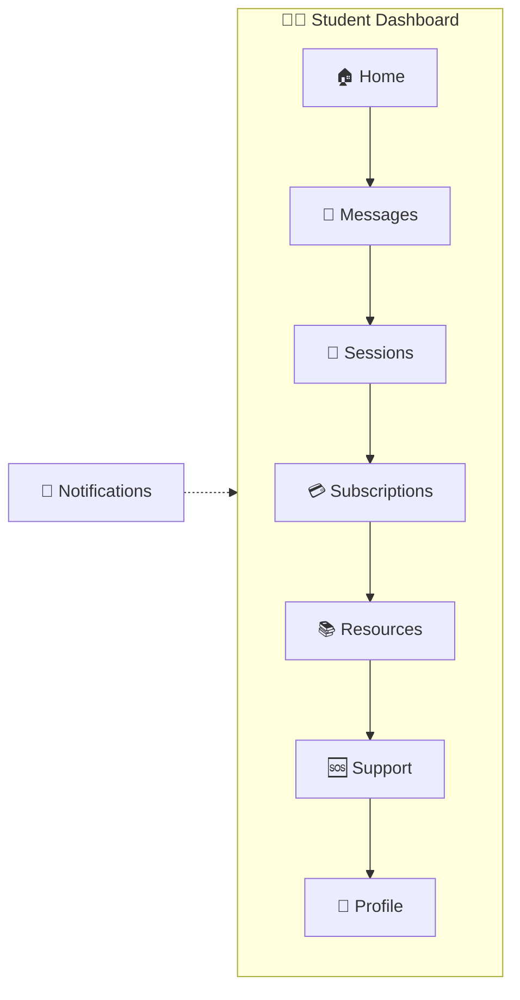

---

# 2. Tutor Journey

## 2.1 Application Review Process

### Flow Diagram

```mermaid
sequenceDiagram
    autonumber

    participant AP as 👤 Applicant
    participant P as 🖥️ Platform
    participant A as 👨‍💼 Admin

    %% ═══════════════════════════════════════════════════════════════
    %% PHASE 1: APPLICATION SUBMISSION
    %% ═══════════════════════════════════════════════════════════════
    rect rgb(254, 243, 199)
        Note over AP,A: 📝 PHASE 1: APPLICATION SUBMISSION
        AP->>P: Click "Become a Tutor" button
        AP->>P: Fill Application Form
        Note right of AP: Personal Info:<br/>• Full Name, DOB<br/>• Email, Phone<br/>• Address (Street, ZIP, City)
        AP->>P: Upload Required Documents
        Note right of AP: Documents:<br/>• CV (Required)<br/>• Abitur Certificate (Required)<br/>• Official ID (Required)<br/>• Other Certificates (Optional)
        AP->>P: Select Teaching Subjects (Max 3)
        AP->>P: Submit Application
        P-->>AP: ✅ Application Received
        P-->>AP: Status: SUBMITTED
        P->>A: 🔔 Notification: New Application
    end

    %% ═══════════════════════════════════════════════════════════════
    %% PHASE 2: ADMIN DOCUMENT REVIEW
    %% ═══════════════════════════════════════════════════════════════
    rect rgb(219, 234, 254)
        Note over AP,A: 📋 PHASE 2: ADMIN REVIEWS DOCUMENTS
        A->>P: Open Applications Dashboard
        A->>P: Click on New Application
        A->>P: View & Download Documents
        Note left of A: Review Checklist:<br/>✓ CV - Education & Experience<br/>✓ Abitur - Authentic & Valid<br/>✓ ID - Matches Name<br/>✓ Subjects - Appropriate
        A->>A: 🤔 Make Decision
    end

    %% ═══════════════════════════════════════════════════════════════
    %% DECISION BRANCHES
    %% ═══════════════════════════════════════════════════════════════

    %% ─────────────────────────────────────────────────────────────────
    %% PATH A: REJECTION
    %% ─────────────────────────────────────────────────────────────────
    rect rgb(254, 226, 226)
        Note over AP,A: ❌ PATH A: REJECTION (Documents Not OK)
        A->>P: Select Rejection Reason
        Note left of A: Reasons:<br/>• Incomplete Documents<br/>• Invalid Certificate<br/>• Not Qualified<br/>• Duplicate Application
        A->>P: Write Rejection Message
        A->>P: Click "Reject Application"
        P-->>AP: 📧 Email: Application Rejected
        Note right of AP: Email contains:<br/>• Rejection reason<br/>• Admin's message<br/>• Reapply info (30 days)
        P-->>AP: Status: REJECTED
        Note over AP: ⛔ Process Ends
    end

    %% ─────────────────────────────────────────────────────────────────
    %% PATH B: REVISION REQUIRED
    %% ─────────────────────────────────────────────────────────────────
    rect rgb(254, 249, 195)
        Note over AP,A: 🔄 PATH B: REVISION (Document Issues Found)
        A->>P: Request Document Correction
        Note left of A: Issues:<br/>• Blurry image<br/>• Wrong file uploaded<br/>• Expired document<br/>• Missing pages
        A->>P: Specify which document(s) need fixing
        A->>P: Write correction instructions
        P-->>AP: 📧 Email: Revision Required
        Note right of AP: Email contains:<br/>• Which document is wrong<br/>• What's the issue<br/>• How to fix it
        P-->>AP: Status: REVISION_REQUIRED
        AP->>P: Upload Corrected Document(s)
        P->>A: 🔔 Notification: Documents Updated
        A->>P: Re-review Updated Documents
        Note over A: Back to Decision Point ↩️
    end

    %% ─────────────────────────────────────────────────────────────────
    %% PATH C: ACCEPTANCE
    %% ─────────────────────────────────────────────────────────────────
    rect rgb(209, 250, 229)
        Note over AP,A: ✅ PATH C: ACCEPTANCE (All Documents OK)
        A->>P: Click "Accept Documents"
        P-->>AP: 📧 Email: Schedule Interview
        Note right of AP: Email contains:<br/>• Congratulations!<br/>• Link to dashboard<br/>• Interview booking instructions
        P-->>AP: Status: DOCUMENTS_REVIEWED
        Note over AP: ➡️ Next: Book Interview Slot
    end

    %% ═══════════════════════════════════════════════════════════════
    %% NEXT STEP
    %% ═══════════════════════════════════════════════════════════════
    rect rgb(237, 233, 254)
        Note over AP,P: 📅 NEXT STEP: INTERVIEW SCHEDULING
        AP->>P: Go to Dashboard
        AP->>P: View Available Interview Slots
        AP->>P: Book a Slot
        P-->>AP: Status: INTERVIEW_SCHEDULED
    end
```

### Application Status Flow

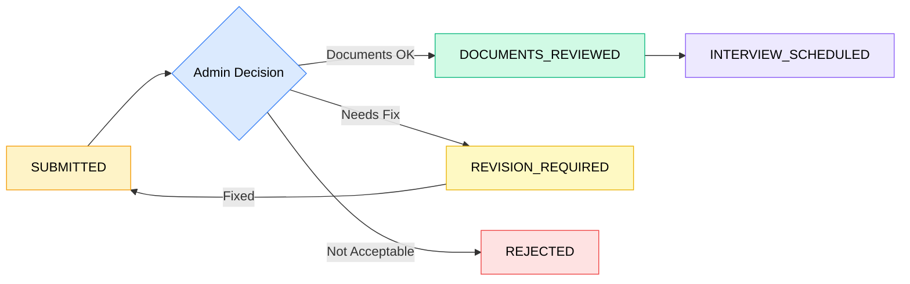

### Rejection Reasons (Predefined)

| Reason Code | Reason | When to Use |
|-------------|--------|-------------|
| INCOMPLETE_DOCS | Incomplete Documents | Missing required documents |
| INVALID_CERT | Invalid Certificate | Certificate appears fake or expired |
| NOT_QUALIFIED | Not Qualified | Doesn't meet minimum requirements |
| DUPLICATE | Duplicate Application | Already has an existing application |
| OTHER | Other | Custom reason with explanation |

### Email Templates

**Acceptance Email:**
```
Subject: 🎉 Great News - Schedule Your Interview!

Dear [Applicant Name],

Congratulations! Your documents have been reviewed and approved.

Next Step: Schedule your interview
1. Log in to your dashboard
2. Go to "My Application" page
3. Select an available interview slot
4. You'll receive a Google Meet link

Interview slots are available for the next 7 days.

Best regards,
[Platform Name] Team
```

**Rejection Email:**
```
Subject: Application Status Update

Dear [Applicant Name],

Thank you for your interest in becoming a tutor.

After reviewing your application, we regret to inform you
that we cannot proceed at this time.

Reason: [Rejection Reason]
Details: [Admin's message]

You may reapply after 30 days with updated documents.

Best regards,
[Platform Name] Team
```

---

## 2.2 Interview Scheduling

### Flow Diagram

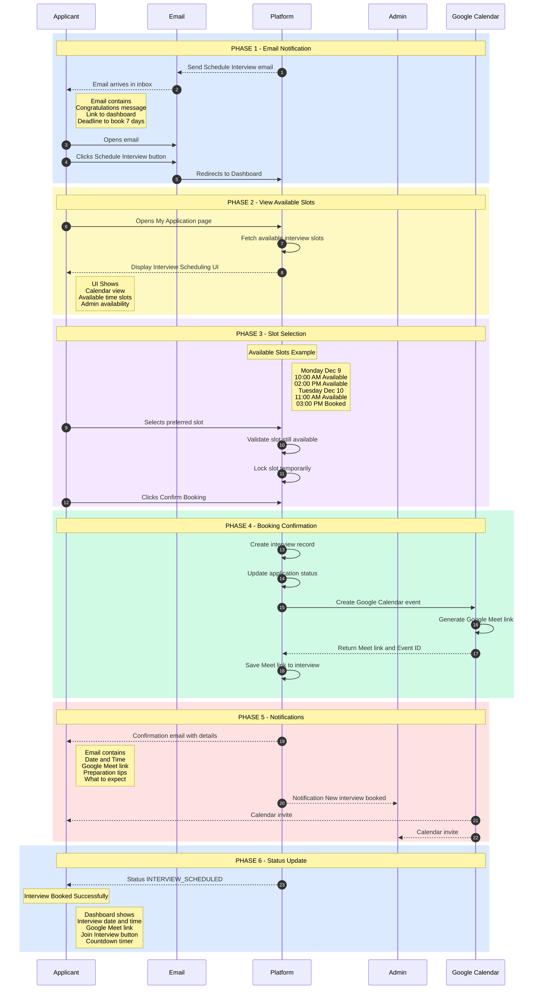

### Interview Slot Details

| Field | Description | Example |
|-------|-------------|---------|
| Date | Interview date | December 9, 2024 |
| Time | Interview time (Europe/Berlin) | 10:00 AM |
| Duration | Fixed duration | 30 minutes |
| Platform | Video call platform | Google Meet |
| Status | Slot status | AVAILABLE / BOOKED |

### Email Templates

**Interview Scheduled - Applicant Email:**
```
Subject: 🎥 Interview Scheduled - [Date] at [Time]

Hi [Applicant Name],

Your interview has been successfully scheduled!

📅 Date: [Day], [Date]
🕐 Time: [Time] (Europe/Berlin timezone)
⏱️ Duration: 30 minutes

🔗 Join via Google Meet:
[Google Meet Link]

📝 What to Prepare:
• Brief introduction about yourself
• Your teaching experience and methodology
• Questions about the platform

💡 Tips:
• Join 5 minutes early
• Test your audio/video beforehand
• Have a stable internet connection

Good luck! 🍀

Best regards,
The Tutoring Platform Team
```

**Interview Booked - Admin Notification:**
```
Subject: 📅 New Interview Booked - [Applicant Name]

New interview scheduled:

👤 Applicant: [Name]
📧 Email: [Email]
📅 Date: [Date] at [Time]
🔗 Meet Link: [Link]

View application: [Dashboard Link]
```

---

## 2.3 After Interview

### Flow Diagram

```mermaid
flowchart TD
    A[🎥 Interview Complete] --> B[📋 Status: INTERVIEW_DONE]

    B --> C{👨‍💼 Admin Decision}

    C -->|✅ Approve| D[APPROVED]
    subgraph Approved[" "]
        D --> D1[👤 Role: APPLICANT → TUTOR]
        D1 --> D2[🖥️ Full dashboard access]
        D2 --> D3[🔔 Can accept trial requests]
        D3 --> D4[💳 Setup Stripe Connect]
    end

    C -->|❌ Reject| E[REJECTED]
    subgraph Rejected[" "]
        E --> E1[📧 Rejection email with reason]
        E1 --> E2[🔚 Process ends]
    end
```

---

## 2.4 Tutor Dashboard (After Approval)

> Approve হওয়ার পরে Tutor মূল Dashboard এ যাবে

### Dashboard Navigation

```mermaid
flowchart LR
    subgraph Dashboard[👨‍🏫 Tutor Dashboard]
        A[🏠 Overview] --> B[📅 Sessions]
        B --> C[👨‍🎓 Students]
        C --> D[💬 Messages]
        D --> E[💰 Earnings]
        E --> F[👤 Profile]
    end

    G[🔔 Notifications] -.-> Dashboard
    H[🆘 Support] -.-> Dashboard
```

### Dashboard Pages Overview

| Page | কি দেখবে | কি করতে পারবে |
|------|----------|---------------|
| Overview | Level, Stats, Earnings, Trial Requests | Accept requests, Quick actions |
| Sessions | Upcoming & Completed sessions | Join, Give feedback |
| Students | All connected students | View progress, Message |
| Messages | All student conversations | Chat, Propose session |
| Earnings | Monthly earnings, Payout history | View breakdown, Download |
| Profile | Personal & Teaching info | Edit profile |

---

### 🏠 Overview Page (Main Dashboard)

#### Page Structure

```mermaid
flowchart TD
    A[Overview Page] --> B[Section 1: Level Progress]
    A --> C[Section 2: Quick Stats]
    A --> D[Section 3: New Trial Requests]
    A --> E[Section 4: Upcoming Sessions]
    A --> F[Section 5: Recent Earnings]
```

#### Full Overview Page Layout

```
┌─────────────────────────────────────────────────────────────────┐
│                     🏠 Dashboard Overview                        │
├─────────────────────────────────────────────────────────────────┤
│                                                                  │
│  ┌────────────────────────────────────────────────────────────┐ │
│  │ ⭐ YOUR LEVEL                                               │ │
│  │                                                             │ │
│  │  ┌─────────────────────────────────────────────────────┐   │ │
│  │  │                                                      │   │ │
│  │  │        🏆 LEVEL 3 - EXPERIENCED TUTOR               │   │ │
│  │  │                                                      │   │ │
│  │  │        Current Rate: €24/hr (Base €20 + €4 bonus)   │   │ │
│  │  │                                                      │   │ │
│  │  └─────────────────────────────────────────────────────┘   │ │
│  │                                                             │ │
│  │  Progress to Level 4:                                      │ │
│  │  ┌───────────────────────────────────────────────────────┐ │ │
│  │  │████████████████████████████░░░░░░░░░░░│ 75/100 lessons│ │ │
│  │  └───────────────────────────────────────────────────────┘ │ │
│  │                                                             │ │
│  │  ✅ 75 lessons completed    ⭐ 4.8 avg rating    🎯 25 more │ │
│  │                                                             │ │
│  └────────────────────────────────────────────────────────────┘ │
│                                                                  │
│  ┌──────────────┐ ┌──────────────┐ ┌──────────────┐ ┌──────────┐│
│  │ 📅 Sessions  │ │ 👨‍🎓 Students │ │ ⭐ Rating    │ │ 💰 Month ││
│  │              │ │              │ │              │ │          ││
│  │     12       │ │      8       │ │    4.8       │ │  €672    ││
│  │  This Month  │ │   Active     │ │   Average    │ │ Earned   ││
│  └──────────────┘ └──────────────┘ └──────────────┘ └──────────┘│
│                                                                  │
│  ┌────────────────────────────────────────────────────────────┐ │
│  │ 🔔 NEW TRIAL REQUESTS                          [View All →]│ │
│  │                                                             │ │
│  │  ┌──────────────────────────────────────────────────────┐  │ │
│  │  │ 📚 Mathematics • Grade 10 • Gymnasium               │  │ │
│  │  │ "Need help with calculus and algebra"               │  │ │
│  │  │ ⏰ 23 hours remaining                                │  │ │
│  │  │                     [✅ Accept]  [⏭️ Skip]          │  │ │
│  │  └──────────────────────────────────────────────────────┘  │ │
│  │                                                             │ │
│  │  ┌──────────────────────────────────────────────────────┐  │ │
│  │  │ 🔬 Physics • Grade 9 • Realschule                   │  │ │
│  │  │ "Struggling with Newton's laws"                     │  │ │
│  │  │ ⏰ 18 hours remaining                                │  │ │
│  │  │                     [✅ Accept]  [⏭️ Skip]          │  │ │
│  │  └──────────────────────────────────────────────────────┘  │ │
│  │                                                             │ │
│  └────────────────────────────────────────────────────────────┘ │
│                                                                  │
│  ┌────────────────────────────────────────────────────────────┐ │
│  │ 📅 UPCOMING SESSIONS                           [View All →]│ │
│  │                                                             │ │
│  │  Today, 3:00 PM    Math with Ahmed      [🎥 Join in 2 hrs]│ │
│  │  Tomorrow, 5:00 PM Physics with Sara    [📅 Scheduled]    │ │
│  │  Dec 5, 4:00 PM    Math with Karim      [📅 Scheduled]    │ │
│  │                                                             │ │
│  └────────────────────────────────────────────────────────────┘ │
│                                                                  │
└─────────────────────────────────────────────────────────────────┘
```

---

### 📝 Student Feedback (After Session)

> Session complete হওয়ার পরে Tutor student কে feedback দিতে পারবে

#### Feedback Flow

```mermaid
flowchart TD
    A[Session Completed] --> B[Feedback Prompt]

    B --> C[Feedback Modal Opens]

    subgraph Feedback[📝 Student Feedback]
        C --> D[Step 1: Rating]
        D --> D1[⭐ Overall Progress 1-5]
        D1 --> D2[⭐ Engagement 1-5]
        D2 --> D3[⭐ Understanding 1-5]

        D3 --> E[Step 2: Voice Feedback]
        E --> E1{Record Voice?}
        E1 -->|Yes| E2[🎤 Record up to 60 sec]
        E1 -->|Skip| E3[Skip Audio]

        E2 --> F[Step 3: Text Notes]
        E3 --> F
        F --> F1[📝 Write feedback notes]
    end

    F1 --> G[Submit Feedback]
    G --> H[✅ Success Modal]
    H --> I[Student sees feedback]
```

#### Feedback Modal Layout

```
┌─────────────────────────────────────────────────────────────────┐
│                 📝 Give Feedback to Student                      │
│                                                                  │
│  Session: Mathematics with Ahmed Khan                            │
│  Date: Dec 1, 2024 • Duration: 1 hour                           │
├─────────────────────────────────────────────────────────────────┤
│                                                                  │
│  STEP 1: Rate the Student                                       │
│  ──────────────────────────────────────────────────────────────  │
│                                                                  │
│  Overall Progress                                                │
│  How well is the student progressing?                           │
│  ☆   ☆   ☆   ☆   ☆                                             │
│  1   2   3   4   5                                              │
│                                                                  │
│  Engagement Level                                                │
│  How engaged was the student during the session?                │
│  ☆   ☆   ☆   ☆   ☆                                             │
│  1   2   3   4   5                                              │
│                                                                  │
│  Understanding                                                   │
│  How well did the student understand the material?              │
│  ☆   ☆   ☆   ☆   ☆                                             │
│  1   2   3   4   5                                              │
│                                                                  │
├─────────────────────────────────────────────────────────────────┤
│                                                                  │
│  STEP 2: Voice Feedback (Optional)                              │
│  ──────────────────────────────────────────────────────────────  │
│                                                                  │
│  Record a personal voice message for the student                │
│  (Max 60 seconds)                                               │
│                                                                  │
│  ┌─────────────────────────────────────────────────────────┐   │
│  │                                                          │   │
│  │           ┌─────────────────────────────┐               │   │
│  │           │         🎤                   │               │   │
│  │           │    [Start Recording]         │               │   │
│  │           └─────────────────────────────┘               │   │
│  │                                                          │   │
│  │           or  [Skip Voice Feedback]                      │   │
│  │                                                          │   │
│  └─────────────────────────────────────────────────────────┘   │
│                                                                  │
├─────────────────────────────────────────────────────────────────┤
│                                                                  │
│  STEP 3: Written Notes (Optional)                               │
│  ──────────────────────────────────────────────────────────────  │
│                                                                  │
│  ┌─────────────────────────────────────────────────────────┐   │
│  │ Great session today! Ahmed showed good understanding    │   │
│  │ of quadratic equations. Need to practice more on       │   │
│  │ factoring. Homework: Pages 45-47.                      │   │
│  │                                                         │   │
│  └─────────────────────────────────────────────────────────┘   │
│                                                                  │
├─────────────────────────────────────────────────────────────────┤
│                                                                  │
│         [Cancel]                    [📤 Submit Feedback]         │
│                                                                  │
└─────────────────────────────────────────────────────────────────┘
```

#### Voice Recording Interface

```
┌─────────────────────────────────────────────────────────────────┐
│                     🎤 Recording Voice Feedback                  │
├─────────────────────────────────────────────────────────────────┤
│                                                                  │
│                                                                  │
│                         ┌───────────┐                           │
│                         │    🎤     │                           │
│                         │           │                           │
│                         │  ●  REC   │                           │
│                         └───────────┘                           │
│                                                                  │
│                          00:23 / 01:00                          │
│                                                                  │
│          ┌──────────────────────────────────────┐               │
│          │▓▓▓▓▓▓▓▓▓▓▓▓▓▓▓░░░░░░░░░░░░░░░░░░░░│               │
│          └──────────────────────────────────────┘               │
│                                                                  │
│                                                                  │
│            [⏹️ Stop]        [🗑️ Delete & Restart]              │
│                                                                  │
│                                                                  │
└─────────────────────────────────────────────────────────────────┘
```

#### Voice Recorded Preview

```
┌─────────────────────────────────────────────────────────────────┐
│                     🎤 Voice Feedback Recorded                   │
├─────────────────────────────────────────────────────────────────┤
│                                                                  │
│  ┌─────────────────────────────────────────────────────────┐   │
│  │                                                          │   │
│  │   🎤 Voice Message                         Duration: 45s │   │
│  │                                                          │   │
│  │   [▶️ Play]  ────────────────────────────  [🗑️ Delete]  │   │
│  │                                                          │   │
│  └─────────────────────────────────────────────────────────┘   │
│                                                                  │
│                    ✅ Voice feedback recorded!                  │
│                                                                  │
│                    [🔄 Re-record]                               │
│                                                                  │
└─────────────────────────────────────────────────────────────────┘
```

#### Success Modal

```
┌─────────────────────────────────────────────────────────────────┐
│                                                                  │
│                                                                  │
│                         ✅                                      │
│                                                                  │
│                  Feedback Submitted!                             │
│                                                                  │
│        Your feedback has been sent to Ahmed Khan.               │
│                                                                  │
│        ┌─────────────────────────────────────────┐              │
│        │  📊 Session Summary                     │              │
│        │                                         │              │
│        │  Student: Ahmed Khan                    │              │
│        │  Subject: Mathematics                   │              │
│        │  Duration: 1 hour                       │              │
│        │  Your Rating: ⭐⭐⭐⭐⭐ (4.7 avg)       │              │
│        │  Voice Feedback: ✅ Included            │              │
│        │  Written Notes: ✅ Included             │              │
│        │                                         │              │
│        │  💰 Earned: €24.00                      │              │
│        │  🎯 Level Progress: +1 lesson          │              │
│        └─────────────────────────────────────────┘              │
│                                                                  │
│                        [🏠 Back to Dashboard]                   │
│                                                                  │
│                                                                  │
└─────────────────────────────────────────────────────────────────┘
```

#### Student View (Receives Feedback)

```
┌─────────────────────────────────────────────────────────────────┐
│                 📬 New Feedback from John Doe                    │
├─────────────────────────────────────────────────────────────────┤
│                                                                  │
│  Session: Mathematics • Dec 1, 2024                              │
│                                                                  │
│  ┌────────────────────────────────────────────────────────────┐ │
│  │ ⭐ TUTOR'S RATING                                          │ │
│  │                                                             │ │
│  │  Overall Progress:  ⭐⭐⭐⭐⭐  Excellent!                  │ │
│  │  Engagement:        ⭐⭐⭐⭐☆  Very Good                    │ │
│  │  Understanding:     ⭐⭐⭐⭐⭐  Excellent!                  │ │
│  │                                                             │ │
│  └────────────────────────────────────────────────────────────┘ │
│                                                                  │
│  ┌────────────────────────────────────────────────────────────┐ │
│  │ 🎤 VOICE MESSAGE                                           │ │
│  │                                                             │ │
│  │  ┌──────────────────────────────────────────────────────┐  │ │
│  │  │  [▶️]  ──────────────────────────────────  0:45      │  │ │
│  │  └──────────────────────────────────────────────────────┘  │ │
│  │                                                             │ │
│  └────────────────────────────────────────────────────────────┘ │
│                                                                  │
│  ┌────────────────────────────────────────────────────────────┐ │
│  │ 📝 TUTOR'S NOTES                                           │ │
│  │                                                             │ │
│  │  "Great session today! Ahmed showed good understanding     │ │
│  │   of quadratic equations. Need to practice more on         │ │
│  │   factoring. Homework: Pages 45-47."                       │ │
│  │                                                             │ │
│  └────────────────────────────────────────────────────────────┘ │
│                                                                  │
│                           [Close]                               │
│                                                                  │
└─────────────────────────────────────────────────────────────────┘
```

#### Feedback Data Structure

```
TutorFeedback {
    feedbackId: "feedback_123"
    sessionId: "session_456"

    // Tutor Info
    tutorId: "tutor_789"
    tutorName: "John Doe"

    // Student Info
    studentId: "student_012"
    studentName: "Ahmed Khan"

    // Ratings
    ratings: {
        overallProgress: 5      // 1-5
        engagementLevel: 4      // 1-5
        understanding: 5        // 1-5
        averageRating: 4.7
    }

    // Voice Feedback
    voiceFeedback: {
        hasVoice: true
        audioUrl: "url_to_audio"
        duration: 45            // seconds
    }

    // Written Notes
    writtenNotes: "Great session today!..."

    // Timestamps
    createdAt: "2024-12-01T16:00:00Z"
    sessionDate: "2024-12-01"
}
```

---

## 2.5 Trial Requests Page

> Tutor Dashboard এ Trial Requests page এ যাবে matching requests দেখতে

### Page Structure

```mermaid
flowchart TD
    A[Trial Requests Page] --> B[Tab 1: Open Requests]
    A --> C[Tab 2: Accepted Requests]

    B --> D[Show Top 9 Matching Requests]
    D --> E[No Pagination - Only Best Matches]

    C --> F[List of Accepted Students]
```

### Trial Requests Page Layout

```
┌─────────────────────────────────────────────────────────────────┐
│                     🔔 Trial Requests                            │
├─────────────────────────────────────────────────────────────────┤
│                                                                  │
│  ┌────────────────────────────────────────────────────────────┐ │
│  │  [🔵 Open Requests (7)]    [⚪ Accepted Requests (3)]       │ │
│  └────────────────────────────────────────────────────────────┘ │
│                                                                  │
│  📋 Showing top 9 matching requests based on your subjects      │
│                                                                  │
│  ┌─────────────────────┐ ┌─────────────────────┐ ┌─────────────────────┐
│  │ 📚 Mathematics      │ │ 📚 Mathematics      │ │ 🔬 Physics          │
│  │ 🏫 Gymnasium        │ │ 🏫 Realschule       │ │ 🏫 Gymnasium        │
│  │ 📊 Grade 10        │ │ 📊 Grade 9         │ │ 📊 Grade 11        │
│  │ 🕐 2 days ago       │ │ 🕐 5 hours ago      │ │ 🕐 1 day ago        │
│  │                     │ │                     │ │                     │
│  │   [👁️ View Details] │ │   [👁️ View Details] │ │   [👁️ View Details] │
│  └─────────────────────┘ └─────────────────────┘ └─────────────────────┘
│                                                                  │
│  ┌─────────────────────┐ ┌─────────────────────┐ ┌─────────────────────┐
│  │ 📚 Mathematics      │ │ 🔬 Physics          │ │ 📚 Mathematics      │
│  │ 🏫 Gesamtschule     │ │ 🏫 Gymnasium        │ │ 🏫 Gymnasium        │
│  │ 📊 Grade 8         │ │ 📊 Grade 10        │ │ 📊 Grade 12        │
│  │ 🕐 3 days ago       │ │ 🕐 6 hours ago      │ │ 🕐 12 hours ago     │
│  │                     │ │                     │ │                     │
│  │   [👁️ View Details] │ │   [👁️ View Details] │ │   [👁️ View Details] │
│  └─────────────────────┘ └─────────────────────┘ └─────────────────────┘
│                                                                  │
│  ┌─────────────────────┐ ┌─────────────────────┐ ┌─────────────────────┐
│  │ 🔬 Physics          │ │ 📚 Mathematics      │ │ 🔬 Physics          │
│  │ 🏫 Realschule       │ │ 🏫 Gymnasium        │ │ 🏫 Gesamtschule     │
│  │ 📊 Grade 9         │ │ 📊 Grade 11        │ │ 📊 Grade 10        │
│  │ 🕐 4 days ago       │ │ 🕐 1 day ago        │ │ 🕐 8 hours ago      │
│  │                     │ │                     │ │                     │
│  │   [👁️ View Details] │ │   [👁️ View Details] │ │   [👁️ View Details] │
│  └─────────────────────┘ └─────────────────────┘ └─────────────────────┘
│                                                                  │
│  ────────────────────────────────────────────────────────────── │
│  ℹ️ Only showing top 9 most relevant requests for your subjects │
│                                                                  │
└─────────────────────────────────────────────────────────────────┘
```

### Request Card Details

```
┌─────────────────────────────────────┐
│                                     │
│  📚 Mathematics                     │  ← Subject Name
│                                     │
│  🏫 Gymnasium                       │  ← School Type
│  📊 Grade 10                       │  ← Grade/Class
│  🕐 2 days ago                      │  ← When posted
│                                     │
│         [👁️ View Details]          │  ← Opens detail modal
│                                     │
└─────────────────────────────────────┘
```

### View Details Modal

```
┌─────────────────────────────────────────────────────────────────┐
│                    📋 Trial Request Details                      │
│                                                          [X]    │
├─────────────────────────────────────────────────────────────────┤
│                                                                  │
│  ┌────────────────────────────────────────────────────────────┐ │
│  │ 👨‍🎓 STUDENT INFORMATION                                    │ │
│  │                                                             │ │
│  │  Name:         Ahmed Khan                                   │ │
│  │  Subject:      📚 Mathematics                               │ │
│  │  School Type:  🏫 Gymnasium                                 │ │
│  │  Grade:        📊 10th Grade                               │ │
│  │  Posted:       🕐 2 days ago                                │ │
│  │                                                             │ │
│  └────────────────────────────────────────────────────────────┘ │
│                                                                  │
│  ┌────────────────────────────────────────────────────────────┐ │
│  │ 🎯 LEARNING GOAL                                           │ │
│  │                                                             │ │
│  │  "I'm struggling with quadratic equations and need help    │ │
│  │   understanding the quadratic formula. I have an exam in   │ │
│  │   3 weeks and want to improve my grades from C to B."      │ │
│  │                                                             │ │
│  └────────────────────────────────────────────────────────────┘ │
│                                                                  │
│  ┌────────────────────────────────────────────────────────────┐ │
│  │ 💬 YOUR INTRODUCTION MESSAGE                               │ │
│  │                                                             │ │
│  │  Write a short message to introduce yourself:              │ │
│  │                                                             │ │
│  │  ┌──────────────────────────────────────────────────────┐  │ │
│  │  │ Hi Ahmed! I'm John, a Mathematics tutor with 3 years │  │ │
│  │  │ of experience. I specialize in algebra and can       │  │ │
│  │  │ definitely help you master quadratic equations.      │  │ │
│  │  │ Let's work together to get you that B!               │  │ │
│  │  │                                                       │  │ │
│  │  └──────────────────────────────────────────────────────┘  │ │
│  │                                                             │ │
│  │  💡 Tip: A personalized message increases acceptance rate! │ │
│  │                                                             │ │
│  └────────────────────────────────────────────────────────────┘ │
│                                                                  │
├─────────────────────────────────────────────────────────────────┤
│                                                                  │
│      [❌ Decline]                        [✅ Accept & Send]      │
│                                                                  │
└─────────────────────────────────────────────────────────────────┘
```

### Accept Flow

```mermaid
flowchart TD
    A[Click "View Details"] --> B[Modal Opens]

    B --> C[See Student Info]
    C --> D[Read Learning Goal]
    D --> E[Write Introduction Message]

    E --> F{Decision}

    F -->|Accept & Send| G[Request Accepted]
    subgraph Success[" "]
        G --> G1[Introduction sent to student]
        G1 --> G2[Chat auto opens]
        G2 --> G3[Can schedule first session]
    end

    F -->|Decline| H[Request Hidden]
    H --> I[See other requests]
```

### Success Modal (After Accept)

```
┌─────────────────────────────────────────────────────────────────┐
│                                                                  │
│                         ✅                                      │
│                                                                  │
│               Request Accepted Successfully!                     │
│                                                                  │
│       Your introduction has been sent to Ahmed Khan.            │
│                                                                  │
│       ┌─────────────────────────────────────────────┐           │
│       │                                              │           │
│       │  👨‍🎓 Student: Ahmed Khan                     │           │
│       │  📚 Subject: Mathematics                     │           │
│       │  📊 Grade: 10th                             │           │
│       │                                              │           │
│       │  ✉️ Your message has been sent!             │           │
│       │                                              │           │
│       └─────────────────────────────────────────────┘           │
│                                                                  │
│           [💬 Open Chat]    [🏠 Back to Requests]               │
│                                                                  │
└─────────────────────────────────────────────────────────────────┘
```

### Accepted Requests Tab (Table View)

```
┌─────────────────────────────────────────────────────────────────┐
│                     🔔 Trial Requests                            │
├─────────────────────────────────────────────────────────────────┤
│                                                                  │
│  ┌────────────────────────────────────────────────────────────┐ │
│  │  [⚪ Open Requests (7)]    [🔵 Accepted Requests (5)]       │ │
│  └────────────────────────────────────────────────────────────┘ │
│                                                                  │
│  📋 Students you've accepted                                    │
│                                                                  │
│  ┌────────────────────────────────────────────────────────────┐ │
│  │ Student Name    │ Subject     │ Sessions │ Status    │Action│ │
│  ├─────────────────┼─────────────┼──────────┼───────────┼──────┤ │
│  │ Ahmed Khan      │ Mathematics │    0     │ ⏳ Awaiting│[👁️] │ │
│  │ Sara Mueller    │ Physics     │    2     │ 📅 Scheduled│[👁️]│ │
│  │ Karim Hassan    │ Mathematics │    5     │ 🟢 Starting│[👁️] │ │
│  │ Lisa Schmidt    │ Physics     │    1     │ 🔵 In Progress│[👁️]│ │
│  │ Max Weber       │ Mathematics │    3     │ ✅ Completed│[👁️] │ │
│  └────────────────────────────────────────────────────────────┘ │
│                                                                  │
└─────────────────────────────────────────────────────────────────┘
```

### Session Status Flow

```mermaid
flowchart LR
    A[⏳ Awaiting Your Response] --> B[📅 Scheduled]
    B --> C[🟢 Starting Soon]
    C --> D[🔵 In Progress]
    D --> E[📝 Leave a Review]
    E --> F[⏳ Review Submitted]
    F --> G[✅ Completed]

    A -->|Decline| H[❌ Declined]
    B -->|Reschedule| A
    C -->|No one joins| I[⚠️ Expired]
    D -->|No one joins| I
```

**Review Flow:**
- Session শেষ হলে → "Leave a Review" দেখাবে
- Review দিলে → "Review Submitted" (অন্যজনের জন্য wait করবে)
- দুইজনই review দিলে → "Completed" হবে
- কেউ join না করলে → "Expired" হবে

### Status Types

| Status | Icon | Meaning | Action Available |
|--------|------|---------|------------------|
| Awaiting Your Response | ⏳ | Student proposed time, waiting for tutor | Accept/Reschedule/Decline |
| Scheduled | 📅 | Session confirmed | View details |
| Starting Soon | 🟢 | 10 min before session | Join Session button |
| In Progress | 🔵 | Session is live | Join Session button |
| Leave a Review | 📝 | Session ended, waiting for your review | Leave Review button |
| Review Submitted | ⏳ | You reviewed, waiting for other person | View your review |
| Completed | ✅ | Both reviewed | View reviews |
| Expired | ⚠️ | No one joined the session | - |
| Declined | ❌ | Tutor declined | - |

---

### View Details Modal (Click 👁️)

```
┌─────────────────────────────────────────────────────────────────┐
│                    👨‍🎓 Student Details                           │
│                                                          [X]    │
├─────────────────────────────────────────────────────────────────┤
│                                                                  │
│  ┌────────────────────────────────────────────────────────────┐ │
│  │ 📋 STUDENT INFORMATION                                     │ │
│  │                                                             │ │
│  │  Name:         Ahmed Khan                                   │ │
│  │  Subject:      📚 Mathematics                               │ │
│  │  School Type:  🏫 Gymnasium                                 │ │
│  │  Grade:        📊 10th Grade                               │ │
│  │  Sessions:     0 completed                                  │ │
│  │  Accepted:     Dec 1, 2024                                  │ │
│  │                                                             │ │
│  └────────────────────────────────────────────────────────────┘ │
│                                                                  │
│  ┌────────────────────────────────────────────────────────────┐ │
│  │ 💬 MESSAGES                                                │ │
│  │                                                             │ │
│  │  ┌──────────────────────────────────────────────────────┐  │ │
│  │  │ 👨‍🏫 You (Dec 1, 10:30 AM)                            │  │ │
│  │  │ "Hi Ahmed! I'm John, a Mathematics tutor. Looking   │  │ │
│  │  │  forward to helping you with quadratic equations!"  │  │ │
│  │  └──────────────────────────────────────────────────────┘  │ │
│  │                                                             │ │
│  │  ┌──────────────────────────────────────────────────────┐  │ │
│  │  │ 👨‍🎓 Ahmed (Dec 1, 11:00 AM)                          │  │ │
│  │  │ "Thanks John! Can we do our first session on        │  │ │
│  │  │  Wednesday at 3 PM?"                                │  │ │
│  │  └──────────────────────────────────────────────────────┘  │ │
│  │                                                             │ │
│  │  ┌──────────────────────────────────────────────────────┐  │ │
│  │  │ Type a message...                          [Send]   │  │ │
│  │  └──────────────────────────────────────────────────────┘  │ │
│  │                                                             │ │
│  └────────────────────────────────────────────────────────────┘ │
│                                                                  │
│  ┌────────────────────────────────────────────────────────────┐ │
│  │ 📅 PROPOSED SESSION                          ⏳ Awaiting   │ │
│  │                                                             │ │
│  │  Student proposed:                                         │ │
│  │  📅 Date: Wednesday, Dec 4, 2024                          │ │
│  │  🕐 Time: 3:00 PM - 4:00 PM                               │ │
│  │  ⏱️ Duration: 1 hour                                       │ │
│  │                                                             │ │
│  └────────────────────────────────────────────────────────────┘ │
│                                                                  │
├─────────────────────────────────────────────────────────────────┤
│                                                                  │
│  [❌ Decline]    [🔄 Reschedule]    [✅ Accept]                 │
│                                                                  │
└─────────────────────────────────────────────────────────────────┘
```

---

### Status: ⏳ Awaiting Your Response

> Student proposed a date/time, tutor needs to respond

```
┌────────────────────────────────────────────────────────────────┐
│ 📅 PROPOSED SESSION                          ⏳ Awaiting       │
│                                                                │
│  Student proposed:                                             │
│  📅 Date: Wednesday, Dec 4, 2024                              │
│  🕐 Time: 3:00 PM - 4:00 PM                                   │
│  ⏱️ Duration: 1 hour                                           │
│                                                                │
├────────────────────────────────────────────────────────────────┤
│                                                                │
│  [❌ Decline]    [🔄 Reschedule]    [✅ Accept]                │
│                                                                │
└────────────────────────────────────────────────────────────────┘
```

**Actions:**
- **Accept** → Session scheduled, Google Meet link created
- **Reschedule** → Propose new date/time
- **Decline** → Cancel this session request

---

### Reschedule Modal

```
┌─────────────────────────────────────────────────────────────────┐
│                    🔄 Reschedule Session                         │
├─────────────────────────────────────────────────────────────────┤
│                                                                  │
│  Student proposed: Wed, Dec 4 at 3:00 PM                        │
│                                                                  │
│  Suggest a new time:                                            │
│                                                                  │
│  📅 Date                                                        │
│  ┌──────────────────────────────────────────────────────────┐  │
│  │ Thursday, Dec 5, 2024                            📅      │  │
│  └──────────────────────────────────────────────────────────┘  │
│                                                                  │
│  🕐 Time                                                        │
│  ┌──────────────────────────────────────────────────────────┐  │
│  │ 4:00 PM                                          🕐      │  │
│  └──────────────────────────────────────────────────────────┘  │
│                                                                  │
│  ⏱️ Duration                                                    │
│  ┌──────────────────────────────────────────────────────────┐  │
│  │ 1 hour                                           ▼       │  │
│  └──────────────────────────────────────────────────────────┘  │
│                                                                  │
│  💬 Message (optional)                                          │
│  ┌──────────────────────────────────────────────────────────┐  │
│  │ Sorry, I'm not available Wednesday. How about Thursday? │  │
│  └──────────────────────────────────────────────────────────┘  │
│                                                                  │
├─────────────────────────────────────────────────────────────────┤
│                                                                  │
│         [Cancel]                   [📤 Send Proposal]           │
│                                                                  │
└─────────────────────────────────────────────────────────────────┘
```

---

### Session Status Reference

```
┌─────────────────────────────────────────────────────────────────┐
│  SESSION STATUS TYPES                                           │
├─────────────────────────────────────────────────────────────────┤
│                                                                  │
│  📅 Scheduled ────────── Session confirmed by both parties      │
│                                                                  │
│  🟢 Starting Soon ────── 10 minutes before session starts       │
│                                                                  │
│  🔵 In Progress ──────── Session is currently live              │
│                                                                  │
│  📝 Leave a Review ───── Session শেষ, review দিতে হবে            │
│                                                                  │
│  ⏳ Review Submitted ─── অন্যজনের review এর জন্য wait করছেন     │
│                                                                  │
│  ✅ Completed ─────────── দুইজনই review দিয়েছে, session complete │
│                                                                  │
│  ⚠️ Expired ───────────── কেউ session এ join করেনি              │
│                                                                  │
└─────────────────────────────────────────────────────────────────┘
```

---

### Session Scheduling Flow (Complete)

```mermaid
sequenceDiagram
    participant S as 👨‍🎓 Student
    participant P as 🖥️ Platform
    participant T as 👨‍🏫 Tutor

    Note over S,T: After Tutor Accepts Trial Request

    S->>P: Proposes date/time in chat
    P->>T: Shows "⏳ Awaiting Your Response"

    rect rgb(209, 250, 229)
        Note over S,T: ✅ Option 1: Tutor Accepts
        T->>P: Clicks "Accept"
        P->>P: Creates Google Meet link
        P->>S: Notification: "Session Scheduled!"
        P->>T: Status: "📅 Scheduled"
        P->>S: Status: "📅 Scheduled"
    end

    rect rgb(254, 249, 195)
        Note over S,T: 🔄 Option 2: Tutor Reschedules
        T->>P: Clicks "Reschedule"
        T->>P: Proposes new time
        P->>S: Notification: "New time proposed"
        S->>P: Accepts new time
        P->>T: Status: "📅 Scheduled"
    end

    rect rgb(254, 226, 226)
        Note over S,T: ❌ Option 3: Tutor Declines
        T->>P: Clicks "Decline"
        P->>S: Notification: "Session declined"
    end

    Note over S,T: 10 minutes before session
    P->>T: Status: "🟢 Starting Soon"
    P->>S: Status: "🟢 Starting Soon"
    P-->>T: Join Session button appears
    P-->>S: Join Session button appears

    rect rgb(209, 250, 229)
        Note over S,T: ✅ Scenario A: Both Join
        Note over S,T: Session starts
        P->>T: Status: "🔵 In Progress"
        P->>S: Status: "🔵 In Progress"

        Note over S,T: Session ends
        P->>T: Status: "📝 Leave a Review"
        P->>S: Status: "📝 Leave a Review"

        T->>P: Submits review for student
        P->>T: Status: "⏳ Review Submitted"
        P->>T: "Waiting for Ahmed to review..."

        S->>P: Submits review for tutor
        P->>S: Status: "⏳ Review Submitted"
        P->>S: "Waiting for John to review..."

        Note over S,T: Both reviewed
        P->>T: Status: "✅ Completed"
        P->>S: Status: "✅ Completed"
    end

    rect rgb(254, 226, 226)
        Note over S,T: ❌ Scenario B: No One Joins
        Note over S,T: Session time passes
        P->>T: Status: "⚠️ Expired"
        P->>S: Status: "⚠️ Expired"
        P-->>T: Reschedule Session option
        P-->>S: Reschedule Session option
    end
```

---

### Review Flow Summary

```
┌─────────────────────────────────────────────────────────────────────┐
│                        REVIEW FLOW                                   │
├─────────────────────────────────────────────────────────────────────┤
│                                                                      │
│  Session শেষ হলে:                                                   │
│  ┌─────────────────┐                                                │
│  │ 📝 Leave Review │ ← Both Tutor & Student see this               │
│  └────────┬────────┘                                                │
│           │                                                          │
│           ▼                                                          │
│  ┌─────────────────────────────────────────────────────────────┐    │
│  │         Person A submits review                              │    │
│  │  ┌────────────────────────────────────────────────────────┐ │    │
│  │  │ Person A sees: ⏳ Review Submitted                     │ │    │
│  │  │ "Waiting for other person to review..."                │ │    │
│  │  └────────────────────────────────────────────────────────┘ │    │
│  │  ┌────────────────────────────────────────────────────────┐ │    │
│  │  │ Person B still sees: 📝 Leave a Review                 │ │    │
│  │  └────────────────────────────────────────────────────────┘ │    │
│  └─────────────────────────────────────────────────────────────┘    │
│           │                                                          │
│           ▼                                                          │
│  ┌─────────────────────────────────────────────────────────────┐    │
│  │         Person B submits review                              │    │
│  │  ┌────────────────────────────────────────────────────────┐ │    │
│  │  │ Both see: ✅ Completed                                  │ │    │
│  │  │ Can view both reviews                                   │ │    │
│  │  └────────────────────────────────────────────────────────┘ │    │
│  └─────────────────────────────────────────────────────────────┘    │
│                                                                      │
│  কেউ Join না করলে:                                                  │
│  ┌─────────────────┐                                                │
│  │  ⚠️ Expired     │ → Reschedule option available                  │
│  └─────────────────┘                                                │
│                                                                      │
└─────────────────────────────────────────────────────────────────────┘
```

---

### Schedule Session Button (From Messages)

> Messages এ accept করার পর automatically chat এ add হয়ে যাবে

```
┌─────────────────────────────────────────────────────────────────┐
│  💬 Chat with Ahmed Khan                                 [X]   │
├─────────────────────────────────────────────────────────────────┤
│                                                                  │
│  ┌──────────────────────────────────────────────────────────┐   │
│  │ 👨‍🏫 You                                                   │   │
│  │ "Hi Ahmed! Looking forward to helping you!"             │   │
│  └──────────────────────────────────────────────────────────┘   │
│                                                                  │
│  ┌──────────────────────────────────────────────────────────┐   │
│  │ 👨‍🎓 Ahmed                                                 │   │
│  │ "Thanks! When can we have our first session?"           │   │
│  └──────────────────────────────────────────────────────────┘   │
│                                                                  │
│  ────────────────────────────────────────────────────────────   │
│                                                                  │
│  ┌──────────────────────────────────────────────────────────┐   │
│  │  📅 SCHEDULE SESSION                                     │   │
│  │                                                          │   │
│  │  Click below to propose a session time                   │   │
│  │                                                          │   │
│  │              [📅 Schedule Session]                       │   │
│  │                                                          │   │
│  └──────────────────────────────────────────────────────────┘   │
│                                                                  │
├─────────────────────────────────────────────────────────────────┤
│  Type a message...                                    [Send]   │
└─────────────────────────────────────────────────────────────────┘
```

---

### Schedule Session Modal

```
┌─────────────────────────────────────────────────────────────────┐
│                    📅 Schedule Session                           │
├─────────────────────────────────────────────────────────────────┤
│                                                                  │
│  Student: Ahmed Khan                                            │
│  Subject: Mathematics                                           │
│                                                                  │
│  📅 Select Date                                                 │
│  ┌──────────────────────────────────────────────────────────┐  │
│  │         December 2024                                    │  │
│  │  Su  Mo  Tu  We  Th  Fr  Sa                             │  │
│  │   1   2   3  [4]  5   6   7                             │  │
│  │   8   9  10  11  12  13  14                             │  │
│  │  15  16  17  18  19  20  21                             │  │
│  └──────────────────────────────────────────────────────────┘  │
│                                                                  │
│  🕐 Select Time                                                 │
│  ┌──────────────────────────────────────────────────────────┐  │
│  │  [2:00 PM]  [3:00 PM]  [4:00 PM]  [5:00 PM]  [6:00 PM]  │  │
│  └──────────────────────────────────────────────────────────┘  │
│                                                                  │
│  ⏱️ Duration                                                    │
│  ┌──────────────────────────────────────────────────────────┐  │
│  │  [1 hour]   [1.5 hours]   [2 hours]                     │  │
│  └──────────────────────────────────────────────────────────┘  │
│                                                                  │
│  Selected: Dec 4, 2024 • 3:00 PM • 1 hour                      │
│                                                                  │
├─────────────────────────────────────────────────────────────────┤
│                                                                  │
│         [Cancel]                   [📤 Send Proposal]           │
│                                                                  │
└─────────────────────────────────────────────────────────────────┘
```

### Data Structure

```
TrialRequest (Card View) {
    requestId: "req_123"
    subject: "Mathematics"
    schoolType: "Gymnasium"
    grade: "10"
    postedAgo: "2 days ago"
}

TrialRequest (Detail View) {
    requestId: "req_123"

    // Student Info
    studentName: "Ahmed Khan"
    subject: "Mathematics"
    schoolType: "Gymnasium"
    grade: "10th Grade"
    postedAt: "2024-11-29T10:00:00Z"

    // Learning Goal
    learningGoal: "I'm struggling with quadratic equations..."

    // Tutor's Response
    tutorIntroMessage: "Hi Ahmed! I'm John..."

    // Status
    status: "open" | "accepted" | "declined" | "expired"
    acceptedAt: null
    expiresAt: "2024-12-01T10:00:00Z"
}
```

---

## 2.6 Teaching a Student

### Flow Diagram

```mermaid
flowchart TD
    A[💬 Chat with student] --> B[🖱️ Click "Propose Session"]

    subgraph Propose[" "]
        B --> B1[📅 Select Date]
        B1 --> B2[🕐 Select Time]
        B2 --> B3[⏱️ Select Duration]
    end

    B3 --> C{Student accepts?}

    C -->|✅ Yes| D[Session Scheduled]
    subgraph Scheduled[" "]
        D --> D1[🔗 Google Meet link created]
        D1 --> D2[🔔 Both notified]
    end

    C -->|❌ No| E[💬 Propose new time]

    D2 --> F[🎥 Join & teach session]
    F --> G[🏁 Session Complete]
    G --> H[⭐ Student reviews]
    H --> I[📊 Rating updated]
```

### Text Flow

```
Chat এ Student এর সাথে কথা বলে
    │
    ▼
"Propose Session" করে
    • Date
    • Time
    • Duration
    │
    ▼
Student Accept করলে
    │
    ▼
Session Scheduled
    • Google Meet link auto create
    │
    ▼
Session Time এ Join করে
    │
    ▼
Session Complete
    │
    ▼
Student Review দেয়
    │
    ▼
Tutor এর Rating Update হয়
```

---

## 2.7 Getting Paid

### Flow Diagram

```mermaid
flowchart TD
    subgraph Month[📅 Throughout the month]
        A1[Session 1 - 2hrs]
        A2[Session 2 - 1hr]
        A3[Session 3 - 2hrs]
        A4[... more sessions]
    end

    A1 & A2 & A3 & A4 --> B[🗓️ Month End - 1st]

    B --> C[System calculates]
    subgraph Calculate[" "]
        C --> C1[📊 Total hours: 30]
        C1 --> C2[💰 Gross: 30 × €28 = €840]
        C2 --> C3[📉 Commission 20%: -€168]
        C3 --> C4[✅ Net payout: €672]
    end

    C4 --> D[📋 Payout record created]
    D --> E[🗓️ 5th of next month]
    E --> F[💳 Stripe transfer]
    F --> G[🏦 Money in bank account]
```

### Example Calculation

| Item | Amount |
|------|--------|
| 30 hours taught | - |
| Gross (30 × €28) | €840 |
| Commission (20%) | -€168 |
| **Tutor Receives** | **€672** |

---

## 2.8 Tutor Dashboard Pages

| Page | কি দেখবে | কি করতে পারবে |
|------|----------|---------------|
| Home | Stats, New requests, Today's sessions | Quick actions |
| Requests | All trial requests | Accept, Skip, View |
| Chats | Student conversations | Message, Propose session |
| Sessions | Upcoming & Completed | Join, View details |
| Earnings | Monthly earnings, Payout history | View, Download |
| Profile | Public profile | Edit info, Add subjects |
| Notifications | All notifications | Mark read, Click to action |
| Support | Report, FAQ | Submit ticket |
| Resources | Open source learning materials | Search, View |

---

### 2.8.1 Earnings Page

> প্রতি মাসের earnings table এ দেখাবে, download করতে পারবে

```
┌─────────────────────────────────────────────────────────────────────┐
│  💰 EARNINGS                                                        │
├─────────────────────────────────────────────────────────────────────┤
│                                                                      │
│  ┌────────────────────────────────────────────────────────────────┐ │
│  │ 📊 EARNINGS OVERVIEW                                           │ │
│  │                                                                 │ │
│  │  Total Earned (All Time)         This Month                    │ │
│  │  ┌─────────────────────┐         ┌─────────────────────┐      │ │
│  │  │     €4,560.00       │         │      €672.00        │      │ │
│  │  └─────────────────────┘         └─────────────────────┘      │ │
│  │                                                                 │ │
│  │  Hours Taught (All Time)         Hours This Month              │ │
│  │  ┌─────────────────────┐         ┌─────────────────────┐      │ │
│  │  │       190 hrs       │         │        30 hrs       │      │ │
│  │  └─────────────────────┘         └─────────────────────┘      │ │
│  │                                                                 │ │
│  └────────────────────────────────────────────────────────────────┘ │
│                                                                      │
│  ┌────────────────────────────────────────────────────────────────┐ │
│  │ 📅 MONTHLY EARNINGS                          [📥 Download CSV] │ │
│  │                                                                 │ │
│  │ ┌─────────────────────────────────────────────────────────────┐│ │
│  │ │  Month     │ Hours │ Gross    │Commission│ Net Earned │Status││ │
│  │ ├────────────┼───────┼──────────┼──────────┼────────────┼──────┤│ │
│  │ │ Dec 2024   │  30   │ €840.00  │ -€168.00 │  €672.00   │🟡Pending││
│  │ │ Nov 2024   │  28   │ €784.00  │ -€156.80 │  €627.20   │✅Paid ││ │
│  │ │ Oct 2024   │  35   │ €980.00  │ -€196.00 │  €784.00   │✅Paid ││ │
│  │ │ Sep 2024   │  25   │ €700.00  │ -€140.00 │  €560.00   │✅Paid ││ │
│  │ │ Aug 2024   │  32   │ €896.00  │ -€179.20 │  €716.80   │✅Paid ││ │
│  │ │ Jul 2024   │  22   │ €616.00  │ -€123.20 │  €492.80   │✅Paid ││ │
│  │ │ Jun 2024   │  18   │ €504.00  │ -€100.80 │  €403.20   │✅Paid ││ │
│  │ └─────────────────────────────────────────────────────────────┘│ │
│  │                                                                 │ │
│  │  [< Previous]                                        [Next >]  │ │
│  │                                                                 │ │
│  └────────────────────────────────────────────────────────────────┘ │
│                                                                      │
│  ┌────────────────────────────────────────────────────────────────┐ │
│  │ 💳 PAYOUT INFORMATION                                          │ │
│  │                                                                 │ │
│  │  Next Payout Date: January 5, 2025                             │ │
│  │  Expected Amount: €672.00                                      │ │
│  │                                                                 │ │
│  │  Bank Account: •••• •••• •••• 4567                             │ │
│  │  [Update Bank Details]                                         │ │
│  │                                                                 │ │
│  └────────────────────────────────────────────────────────────────┘ │
│                                                                      │
└─────────────────────────────────────────────────────────────────────┘
```

#### Monthly Earnings Table Columns

| Column | Description |
|--------|-------------|
| Month | কোন মাস |
| Hours | সেই মাসে কত ঘন্টা পড়িয়েছে |
| Gross | মোট আয় (Hours × Hourly Rate) |
| Commission | Platform এর 20% কমিশন |
| Net Earned | Tutor যা পাবে (Gross - Commission) |
| Status | 🟡 Pending / ✅ Paid |

#### Download Options

```
┌─────────────────────────────────────────────────────────────────┐
│  📥 DOWNLOAD EARNINGS                                           │
├─────────────────────────────────────────────────────────────────┤
│                                                                  │
│  Select format:                                                  │
│  ┌──────────────────────────────────────────────────────────┐   │
│  │  [📊 CSV]        [📄 PDF]        [📑 Excel]              │   │
│  └──────────────────────────────────────────────────────────┘   │
│                                                                  │
│  Select period:                                                  │
│  ┌──────────────────────────────────────────────────────────┐   │
│  │  [This Month]  [Last 3 Months]  [Last 6 Months]  [Year]  │   │
│  └──────────────────────────────────────────────────────────┘   │
│                                                                  │
│  Or custom range:                                                │
│  ┌─────────────────┐    ┌─────────────────┐                     │
│  │ From: Nov 2024  │    │  To: Dec 2024   │                     │
│  └─────────────────┘    └─────────────────┘                     │
│                                                                  │
│                              [📥 Download]                       │
│                                                                  │
└─────────────────────────────────────────────────────────────────┘
```

---

### 2.8.2 Support Page

> Tutor এর জন্য support options (Same structure as Student)

```
┌─────────────────────────────────────────────────────────────────────┐
│  🆘 SUPPORT                                                         │
├─────────────────────────────────────────────────────────────────────┤
│                                                                      │
│  ┌────────────────────────────────────────────────────────────────┐ │
│  │ 📋 REPORT AN ISSUE                                             │ │
│  │                                                                 │ │
│  │  What do you need help with?                                   │ │
│  │                                                                 │ │
│  │  ┌────────────────────┐  ┌────────────────────┐               │ │
│  │  │  💰 Payout Issue   │  │  👨‍🎓 Student Issue │               │ │
│  │  └────────────────────┘  └────────────────────┘               │ │
│  │                                                                 │ │
│  │  ┌────────────────────┐  ┌────────────────────┐               │ │
│  │  │  🎥 Technical Issue│  │  ❓ Other          │               │ │
│  │  └────────────────────┘  └────────────────────┘               │ │
│  │                                                                 │ │
│  └────────────────────────────────────────────────────────────────┘ │
│                                                                      │
│  ┌────────────────────────────────────────────────────────────────┐ │
│  │ 📝 MY TICKETS                                                  │ │
│  │                                                                 │ │
│  │  ┌──────────────────────────────────────────────────────────┐ │ │
│  │  │  #TKT-2024-5678   Payout Delay     🟡 In Progress        │ │ │
│  │  │  Created: Dec 1, 2024                        [View]      │ │ │
│  │  └──────────────────────────────────────────────────────────┘ │ │
│  │                                                                 │ │
│  │  ┌──────────────────────────────────────────────────────────┐ │ │
│  │  │  #TKT-2024-5123   Session Issue    ✅ Resolved           │ │ │
│  │  │  Created: Nov 20, 2024                       [View]      │ │ │
│  │  └──────────────────────────────────────────────────────────┘ │ │
│  │                                                                 │ │
│  └────────────────────────────────────────────────────────────────┘ │
│                                                                      │
│  ┌────────────────────────────────────────────────────────────────┐ │
│  │ ❓ FREQUENTLY ASKED QUESTIONS                                  │ │
│  │                                                                 │ │
│  │  ┌──────────────────────────────────────────────────────────┐ │ │
│  │  │ ▶ When will I receive my payout?                         │ │ │
│  │  └──────────────────────────────────────────────────────────┘ │ │
│  │                                                                 │ │
│  │  ┌──────────────────────────────────────────────────────────┐ │ │
│  │  │ ▶ How is my commission calculated?                       │ │ │
│  │  └──────────────────────────────────────────────────────────┘ │ │
│  │                                                                 │ │
│  │  ┌──────────────────────────────────────────────────────────┐ │ │
│  │  │ ▶ How do I level up and increase my rate?                │ │ │
│  │  └──────────────────────────────────────────────────────────┘ │ │
│  │                                                                 │ │
│  │  ┌──────────────────────────────────────────────────────────┐ │ │
│  │  │ ▶ What happens if a student doesn't show up?             │ │ │
│  │  └──────────────────────────────────────────────────────────┘ │ │
│  │                                                                 │ │
│  │  ┌──────────────────────────────────────────────────────────┐ │ │
│  │  │ ▶ How can I update my bank details?                      │ │ │
│  │  └──────────────────────────────────────────────────────────┘ │ │
│  │                                                                 │ │
│  │  [View All FAQs]                                               │ │
│  │                                                                 │ │
│  └────────────────────────────────────────────────────────────────┘ │
│                                                                      │
│  ┌────────────────────────────────────────────────────────────────┐ │
│  │ 💬 CONTACT SUPPORT                                             │ │
│  │                                                                 │ │
│  │  📧 Email: tutor-support@platform.com                          │ │
│  │  📞 Phone: +49 30 12345678 (Mon-Fri, 9am-6pm)                  │ │
│  │                                                                 │ │
│  │  [💬 Start Live Chat]                                          │ │
│  │                                                                 │ │
│  └────────────────────────────────────────────────────────────────┘ │
│                                                                      │
└─────────────────────────────────────────────────────────────────────┘
```

#### Report Issue Modal

```
┌─────────────────────────────────────────────────────────────────┐
│  💰 Report Payout Issue                                   [X]   │
├─────────────────────────────────────────────────────────────────┤
│                                                                  │
│  Issue Type                                                      │
│  ┌──────────────────────────────────────────────────────────┐   │
│  │ Payout not received                                    ▼ │   │
│  └──────────────────────────────────────────────────────────┘   │
│                                                                  │
│  Related Month                                                   │
│  ┌──────────────────────────────────────────────────────────┐   │
│  │ November 2024                                          ▼ │   │
│  └──────────────────────────────────────────────────────────┘   │
│                                                                  │
│  Description                                                     │
│  ┌──────────────────────────────────────────────────────────┐   │
│  │ I haven't received my payout for November yet. It's     │   │
│  │ been 10 days since the expected date...                 │   │
│  │                                                          │   │
│  │                                                          │   │
│  └──────────────────────────────────────────────────────────┘   │
│                                                                  │
│  Attachments (optional)                                          │
│  ┌──────────────────────────────────────────────────────────┐   │
│  │  [📎 Attach Screenshot]                                  │   │
│  └──────────────────────────────────────────────────────────┘   │
│                                                                  │
├─────────────────────────────────────────────────────────────────┤
│                                                                  │
│         [Cancel]                    [📤 Submit Ticket]           │
│                                                                  │
└─────────────────────────────────────────────────────────────────┘
```

---

### 2.8.3 Resources Page

> Tutor এর জন্য teaching resources (Same as Student - Open source database)

```
┌─────────────────────────────────────────────────────────────────────┐
│  📚 TEACHING RESOURCES                                              │
├─────────────────────────────────────────────────────────────────────┤
│                                                                      │
│  ┌────────────────────────────────────────────────────────────────┐ │
│  │ 🔍 SEARCH RESOURCES                                            │ │
│  │                                                                 │ │
│  │  ┌──────────────────────────────────────────────────────────┐ │ │
│  │  │ 🔍 Search for worksheets, exercises, videos...          │ │ │
│  │  └──────────────────────────────────────────────────────────┘ │ │
│  │                                                                 │ │
│  │  Filters:                                                      │ │
│  │  ┌─────────────┐ ┌─────────────┐ ┌─────────────┐              │ │
│  │  │Subject    ▼│ │Grade      ▼│ │Type       ▼│              │ │
│  │  └─────────────┘ └─────────────┘ └─────────────┘              │ │
│  │                                                                 │ │
│  └────────────────────────────────────────────────────────────────┘ │
│                                                                      │
│  ┌────────────────────────────────────────────────────────────────┐ │
│  │ 📂 CATEGORIES                                                  │ │
│  │                                                                 │ │
│  │  ┌──────────────┐ ┌──────────────┐ ┌──────────────┐           │ │
│  │  │ 📐 Math     │ │ 🔬 Physics  │ │ 🧪 Chemistry │           │ │
│  │  │  125 items  │ │   89 items  │ │   67 items   │           │ │
│  │  └──────────────┘ └──────────────┘ └──────────────┘           │ │
│  │                                                                 │ │
│  │  ┌──────────────┐ ┌──────────────┐ ┌──────────────┐           │ │
│  │  │ 🧬 Biology  │ │ 🌍 Geography│ │ 📖 German   │           │ │
│  │  │   54 items  │ │   43 items  │ │   78 items   │           │ │
│  │  └──────────────┘ └──────────────┘ └──────────────┘           │ │
│  │                                                                 │ │
│  └────────────────────────────────────────────────────────────────┘ │
│                                                                      │
│  ┌────────────────────────────────────────────────────────────────┐ │
│  │ ⭐ POPULAR RESOURCES                                           │ │
│  │                                                                 │ │
│  │  ┌──────────────────────────────────────────────────────────┐ │ │
│  │  │ 📄 Quadratic Equations Worksheet         📐 Math | Gr.10 │ │ │
│  │  │    ⭐ 4.8 (234 downloads)                     [📥 Download]│ │ │
│  │  └──────────────────────────────────────────────────────────┘ │ │
│  │                                                                 │ │
│  │  ┌──────────────────────────────────────────────────────────┐ │ │
│  │  │ 🎬 Newton's Laws Explained               🔬 Physics |Gr.9│ │ │
│  │  │    ⭐ 4.9 (456 views)                          [▶️ Watch] │ │ │
│  │  └──────────────────────────────────────────────────────────┘ │ │
│  │                                                                 │ │
│  │  ┌──────────────────────────────────────────────────────────┐ │ │
│  │  │ 📝 German Grammar Exercises              📖 German |Gr.8 │ │ │
│  │  │    ⭐ 4.7 (189 downloads)                     [📥 Download]│ │ │
│  │  └──────────────────────────────────────────────────────────┘ │ │
│  │                                                                 │ │
│  └────────────────────────────────────────────────────────────────┘ │
│                                                                      │
│  ┌────────────────────────────────────────────────────────────────┐ │
│  │ 📤 SHARE YOUR RESOURCES                                        │ │
│  │                                                                 │ │
│  │  Have great teaching materials? Share with the community!      │ │
│  │                                                                 │ │
│  │  [📤 Upload Resource]                                          │ │
│  │                                                                 │ │
│  └────────────────────────────────────────────────────────────────┘ │
│                                                                      │
└─────────────────────────────────────────────────────────────────────┘
```

---

# 3. Admin Journey

## 3.1 Admin Responsibilities

| Task | Frequency | Priority |
|------|-----------|----------|
| Review applications | Daily | High |
| Schedule interviews | Daily | High |
| Conduct interviews | As scheduled | High |
| Monitor platform | Daily | Medium |
| Handle issues | As needed | Medium |
| Generate reports | Weekly/Monthly | Low |

---

## 3.2 Application Management

### Flow Diagram

```mermaid
flowchart TD
    A[📥 New Application arrives] --> B[👨‍💼 Admin reviews]

    subgraph Review[" "]
        B --> B1[📄 Check CV]
        B1 --> B2[🎓 Verify Abitur certificate]
        B2 --> B3[📜 Check other certificates]
        B3 --> B4[📝 Review experience]
    end

    B4 --> C{Decision}

    C -->|✅ Good| D[Accept Application]
    subgraph Accept[" "]
        D --> D1[📧 Email sent to applicant]
        D1 --> D2[📅 Can schedule interview]
    end

    C -->|❌ Not Good| E[Reject Application]
    subgraph Reject[" "]
        E --> E1[📝 Write rejection reason]
        E1 --> E2[📧 Email sent to applicant]
    end
```

### Text Flow

```
New Application আসে
    │
    ▼
Admin Documents Review করে
    • CV check
    • Certificates verify
    • Experience দেখে
    │
    ├── Looks Good ──> Accept
    │                   │
    │                   ▼
    │               Applicant Interview schedule করতে পারবে
    │
    └── Not Good ──> Reject with reason
```

---

## 3.3 Interview Flow

### Flow Diagram

```mermaid
flowchart TD
    A[👨‍💼 Admin creates interview slots] --> B[📅 Sets available times]

    subgraph Slots[" "]
        B --> B1[Date + Time]
        B1 --> B2[Duration: 30 min]
        B2 --> B3[🔗 Google Meet auto-created]
    end

    B3 --> C[📋 Approved applicants see slots]
    C --> D[🖱️ Applicant books a slot]
    D --> E[🔔 Admin gets notification]
    E --> F[🎥 Interview on Google Meet]

    F --> G{👨‍💼 Decision}

    G -->|✅ Approve| H[Applicant becomes Tutor]
    subgraph Approve[" "]
        H --> H1[👤 Role changed to TUTOR]
        H1 --> H2[📧 Welcome email sent]
    end

    G -->|❌ Reject| I[Application rejected]
    subgraph RejectFlow[" "]
        I --> I1[📝 Reason documented]
        I1 --> I2[📧 Rejection email sent]
    end
```

### Text Flow

```
Admin Interview Slots তৈরি করে
    • Date
    • Time
    • Duration (30 min)
    │
    ▼
Approved Applicants Slots দেখে
    │
    ▼
Applicant একটা slot book করে
    │
    ▼
Admin Notification পায়
    │
    ▼
Interview Time এ Google Meet এ Join
    │
    ▼
Interview Complete করে
    │
    ▼
Decision:
    ├── Approve ──> Applicant becomes Tutor
    └── Reject ──> Applicant rejected
```

---

## 3.4 User Management

### Flow Diagram

```mermaid
flowchart TD
    subgraph Students[👨‍🎓 Students Management]
        A1[📋 View student list] --> A2[🔍 Search/Filter]
        A2 --> A3[👁️ View details]
        A3 --> A4{Action}
        A4 --> A5[🚫 Block student]
        A4 --> A6[✅ Unblock student]
        A4 --> A7[📊 View sessions]
        A4 --> A8[💳 View payments]
    end

    subgraph Tutors[👨‍🏫 Tutors Management]
        B1[📋 View tutor list] --> B2[🔍 Search/Filter]
        B2 --> B3[👁️ View details]
        B3 --> B4{Action}
        B4 --> B5[🚫 Block tutor]
        B4 --> B6[✅ Unblock tutor]
        B4 --> B7[📊 View sessions]
        B4 --> B8[💰 View earnings]
        B4 --> B9[⭐ View reviews]
    end
```

### Text Flow

**Students:**
```
View student list
    │
    ├── View details ──> Profile, Sessions, Payments
    │
    ├── Block ──> Student can't use platform
    │
    └── Unblock ──> Access restored
```

**Tutors:**
```
View tutor list
    │
    ├── View details ──> Profile, Students, Earnings, Reviews
    │
    ├── Block ──> Tutor can't accept requests
    │
    └── Unblock ──> Access restored
```

---

## 3.5 Admin Dashboard Pages

| Page | Purpose |
|------|---------|
| Overview | Stats, Charts, Recent activity |
| Students | List, View, Block/Unblock |
| Tutors | List, View, Block/Unblock |
| Sessions | All sessions, Filter by status |
| Applications | Review, Accept/Reject, Schedule interview |
| Transactions | Payment history, Payouts |
| Meetings | Interview slots management |
| Settings | Platform settings, Terms, Profile |

---

# 4. Key Flows Summary

## 4.1 Student Complete Journey

### Flow Diagram

```mermaid
flowchart LR
    A[📝 Sign Up] --> B[🎯 Request Trial]
    B --> C[✅ Tutor Accepts]
    C --> D[💬 Chat Opens]
    D --> E[📅 Book Session]
    E --> F[🎥 Attend Session]
    F --> G[⭐ Give Review]
    G --> H[💳 Monthly Payment]
```

### Text Flow

```
Sign Up → Request Trial → Tutor Accepts → Chat Opens → Book Session
    → Attend Session → Give Review → Monthly Payment
```

## 4.2 Tutor Complete Journey

### Flow Diagram

```mermaid
flowchart LR
    A[📝 Apply] --> B[📄 Documents Reviewed]
    B --> C[📅 Interview Scheduled]
    C --> D[🎥 Interview Done]
    D --> E[✅ Approved]
    E --> F[🔔 Accept Requests]
    F --> G[👨‍🏫 Teach]
    G --> H[💰 Get Paid Monthly]
```

### Text Flow

```
Apply → Documents Reviewed → Interview Scheduled → Interview Done
    → Approved → Accept Requests → Teach → Get Paid Monthly
```

## 4.3 Session Lifecycle

### Flow Diagram

```mermaid
flowchart LR
    A[📤 Proposed] --> B[✅ Accepted]
    B --> C[📅 Scheduled]
    C --> D[🎥 In Progress]
    D --> E[🏁 Completed]
    E --> F[⭐ Reviewed]
```

### Text Flow

```
Proposed → Accepted → Scheduled → In Progress → Completed → Reviewed
```

## 4.4 Payment Lifecycle

### Flow Diagram

```mermaid
flowchart LR
    A[📚 Sessions Taken] --> B[🗓️ Month End]
    B --> C[📄 Invoice Generated]
    C --> D[💳 Student Pays]
    D --> E[📋 Tutor Payout Created]
    E --> F[💰 Tutor Receives - 5th]
```

### Text Flow

```
Sessions Taken → Month End → Invoice Generated → Student Pays
    → Tutor Payout Created → Tutor Receives (5th)
```

---

# 5. Status Reference

## User Status

### State Diagram

```mermaid
stateDiagram-v2
    [*] --> PENDING_VERIFICATION: 📝 Sign up
    PENDING_VERIFICATION --> ACTIVE: ✅ Email verified
    ACTIVE --> RESTRICTED: 🚫 Admin blocks
    RESTRICTED --> ACTIVE: ✅ Admin unblocks
```

### Status Table

| Status | Meaning |
|--------|---------|
| ACTIVE | Normal user |
| RESTRICTED | Blocked by admin |
| PENDING_VERIFICATION | Email not verified |

## Application Status

### State Diagram

```mermaid
stateDiagram-v2
    [*] --> SUBMITTED: 📝 Apply
    SUBMITTED --> DOCUMENTS_REVIEWED: ✅ Admin accepts
    SUBMITTED --> REJECTED: ❌ Admin rejects
    DOCUMENTS_REVIEWED --> INTERVIEW_SCHEDULED: 📅 Books slot
    INTERVIEW_SCHEDULED --> INTERVIEW_DONE: 🎥 Interview complete
    INTERVIEW_DONE --> APPROVED: ✅ Admin approves
    INTERVIEW_DONE --> REJECTED: ❌ Admin rejects
    APPROVED --> [*]: 👨‍🏫 Becomes Tutor
```

### Status Table

| Status | Phase | Next Step |
|--------|-------|-----------|
| SUBMITTED | 1 | Wait for review |
| DOCUMENTS_REVIEWED | 2 | Schedule interview |
| INTERVIEW_SCHEDULED | 2 | Attend interview |
| INTERVIEW_DONE | 2 | Wait for decision |
| APPROVED | 3 | Start teaching! |
| REJECTED | - | End |

## Session Status

### State Diagram

```mermaid
stateDiagram-v2
    [*] --> PENDING: 📤 Tutor proposes
    PENDING --> SCHEDULED: ✅ Student accepts
    PENDING --> CANCELLED: ❌ Student declines
    SCHEDULED --> IN_PROGRESS: 🎥 Session starts
    SCHEDULED --> CANCELLED: 🚫 Either cancels
    IN_PROGRESS --> COMPLETED: 🏁 Session ends
```

### Status Table

| Status | Meaning |
|--------|---------|
| PENDING | Proposed, waiting accept |
| SCHEDULED | Confirmed, waiting for time |
| IN_PROGRESS | Currently happening |
| COMPLETED | Finished |
| CANCELLED | Cancelled by student/tutor |

## Trial Request Status

### State Diagram

```mermaid
stateDiagram-v2
    [*] --> PENDING: 📝 Student creates
    PENDING --> ACCEPTED: ✅ Tutor accepts
    PENDING --> EXPIRED: ⏰ 24 hours pass
    PENDING --> CANCELLED: ❌ Student cancels
```

### Status Table

| Status | Meaning |
|--------|---------|
| PENDING | Waiting for tutor |
| ACCEPTED | Tutor accepted |
| EXPIRED | 24 hours passed |
| CANCELLED | Student cancelled |

---

# 6. Questions for Client

| # | Question | Why Important |
|---|----------|---------------|
| 1 | Platform এর main language? | German / English / Both |
| 2 | Logo এবং brand colors? | UI design এর জন্য |
| 3 | Trial session এর duration? | 30 min / 1 hr |
| 4 | Maximum subjects per tutor? | Currently 3, change? |
| 5 | Commission percentage? | Currently 20%, change? |
| 6 | Payout date? | Currently 5th, change? |
| 7 | Interview duration? | Currently 30 min, change? |
| 8 | Age restriction for tutors? | 18+ / 21+ |

---

*Document Version: 5.0*
*Last Updated: November 28, 2024*